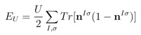
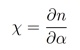
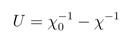
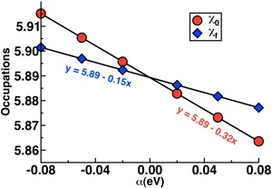
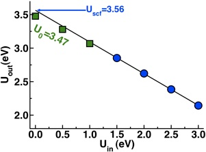

If you you think you might be interested in carrying out DFT+U calculations on a system, this tutorial is tailor made for you.  

 

Background: Recall, the DFT+U functional, as implemented in [Quantum-ESPRESSO](http://quantum-espresso.org/ "http://quantum-espresso.org")[1] corresponds to an additional term of the form:

The use of this functional form is particularly motivated by systems consisting of transition-metals with localized electrons (i.e. d or f) that standard DFT struggles to treat accurately.  

 

Before embarking on production level simulations, one of the first things you should always do is to calculate the value of U for your system. In our linear-response U approach[1], the response function that we calculate is:

with a matrix of response functions in the case of multiple sites but a single value for single site systems. In order to obtain U, we invert the self-consistent response function and subtract out the bare, non-interacting response[1]:

Today we will only address the single site example of MnO[3], but a future [tutorial](tutorial "Tutorials") will expand the calculation to more manifolds.

 

Instruction:  The determination of the linear-response U is simple and costs little more than a standard single point energy calculation, which is something you have likely already carried out for the system of interest.  Using the scripts provided below, we can easily calculate the linear response U for the sextet ground state of the diatomic molecule MnO.

 

We obtain the bare and self-consistent response functions from linear regression of the relationship between the occupations that result from a range of rigid potential shifts, alpha:

 

For sextet MnO, the bare and self-consistent slopes are -0.32 and -0.15, respectively, giving U0 = 3.47 eV.

 

We determine the linear-response U as follows:

1. 1.Obtain single point energy at zero alpha and store density.
2. 2.Starting from 1, obtain new single point energy at several values ofnon-zero alpha (e.g. -0.08 to 0.08) with tight convergence criteria.
3. 3.Collect occupations from first iteration of 2 for bare response and last iteration of 2 for self-consistent response.
4. 4.Calculate response functions from linear regression of 3 and invert to obtain U.

 

The additional single points in step 2 should each take less than half of the time of the original single point in step 1 because the addition of alpha is only a small perturbation. (Note: The key here is to ensure that you can copy over the starting zero-alpha density each time for each non-zero alpha calculation). One approach for the file copying step is implemented in the main script, [jobrun.py](jobrun.py), and clarified in the variables file, [variables.py](variables.py).  The linear regression is carried out after completion of the SCF runs in [linregress.py](linregress.py) and the results are written to the file ucalc.dat.  

 

In addition to the standard linear-response U0, the self-consistent extension,Uscf[2], can be determined with these scripts.  This approach is carried out automatically by setting a range of values of Uin (e.g. 0.5-3.0 eV in 0.5 eV increments) in the file [variables.py](variables.py).  

 

The linear-response and self-consistent U values are essentially identical for sextet MnO. The self-consistent U is determined from the extrapolation ofUout calculated over a range of Uin where the relationship is linear[2].  Larger differences between the self-consistent and linear-response U values can be much larger, especially where the electronic structure between DFT and DFT+U differs significantly. We have also studied systems from a few to hundreds of atoms in size with self-consistent DFT+U, and I encourage you to read about the relevant [publications](../publication "Publications").

 

Summary: The tutorial files, provided also as a [zipped archive here](DFTU-Tut.zip), are:

1. [jobrun.py](jobrun.py) — skeleton script generates input files and runs jobs.
2. [variables.py](variables.py) — you should change these job and cluster variables!
3. [libraries.py](libraries.py) — dictionary of parameters that should not be changed.
4. [linregress.py](linregress.py) — calculates U0 and Uscf from results of jobrun.py.
5. [zip archive of other files](DFT-Tut.zip) — pseudopotentials, coordinates for MnO, a readme file, and an example job script for SGE queues.

 

I hope that this [tutorial](../) has helped you to better understand how to calculate the linear-response and self-consistent Hubbard U for single-site transition metal complexes.  Please [email me](mailto:hjkulikATmitDOTedu?subject=Questions%20about%20Calculating%20Hubbard%20U%20tutorial "mailto:hjkulikATmitDOTedu?subject=Questions about Calculating Hubbard U tutorial") if you have any additional questions not answered here!

 

References:

[[1](http://prb.aps.org/abstract/PRB/v71/i3/e035105 "http://prb.aps.org/abstract/PRB/v71/i3/e035105")] M. Cococcioni  and S. de Gironcoli. Physical Review B 71, 035105 (2005) and references therein for more details.

[[2](http://prl.aps.org/abstract/PRL/v97/i10/e103001 "http://prl.aps.org/abstract/PRL/v97/i10/e103001")] H. J. Kulik, M. Cococcioni, D. A. Scherlis, and N. Marzari. Physical Review Letters 97, 103001 (2006).

[[3](http://jcp.aip.org/resource/1/jcpsa6/v133/i11/p114103_s1 "http://jcp.aip.org/resource/1/jcpsa6/v133/i11/p114103_s1")] H. J. Kulik and N. Marzari.  Journal of Chemical Physics 133, 114103 (2010).

**Scripts:**  
[Jobrun.py python script](jobrun.py)  
[Libraries.py python script](libraries.py)  
[Linregress.py python script](linregress.py)  
[Variables.py python script](variables.py)  
[DFT+U Tutorial ZIP Archive](DFTU-Tut.zip)  

