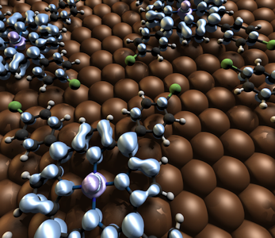

After we’ve completed a few simulations, it can be very useful to visualize the electronic structure of our system.  In [Quantum-ESPRESSO](http://quantum-espresso.org/ "http://quantum-espresso.org"), the wavefunctions we collect at the end of a calculation can be postprocessed for visualization of a number of properties including: the total density, spin density, and density of each molecular state.  Aside from projected density of states, these observables are the primary means of identifying the character of your electronic state.

 

A unique consideration for slabs or isolated molecules is that a large portion of the simulation cell is vacuum.  By default, the post-processing codes in [Quantum-ESPRESSO](http://quantum-espresso.org/ "http://quantum-espresso.org") visualize the entire simulation cell including the vacuum.  In addition, depending on the initial coordinates you provided for your molecule, the associated electron density may not be centered or may even wrap across the boundaries of the unit cell.

 

In today’s tutorial, I will provide you with tools that will enable you to manipulate and visualize properties of the density very easily.

 

Instruction:   

We start by assuming you have generated the wavefunction and density of a partially-isolated system using PWscf in [Quantum-ESPRESSO](http://quantum-espresso.org/ "http://quantum-espresso.org") and still have access to the files you have generated (i.e. with the associated prefix in your chosen outdir).   If you have not carried out this step yet, you can modify the [DFT+U tutorial](../2011-05-31-calculating-hubbard-u/) to generate the density for a sextet MnO diatomic molecule by restricting the value of alpha to zero.

 

Note: In addition to pw.x, you will need to have compiled the postprocessing utility, pp.x, which you can accomplish via make pp in your main [Quantum-ESPRESSO](http://quantum-espresso.org/ "http://quantum-espresso.org") directory.    

 

The simplest approach is to provide the name of the original input file you used and associated output file in the variables file, [variables.py](variables.py).  The only other variables that need to be set is which component of spin you wish to calculate - all, or up or down only - and what type of property you wish to calculate.  For finer controls, you can choose the bands to calculate and set variables manually in [variables.py](variables.py).  Just remember to set pwin=’’.

 

Additionally: We choose the minimum box size based on the position of the atoms and the associate covalent radii for a given element.  We then identify the approximate radius of the electron density of interest as the box that encompasses each atom represented by a sphere with a radius 2x its covalent radius. Custom atom types and radii may be assigned by adding lines to [libraries.py](libraries.py) or by modifying the overall multiplier on radius size.  For most molecules and molecular orbitals, default cutoffs are sufficient.  However, for highly delocalized states, one may wish to enhance the multiplier on the atomic radii in the input file.

 

The benefit to reducing the portion of the unit cell that gets stored is that the grid files can be reduced by up to 90% in size before compression!  This will speed up and ease your ability to visualize molecular states, such as the spin density profile of the tetrabromophenyl porphyrin on Cu(111) shown below.

 

Summary: The tutorial files, provided also as a [zipped archive here](PP-Tut.zip), are:

1. [jobrun.py](jobrun.py) — main script that generates density grids
2. [libraries.py](libraries.py) — covalent radii and other static variables set here. Only advanced users should modify this.
3. [variables.py](variables.py) — you should change these job and cluster variables!
4. [pwreader.py](pwreader.py) — parses input and output files to set variables
5. xsf2cub — This utility converts the XCrysDen-friendly .xsf file format to a Gaussian .cub file.  Gaussian cube files are more universal and can be used with visualization programs including VMD, Molden and even XCrysden.
6. other files: README, and sample input/output to show how pwreader.py parsing works.

 

I hope that this [tutorial](../) has helped you to better understand how to visualize molecular orbitals. Check back soon for a follow-up tutorial on more advanced ways to manipulate the density including arbitrary cutting planes! Please [email me](mailto:hjkulikATmitDOTedu?subject=Questions%20about%20visualizing%20molecular%20orbitals "mailto:hjkulikATmitDOTedu?subject=Questions about Visualizing molecular orbitals  tutorial") if you have any additional questions not answered here!

**Scripts:**  
[Molecular orbital tutorial zip archive](PP-Tut.zip)  
[jobrun.py python script](jobrun.py)  
[libraries.py python script](libraries.py)  
[variables.py python script](variables.py)  
[pwreader.py python script](pwreader.py)  
