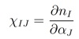
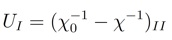
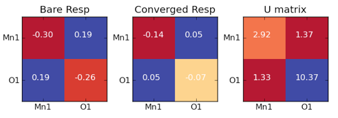

This [tutorial](../) is suited to those interested in carrying out DFT+U calculations on a system with multiple transition-metal sites.  If, instead, you are only concerned with single-site complexes, check out [the original tutorial](../2011-05-31-calculating-hubbard-u/ "Calculating the Hubbard U") on calculating the Hubbard U. You may wish to [revisit the single-site U tutorial](../2011-05-31-calculating-hubbard-u/ "Calculating the Hubbard U") for more background and instruction.

 

Background: The DFT+U approach in [Quantum-ESPRESSO](http://quantum-espresso.org/ "http://quantum-espresso.org") is equipped to not only [treat single-site complexes](../2011-05-31-calculating-hubbard-u "Calculating the Hubbard U") but multiple sites as well.  Typically, the extension to multiple sites is important where there is more than one unique transition-metal in the system or, in rare cases, where an on-site U on ligand atoms is useful in addition to transition-metals.  

 

The multiple-site, linear-response U is determined from a matrix of linear-response functions of the form[1]:

where the relationship between the perturbation of electrons on site J and the response on site I yields the response function denoted by an index IJ. In order to obtain U for multiple sites, we now invert the converged and bare matrices[1].  The value of U for site I is given by:

 

where the off-diagonal elements indirectly influence the value of on-site Uthrough the matrix inversion.  

 

Extensions to this approach in which we treat multiple manifolds on the 

same site - e.g. both 3d and 4s electrons on a transition metal[2] - or directly treat intersite coupling from off-diagonal terms[3] are both possible but neither are currently available in a public version of [Quantum-ESPRESSO](http://quantum-espresso.org/ "http://quantum-espresso.org"). These more advanced topics may be discussed in the future.

 

Instruction: As was the case for single-site, linear-response U calculation, the extension to a matrix of response functions adds little additional computational cost.  We extend the previous case of ground state sextet MnO to include a calculation of linear-response Hubbard U values for both the Mn 3d manifold and the O 2p manifold.

 

We determine the linear-response U for a multiple-site complex as follows:

1. Obtain single point energy at zero alpha and store wavefunctions.
2. Starting from 1, obtain new single point energy at several values ofnon-zero alpha on site J (e.g. -0.08 to 0.08) with tight convergence criteria.
3. Collect occupations of all sites from first iteration of 2 for bare response and last iteration of 2 for converged response.
4. Calculate response functions from linear regression of all relationships obtained in 3 via linear regression.
5. Repeat 2-4 by applying alpha sequentially to each additional non-J site.
6. Invert the matrices and subtract to obtain each U from diagonal elements.

 

After [jobrun.py](jobrun.py) carries out calculations, the [linregress.py](linregress.py) script calculates response functions and inverts the matrices.  If [matplotlib](http://matplotlib.org/ "http://matplotlib.org") is enabled, we can visualize our results on MnO to obtain the following:

The recalculated U on Mn 3d is now 2.9 eV, reduced from the value of about 3.5 eV obtained when only [calculating U on a single site](calculating-hubbard-u "Calculating the Hubbard U"). These two treatments produce slightly different values of U because the multiple-site case includes the effects of O 2p.

 

Note that we obtain the inverse in 6 routinely for the 2x2 case.  For larger matrices, the script uses the [scipy](http://www.scipy.org/Installing_SciPy "http://www.scipy.org/Installing_SciPy") module [linalg](http://docs.scipy.org/doc/scipy/reference/tutorial/linalg.html "http://docs.scipy.org/doc/scipy/reference/tutorial/linalg.html").  If [linregress.py](linregress.py "linregress.py") detects that [scipy](http://www.scipy.org/Installing_SciPy "http://www.scipy.org/Installing_SciPy") is not installed, it will write the linear-response matrices and you will need to invert the matrices with the software package of your choosing.  

 

Summary: The tutorial files, provided also as a [zipped archive here](DFTUS-Tut.zip), are:

1. [jobrun.py](jobrun.py) — skeleton script generates input files and runs jobs.
2. [atreader.py](atreader.py) — parses your xyz file to generate run parameters.
3. [variables.py](variables.py) — you should change these job and cluster variables!
4. [libraries.py](libraries.py) — dictionary of parameters that should not be changed.
5. [linregress.py](linregress.py) — calculates matrix of U values from [jobrun.py](jobrun.py) results.
6. other files — pseudopotentials, coordinates for MnO, a readme file.

 

Advanced note: If you try to run DFT+U on an unconventional element, the code may exit with the error “Pseudopotential not yet inserted”.  In order to circumvent this issue, you will want to modify the files set\_hubbard\_l.f90 and tabd.f90 in the PW folder of your [Quantum-ESPRESSO](http://quantum-espresso.org/ "http://quantum-espresso.org") root directory.

 

I hope that this [tutorial](../) has helped you to better understand how to calculate the linear-response and self-consistent Hubbard U for multiple-site transition metal complexes.  Please [email me](mailto:hjkulikATmitDOTedu?subject=Questions%20about%20Hubbard%20U%20for%20multiple%20sites%20tutorial "mailto:hjkulikATmitDOTedu?subject=Questions about Hubbard U for multiple sites tutorial") if you have any additional questions not answered here!

 

References:

[[1](http://prb.aps.org/abstract/PRB/v71/i3/e035105 "http://prb.aps.org/abstract/PRB/v71/i3/e035105")] M. Cococcioni  and S. de Gironcoli. Physical Review B 71, 035105 (2005) and references therein for more details.

[[2](http://prl.aps.org/abstract/PRL/v97/i10/e103001 "http://prl.aps.org/abstract/PRL/v97/i10/e103001")] H. J. Kulik, M. Cococcioni, D. A. Scherlis, and N. Marzari. Physical Review Letters 97, 103001 (2006).  

[[3](http://jcp.aip.org/resource/1/jcpsa6/v134/i9/p094103_s1 "http://jcp.aip.org/resource/1/jcpsa6/v134/i9/p094103_s1")] H. J. Kulik and N. Marzari. Journal of Chemical Physics 134, 094103 (2011).

**Scripts:**
[DFT+U multiple sites zip archive](DFTUS-Tut.zip)  
[jobrun.py python script](jobrun.py)  
[atreader.py python script](atreader.py)  
[variables.py python script](variables.py)  
[libraries.py python script](libraries.py)  
[linregress.py python script](linregress.py)  
