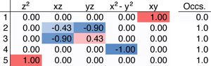
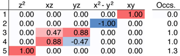
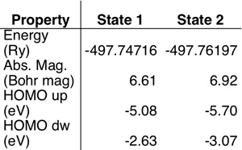
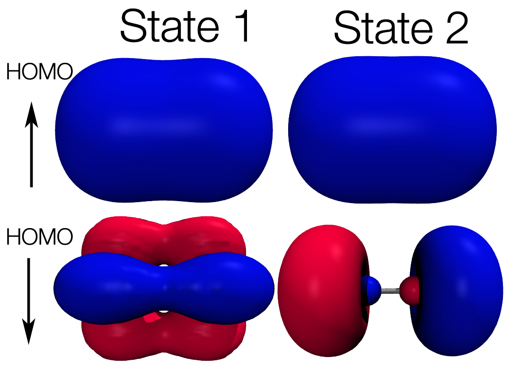

Multiple low-lying electronic states are common for open-shell transition metal complexes and other small molecules. It is important to make sure you can straightforwardly characterize each state you converge to in order to be certain you are obtaining the properties you wish to calculate. In cases where the electronic ground state has not been definitively identified by experimental techniques, an exhaustive search is particularly necessary.

 

Today, we will look at how to converge and identify multiple low-lying electronic states for the iron dimer molecule in the septet spin state. For over twenty years, a septet state with delta angular momentum character and 14 3d electrons was believed to be the ground state of this molecule.  However, more careful theoretical and experimental analysis now suggestions that a nonet state is the ground state and that in fact the previously characterized septet delta ground state is not even the lowest state of septet spin multiplicity. Rather, the lowest energy septet state has 13 d electrons and sigma angular momentum character. 

 

The two input files provided here ([input1](state1.in) and [input2](state2.in)) should straightforwardly converge to two differing states and are suitable for the latest versions of [Quantum-ESPRESSO](http://qe-forge.org/gf/project/q-e/ "Quantum-ESPRESSO").  Here are a few ways we can distinguish these electronic states and identify the lowest energy ones:

 

**1. Occupation matrices from DFT+U.** Even if DFT+U calculations are not being carried out, on the fly determination of the projection of molecular states onto the atomic orbitals of relevant open-shell centers can be very useful.  We can set U to a very small, nearly zero value in order to retain the occupation matrix without actually using the DFT+U method (in this case, we use a U= 3 eV which was previously shown to be the correct self-consistent U for this system).  Below, you’ll find the minority spin occupation matrices for the two states we converged to earlier:  

 

State 1:

 

State 2:

 

In the first case, we probably have a single electron in each of four orbitals of type: sigma, delta, and two pi orbitals. In the latter case, there’s no occupation of any delta-character orbitals, but there is a slightly greater than one occupation in the sigma orbital. This suggests either strong hybridization with nearby 4s orbitals or population of an antibonding 3d-derived state.  Since we only considered occupation matrices for the 3d states, we cannot say definitively the source of the character, but we can tell that the states are likely to have differing total angular momenta.  

 

**2. Other details from output files: absolute magnetization, total energy, and eigenvalues.** There are several other properties printed by default in the output that can be used to distinguish electronic states. A comparison of the two states we have converged to is provided below:  

 

   

 

As you can see, these properties make it easy to tell that two states are different, but an occupation matrix can be much more beneficial for identifying how two states are different.  

 

**3. Projected density of states or visualization of orbitals.** Spin density or visualizing and enumerating all of the orbitals is the most definitive way to identify and compare electronic states.  In order to visualize key orbitals, I use the tools developed and explained in the [visualizing molecular orbitals tutorial](../2011-06-14-visualizing-molecular-orbitals "Visualizing molecular orbitals").  Projected density of states can also be useful, especially for larger and extended systems. PDOS will be addressed in detail in a later tutorial. The figure below shows key orbitals that differ between the two states:

 

 

With all of the different analysis tools we used so far, we can now identify the two states.  State 1 is the previously identified ground state with delta character, while State 2 is actually lower and has 13 d electrons with sigma character.  For more tips and tricks how to converge multiple states, be sure to check out the [previous tutorial](../2011-08-09-low-lying-electronic-states "Low-lying electronic states") on [low-lying electronic states](../2011-08-09-low-lying-electronic-states "Low-lying electronic states"). 

 

I hope that this quick tip has helped you to better understand how to converge multiple low-lying states in [Quantum-ESPRESSO](http://www.quantum-espresso.org/ "http://www.quantum-espresso.org") and [PWscf](http://www.pwscf.org/ "http://www.pwscf.org"). Please [email me](mailto:hjkulik@mit.edu?subject=Questions%20about%20second%20low-lying%20electronic%20state%20tutorial "mailto:hjkulik@mit.edu?subject=Questions about second low-lying electronic state tutorial") if you have any additional questions not answered here!

