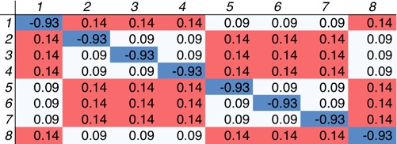
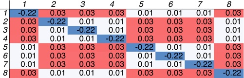

Periodic systems have always been the primary application for DFT+U. The original utility of DFT+U was largely observed in improving descriptions of band gaps and recovering insulating behavior in materials that standard approximations to DFT make metallic. Previously, I showed you how to calculate the Hubbard U for isolated [single-site](../2011-05-31-calculating-hubbard-u "Calculating the Hubbard U") and [multiple-site](../2011-06-28-hubbard-u-multiple-sites "Hubbard U for multiple sites") transition metal complexes as well as how to [troubleshoot](../2011-09-13-troubleshooting-common-problems-dftu "Troubleshooting common problems with DFT+U") general challenges associated with DFT+U calculations.   Today we’ll look at how to calculate the linear-response U in a prototypical solid state system: **bcc iron**.


 


Following the procedure outlined in [1], we start with a 2x2x2 supercell of bcc Fe and perturb a single Hubbard atom in the environment of the other iron sites.  We use a 4x4x4 k-point mesh appropriate for the supercell and a 35 Ry/420 Ry wavefunction and density cutoffs, but higher cutoffs and more k-points may be needed for production runs. I’ll also be using a PBE iron pseudopotential with 3s and 3p states in the valence, which you can [download here](http://www.quantum-espresso.org/pseudo/1.3/UPF/Fe.pbe-sp-van.UPF "http://www.quantum-espresso.org/pseudo/1.3/UPF/Fe.pbe-sp-van.UPF").


The lattice parameter is set to 10.82 au (or twice the experimental unit cell size since this is a supercell).


We have eight iron sites in our cell (ordering is arbitrary):

```
Fe1 0.0000 0.0000 0.0000
Fe2 0.5000 0.0000 0.0000
Fe3 0.0000 0.5000 0.0000
Fe4 0.0000 0.0000 0.5000
Fe5 0.5000 0.5000 0.0000
Fe6 0.0000 0.5000 0.5000
Fe7 0.5000 0.0000 0.5000
Fe8 0.5000 0.5000 0.5000
```
 
We identify a single Hubbard atom and apply a potential shift, alpha, to the 3d manifold. We then measure the bare and self consistent response for both the Hubbard atom and the neighboring atoms.  We could repeat this procedure for all iron atoms, but instead my script simply reconstructs the response matrix using the symmetry between iron sites.


 


The response matrix we wish to invert is either 8x8 or 9x9 if you include a row and column for background states.  In either case, these scripts require scipy for the matrix inversion, or you may also use your own preferred tool for matrix inversion separately. 


 


The resulting response matrices are as follows:


Bare




Converged




where an additional background row or column is simply the reverse of the sum of the elements in that row so that the result is equal to zero.


 


The symmetry of the sites is evident from the pattern in the response matrices. Inverting these matrices gives a **U = 2.9 eV** for bcc iron. Note: this U is higher than the 2.2 eV value estimated in [1], potentially due to differences in the pseudopotential used between the two approaches and the number of k-points.


 


Here are the files that you’ll need in order to run these calculations ([in a zip](DFTUSolids.tar.gz "archive of all files")):
1. [jobrun.py](jobrun.py "jobrun.py") — skeleton script generates input files and runs jobs.
2. [variables.py](variables.py "variables.py") — you should change these job and cluster variables!
3. [libraries.py](libraries.py "libraries.py") — standard variables that should not be changed.

Coming soon (or you can write your own routines): 
  response.py — constructs response matrix and calculates U0.

 

I hope that this tutorial has helped you to better understand how to converge multiple low-lying states in [Quantum-ESPRESSO](http://www.quantum-espresso.org/ "http://www.quantum-espresso.org") and [PWscf](http://www.pwscf.org/ "http://www.pwscf.org"). Please [email me](mailto:hjkulik@mit.edu?subject=Questions%20about%20Hubbard%20U%20for%20periodic%20systems%20tutorial "mailto:hjkulik@mit.edu?subject=Questions about Hubbard U for periodic systems tutorial") if you have any additional questions not answered here! 


**References**
[1] M. Cococcioni and S. de Gironcoli.  *Phys. Rev. B.* **71**, 035105 (2005).
