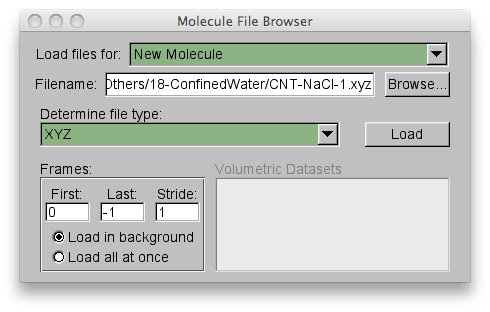
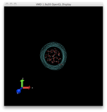
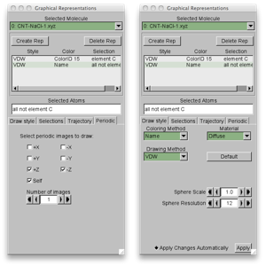
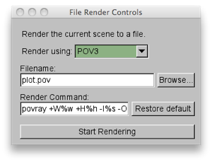
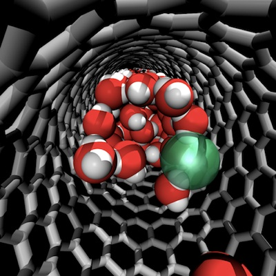

While [XCrysden](http://www.xcrysden.org/ "http://www.xcrysden.org/") is a great tool for checking your [PWscf](http://www.pwscf.org/ "http://www.pwscf.org") input for bugs, visualizing NEB pathways and charge densities, this tutorial will show you how [VMD](http://www.ks.uiuc.edu/Research/vmd/ "http://www.ks.uiuc.edu/Research/vmd/") can provide powerful tools for visualizing results as well.


 


Getting started with VMD to visualize Quantum-ESPRESSO results:


1. Choose what you will visualize and load the files:

Today, I’ll only be going over how to visualize simple coordinates, but you can visualize molecular orbitals or charge and spin density, as I’ve highlighted in these previous tutorials.  So, for today, we’ll just need an XYZ coordinate file, which you can [download here](CNT-NaCl.xyz "XYZ coordinate file") or use one of your own.


Launch VMD and go to `File>New Molecule...>Browse` and select your file.  


 


2. Begin to modify the scene by changing representations and adding periodic boundary conditions:




When we first load the coordinate file, we get a single representation of the unit cell without any periodic boundary conditions.  First, we will change our nanotube to VDW representation by going to `Graphics>Representations` and where it says “Selected atoms”, type element C. Then under Drawing method select VDW or add two representations, one as dynamic bonds and one as VDW with the radius turned down to 0.3. For material choose AOChalky for the nanotube and select coloring method by color ID (I chose 6: silver). Now we need to create a new representation for everything else.  Click Create Rep and for selected atoms type “all not element C”. Here, I choose a AOChalky material and leave the coloring to name.

Next we add periodic boundary conditions. Find the terminal window associated with your VMD session.  In that window, type `pbc set {21.167080 21.167080 17.0649057}`. We have equal periodicity in X and Y and a different lattice parameter in Z. The z-axis corresponds to the direction of the nanotube that we want to repeat our unit cell in.  In order to do this, we go to the periodic tab on each representation in the representation window and check +z and -z.  Make sure to do this for all representations. 



 

Left: Periodic boundary conditions are set to +Z and -Z for each representation. Right: Each representation has a coloring method, material, and drawing method. Note: for better looking figures you may want to hide the axis indicator by going to Display>Axes>Off and increasing the sphere resolution to above 30 from the default of 12. This is important for rendering later.


3. Choosing rendering settings:


For more realistic rendering, we turn on shadows and ambient occlusion. Go to Display>Display Settings...> and turn Shadows and Ambient Occlusion on to their default values.  In addition, I added a special EdgyGlassrepresentation for the ions which you can see in the final result.


 

4. Rendering:


Go to File>Render... and choose “Render using:”POV3.  You’ll see the default render command in the same window.  You can change these commands, but I find it most handy to save and manipulate the pov file that has been created (by default: plot.pov) from the commandline.
 





 


Any additional modifications can be achieved by editing plot.pov and reissuing the povray command from the commandline, e.g. if I want to render the scene so that the file is twice as big (1024x1024) I can try:


   

```
povray +W1024 +H1024 -Iplot.pov -Oplot.pov.tga +P +X +A +FT +C**
```

 


Make sure to delete plot.pov.tga if you already have one in the directory or you won’t be able to re-render.  Another style of rendering is to use the tachyon renderer with diffuse materials and ambient occlusion on VDW structures with pastel coloring. This can make a qutemol-like figure and may be discussed here in more detail in the future. 


 


5. Our final result:

 




 


Note, you can always play with the number of lights, their position and type, and the camera position either by modifying these in the display menu of VMD or by editing the pov file directly.


 


This figure was featured as the table of contents graphic for a [recent publication of mine](http://pubs.acs.org/doi/abs/10.1021/jz300932p "Kulik et al JPC Lett 2012"). I hope that this tutorial has helped you to better understand how to visualize your [Quantum-ESPRESSO](http://www.quantum-espresso.org/ "http://www.quantum-espresso.org") and [PWscf](http://www.pwscf.org/ "http://www.pwscf.org") results using [VMD](http://www.ks.uiuc.edu/Research/vmd/ "http://www.ks.uiuc.edu/Research/vmd/") and render them with [POV-Ray](http://www.povray.org/ "http://www.povray.org/"). Please [email me](mailto:hjkulik@mit.edu?subject=Questions%20about%20VMD%20rendering%20tutorial "mailto:hjkulik@mit.edu?subject=Questions about VMD rendering tutorial") if you have any additional questions not answered here!


