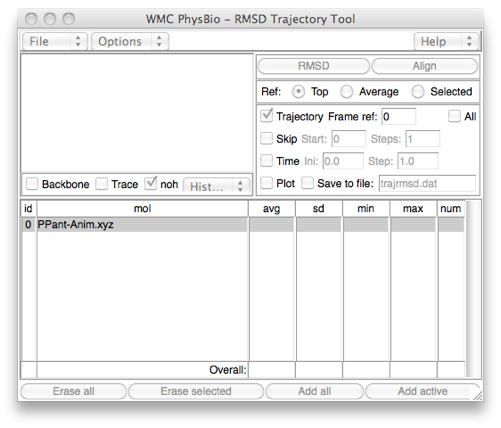
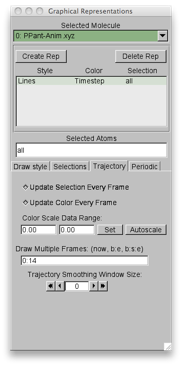
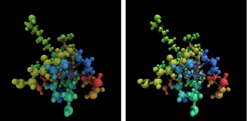
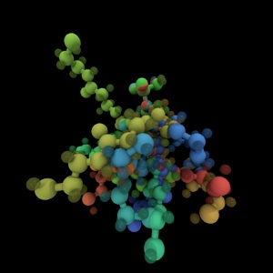
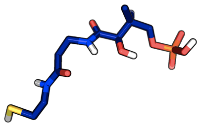

As a continuation of the [previous tutorial](../2011-11-29-visualizing-vmd-rendering-pov-ray "Visualizing with VMD & Rendering with POVray"), I will show you a few more things you can do with [VMD](http://www.ks.uiuc.edu/Research/vmd/ "http://www.ks.uiuc.edu/Research/vmd/") along with some tricks for [PyMOL](http://www.pymol.org/ "http://www.pymol.org").  We’ll use a model for the phosphopantetheine tether of acyl carrier proteins.  This prosthetic tether forms a thioester linkage to amino acids and delivers them to the active sites of many different enzymes found most commonly in natural product biosynthetic pathways.  


Nevertheless, all you really need to know is that it is the example molecule we’ll work with today, and you can download the coordinates we’ll use for the visualization [here](PPant-Anim.xyz "PPant-Anim.xyz") and [here](PPant.xyz "PPant.xyz").


*1. Revisiting [VMD](http://www.ks.uiuc.edu/Research/vmd/ "http://www.ks.uiuc.edu/Research/vmd/"): Trajectories, [Tachyon](http://jedi.ks.uiuc.edu/~johns/raytracer/ "http://jedi.ks.uiuc.edu/~johns/raytracer/") and beyond.*

Now, there are a few details of [VMD](http://www.ks.uiuc.edu/Research/vmd/ "http://www.ks.uiuc.edu/Research/vmd/") we didn’t get to last time that are useful for getting more descriptive figures from your coordinate files with [VMD](http://www.ks.uiuc.edu/Research/vmd/ "http://www.ks.uiuc.edu/Research/vmd/").  Start by opening the [PPant-Anim.xyz](PPant-Anim.xyz "PPant-Anim.xyz") file in [VMD](http://www.ks.uiuc.edu/Research/vmd/ "http://www.ks.uiuc.edu/Research/vmd/"). When you open this file, you’ll notice that there is more than one set of coordinates in it. You can look at the different coordinates by sliding back and forth the bar on the bottom of the [VMD](http://www.ks.uiuc.edu/Research/vmd/ "http://www.ks.uiuc.edu/Research/vmd/") main window. You’ll notice that the different structures are not aligned in any way.


Here’s how to align structures in [VMD](http://www.ks.uiuc.edu/Research/vmd/ "http://www.ks.uiuc.edu/Research/vmd/")...  
Go to Extensions>Analysis>RMSD Trajectory Tool and you’ll see a window that looks like this:


 
 
In the top left window, we will write an expression for the atoms we wish to align. In this case, we want to align the phospho group and that corresponds to the expression index 13 14 15 16 so type that and click the button align.  You can also align certain elements, the backbone of a protein, and use expressions that exclude certain elements or indices.  Now that we’ve aligned the structures, when we use the bar on the main [VMD](http://www.ks.uiuc.edu/Research/vmd/ "http://www.ks.uiuc.edu/Research/vmd/") window, we can see that the structures are all the same at the phospho end of the molecule.  


How to visualize all of the structures at the same time:





In [VMD](http://www.ks.uiuc.edu/Research/vmd/ "http://www.ks.uiuc.edu/Research/vmd/"), we can also overlay all of the different structures from our trajectory at the same time.  Go to Graphics>Representations and select the Trajectory tab. Since there are 15 frames numbered from 0 to 14 and we want to see all of them, we’ll write 0:14 in the Draw Multiple Frames dialog box.

Now we can go back to the Draw style tab and choose coloring method as Timestep. The color gradient by default is red/white/blue. You can choose an alternative option by going to Graphics>Colors and choosing the Color Scale tab (I’ll actually be using red/green/blue today with an offset of 0.30 to make the colors lighter). As for the rest of the settings, see the [previous tutorial](visualizing-vmd-rendering-pov-ray "Visualizing with VMD & rendering with POV-ray") for turning on ambient occlusion, setting the material to diffuse, and Drawing Method as CPK with Sphere Scale/Bond Scale 1.6 and 1.0.  

Now, the result of our rendering can differ greatly depending on which renderer we use.  To give a soft appearance that emphasizes depth, we can use [Tachyon](http://jedi.ks.uiuc.edu/~johns/raytracer/ "http://jedi.ks.uiuc.edu/~johns/raytracer/") with a diffuse material. This nearly replicates [Qutemol](http://qutemol.sourceforge.net/ "http://qutemol.sourceforge.net/")-like rendering, but you’ll want to play with the colors that you use. In order to show the differences between the two rendering engines more clearly, look at the following scene rendered with [Tachyon](http://jedi.ks.uiuc.edu/~johns/raytracer/ "http://jedi.ks.uiuc.edu/~johns/raytracer/") (left) and [POV-Ray](http://www.povray.org/ "http://www.povray.org/") (right): 

[](scenes-tachpov.png "Tachyon and Povray scenes zoom")  
   
The same materials produce a much harsher image on the right than on the left with [Tachyon](http://jedi.ks.uiuc.edu/~johns/raytracer/ "http://jedi.ks.uiuc.edu/~johns/raytracer/"). Click on either image for an expanded view. Using trajectory coloring is very helpful in assessing reaction coordinates.  
 
Note, another useful technique in visualizing with [VMD](http://www.ks.uiuc.edu/Research/vmd/ "http://www.ks.uiuc.edu/Research/vmd/") is to assign different materials to different elements or selections. We can change the selected atoms in representations for our CPK rep to “All not element H”. Then we create a new VDW rep with sphere scale 0.4 and selected atoms are chosen as “element H”.   For materials, we select Glass3 and set the coloring to Timestep and turn on visualizing all frames again in the Trajectory tab. The end result, rendered with [Tachyon](http://jedi.ks.uiuc.edu/~johns/raytracer/ "http://jedi.ks.uiuc.edu/~johns/raytracer/") is (click on image for a larger view):

[](vis-with-ghost-tach.png)


*2. [PyMOL](http://www.pymol.org/ "http://www.pymol.org"): Great illustrations and not just for proteins.*

[PyMOL](http://www.pymol.org/ "http://www.pymol.org") is a molecular visualization tool that is based upon a [Python](http://python.org/ "http://python.org/") base and works with [Python scripting](http://www.pymolwiki.org/index.php/Launching_PyMOL#Launching_Python_scripts "http://www.pymolwiki.org/index.php/Launching_PyMOL#Launching_Python_scripts").  The [wiki for PyMOL](http://www.pymolwiki.org/ "http://www.pymolwiki.org") is a great resource that delves into many details that I’ll be glossing over today.  For [PyMOL](http://www.pymol.org/ "http://www.pymol.org"), open the [PPant.xyz](PPant.xyz "PPant.xyz") coordinates by going to File>Open and finding the file.   

Note: [PyMOL](http://www.pymol.org/ "http://www.pymol.org") supports multiple frames in a single file, but only if they are in PDB model format. You can achieve this on PPant-Anim.xyz by converting the file with [openbabel](http://openbabel.org/wiki/Main_Page "http://openbabel.org/wiki/Main_Page"), if you like.  


The default representation is lines, but we’d like to switch this representation to sticks by going to the small S in the window next to the PPant label and clicking on sticks.  You could also try show as spheres for a van der Waals appearance. Changing `sphere_scale` with `set sphere_scale, 0.5` along with showing sticks replicates CPK or ball and stick with PyMOL.  

We now want to change the color of our backbone atoms. In PyMOL, each model, as it is opened up, has a different default backbone color that is used to distinguish it from the previous model.  In order to change that color, select the small C and choose the color. I chose density under the blues sub-menu. Then click C again and choose by element with the top selection CHNOS with C greyed out. This will return the colors of the other elements to typical defaults. 

When it comes time to render, we can choose ray trace modes from the commandline of our [PyMOL](http://www.pymol.org/ "http://www.pymol.org") window demarcated as PyMOL> and type:  

```
set ray_trace_mode, <# = 0,1,2,3> 
```

where 0 is the default, 1 is a cartoon-like flattened representation, 2 is black and white cartoon, and 3 is 1 but more extreme. We’ll choose 3 today.   

Now, to render our final image, we type “ray” at the PyMOL> commandline. Once the rendering finishes (which you can tell from the progress bar), you’ll see the final image.  


  

Click File>Save Image As...>PNG to open a dialog box and save your final image.


I hope that this tutorial has helped you with using [VMD](http://www.ks.uiuc.edu/Research/vmd/ "http://www.ks.uiuc.edu/Research/vmd/") and [PyMOL](http://www.pymol.org/ "http://www.pymol.org") and rendering with [POV-Ray](http://www.povray.org/ "http://www.povray.org/") and [Tachyon](http://jedi.ks.uiuc.edu/~johns/raytracer/ "http://jedi.ks.uiuc.edu/~johns/raytracer/"). Please [email me](mailto:hjkulik@mit.edu?subject=Questions%20about%202nd%20rendering%20tutorial "mailto:hjkulik@mit.edu?subject=Questions about 2nd rendering tutorial") if you have any additional questions not answered here!


