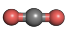
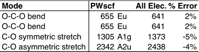
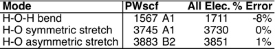
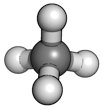
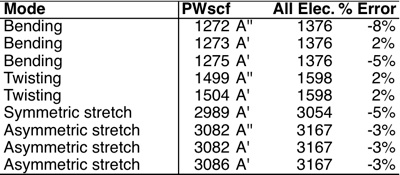

This tutorial will focus on how we can determine the vibrational properties of molecules with [PWscf](http://www.pwscf.org/ "http://www.pwscf.org") and [Quantum-ESPRESSO](http://www.quantum-espresso.org/ "http://www.quantum-espresso.org") using the phonon code.  Before we proceed, you’ll need to make sure you have the ph.x executable compiled in your [Quantum-ESPRESSO](http://www.quantum-espresso.org/ "http://www.quantum-espresso.org") distribution. If you don’t, type ‘make ph’ at the root of your Q-E distribution. 


 


Today, we’ll look at some prototypical organic molecules that are common examples used when learning how to calculate vibrational properties.  In a future [tutorial](../ "Tutorials"), we will look at more complex systems with stronger anharmonic features. The following three molecules are our examples with the Q-E assigned symmetry indicated for each: 

1. Linear carbon dioxide (D4h):  


We’ll start by relaxing the CO2 structure to find an optimized geometry and then we’ll calculate the vibrational properties. Alternatively, if you have an optimized structure, you can calculate a single-point energy and then calculate the phonons from there.


Download input files: [relax input](co2.rlx.in "relax input"); [phonon input](co2.phG.in "phonon input").

**Note:** you’ll probably want to change the `pseudo_dir` and `outdir` specified in these input files from their defaults.  If you don’t have any of the pseudopotentials specified in the input, you can download all of them in a [zip file here](pseudos.zip "pseudos zip file") or from the [Quantum-ESPRESSO pseudopotential webpage](http://www.quantum-espresso.org/pseudopotentials/ "Q-E pseudopotentials").

Then, in order we run (these input files are written for Quantum-Espresso 4.3.2 but should be backwards compatible to older versions):

```
<para command> <path-to-QE-dist>/pw.x < co2.rlx.in > co2.rlx.out
<para command> <path-to-QE-dist>/ph.x < co2.phG.in > co2.phG.out           
```

The format of the phonon input may look a little unfamiliar if you have never run calculations with the phonon code before, so we’ll go over a few details. 

In the `&inputph` namelist, you’ll want to specify an atomic mass or `amass(i)` where `i` is the atom type index for each atom type in the same order as in your input file for the scf or relax calculation. The next variable, `fildyn`, writes the dynamical matrix which is diagonalized by `dynmat.x`.  It is optional to set this variable. Finally, we set `trans = .true.`, which tells the code to calculate the phonons.


All q points are indicated after the `&inputph` namelist. Since we are studying properties of molecules, we have a single molecule in a supercell that includes a fair amount of vacuum and only want to calculate our properties at the real space gamma point. 

Now let’s look at the output of our vibrational calculation! The first portion of the file indicates progress of the calculation and some details about the symmetry of your system.  We can scroll ahead to the bottom to look at the 3N-5=4 vibrational modes of carbon dioxide.  I’ll actually be comparing them to [all electron values](http://www.chemtube3d.com/vibrationsCO2.htm "http://www.chemtube3d.com/vibrationsCO2.htm") so you can get a sense of how accurate these calculations are:


The calculations are in reasonably good agreement.  Note that we only see three lines in our output for vibrational modes because the phonon code recognizes the first two levels as degenerate.


 


**2. Bent water molecule (C2v):**  


Now that we’ve got the hang of things, let’s look at a water molecule. In this case, we have 3N-6=3 vibrational modes to calculate.


 

Download input files: [relax input](h2o.rlx.in "relax input"); [phonon input](h2o.phG.in "phonon input").





The stretch results are in good agreement with all electron calculations, but the bending mode is underestimated a little bit.


**3.Tetrahedral methane (Cs):** 


Now, let’s look at a slightly bigger system. Here we have 3N-6=9 vibrational modes to calculate. Note, symmetry is determined by PWscf based on the cartesian coordinates. In this case, we didn’t maintain symmetry in the cartesian coordinates properly so the vibrational properties are calculated at lower symmetry than the symmetry of the molecule.


Download input files: [relax input](ch4.rlx.in "relax input"); [phonon input](ch4.phG.in "phonon input").


 


As you can see, the reduced symmetry introduces some spread in otherwise degenerate vibrational levels. We also start to notice a trend that the lowest energy bending modes are the most underestimated by our pseudopotential calculations with respect to all-electron references.


 


I hope that this tutorial has helped you with characterizing the vibrational properties of molecules with [PWscf](http://www.pwscf.org/ "http://www.pwscf.org") and [Quantum-ESPRESSO](http://www.quantum-espresso.org/ "http://www.quantum-espresso.org"). For those of you who follow the tutorials, note that for the next couple of months I’ll be moving to a monthly instead of bi-monthly schedule. Please [email me](mailto:hjkulik@mit.edu?subject=Questions%20about%20vibrational%20properties%20tutorials "mailto:hjkulik@mit.edu?subject=Questions about vibrational properties tutorials") if you have any additional questions not answered here!


