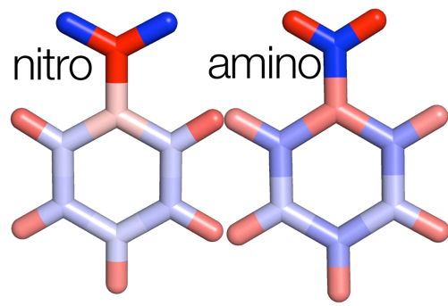

For molecules and the condensed phase alike, it can be useful to analyze how molecular states are defined by the relative atomic contributions. [Visualizing molecular orbitals](../2011-06-14-visualizing-molecular-orbitals "Visualizing molecular orbitals") allows us to identify the overall character of each individual orbital.  However, for larger molecules, it may be challenging to analyze all orbitals individually.  The projected density of states can provide a guide, alongside the eigenvalues of your system, for which orbitals you should visualize.  Lowdin population analysis, which is carried out alongside projected density of states calculations in PWscf, can be useful for identifying partial charges on atoms.  This is particularly useful when analyzing differences between sets of electronic structure calculations. So, let’s get started with calculating projected density of states and Lowdin population analysis!


Download input files [here](input.zip "input files") to get started. This includes an input file for running the SCF calculation and an input file for the projections. If you’re missing any of the pseudopotentials needed for these calculations, you can download them [here](pseudo.zip "pseudo files") or from the [Quantum-ESPRESSO pseudopotential page](http://www.quantum-espresso.org/pseudopotentials/ "http://www.quantum-espresso.org/pseudopotentials/").  Even though you’d normally carry out these routines primarily for larger molecules, in order to expedite the examples, today we’ll compare the effects of functional groups on the electronic structure of a benzene molecule.  As an example of an electron donating group (EDG), we have added an amino group and as an example of an electron withdrawing group (EWG), we have added a nitro group.


If you don’t have projwfc.x in your espresso executable directory, go to your root and type `make pp` to make all the postprocessing utilities.  In order to run the single point energy calculation and then the analysis, issue these commands:


For EDG:
```
<para cmd> <path-to-QE-dist>/pw.x < PhNH2.scf.in > PhNH2.scf.out
<para cmd> <path-to-QE-dist>/projwfc.x < PhNH2.proj.in > PhNH2.proj.out   
```

For EWG:
```
<para cmd> <path-to-QE-dist>/pw.x < PhNO2.scf.in > PhNO2.scf.out
<para cmd> <path-to-QE-dist>/projwfc.x < PhNO2.proj.in > PhNO2.proj.out    
```

The projection parameters are set in part by the eigenvalue windows that you obtain when you run the single point calculation.  Gaussian smearing is minimized here because we have an isolated molecule but this feature is useful for extended systems.

Now, we’ll take a look at the output of the projection analysis. 

If you open your `*.proj.out` files, you’ll see a few things including the results of the Lowdin population analysis. First, you get the l and m values of the atomic basis from the pseudopotentials which is what you’re projecting the molecular states onto.  Then, you get the MOs in terms of AO coefficients. Finally, you’ll see Lowdin charges which are ordered by the order of atoms in your input file and indicate a total charge (this is the number of valence electrons, not a partial charge) as well as charge for the s shell and p shell in this case.  The spilling parameter indicates what percentage of the total density cannot be represented by these projections. The closer it is to zero, the more accurate this representation is.

For instance, for the nitro EWG case, we see more than the 6 electrons we’d expect on the oxygens in the nitro group.  This has a net effect of less charge on the rest of the benzene ring.  

 
In order to visualize the partial charges on each molecule, I’ve converted each set of coordinates to a PDB file and put the partial Lowdin charge (actual Lowdin charge minus anticipated number of electrons) in the B factor column.  This makes it possible for me to color-by-B-factor with PyMOL in order to see the partial charges better. Check out the [previous tutorial on PyMOL](../2011-12-13-more-visualization-vmd-pymol "More visualization with VMD and PyMOL") if you’re interested in getting more familiar with it. The partial charges reveal that there’s more charge on the benzene ring in the amino case than the nitro case (i.e. more blue on the carbons in the amino case and more partially positive hydrogens in the nitro case indicated by red).
 


In addition to Lowdin charges, we now have projected density of states decomposed into each atom and shell of electrons as specified by the filpdos prefix.  There is also a total PDOS which should be very close to a standard DOS, especially if the spilling parameter is small.

These PDOS results can also be useful because you can look at PDOS differences under a perturbation in order to understand how levels move around, but you would likely want to add more Gaussian smearing in that case.  In a future tutorial, we’ll look more closely at how PDOS results can be useful to analyze systems.

I hope that this tutorial has helped you to better understand how to analyze the Lowdin populations of your system in order to quantify electronic structure. Please [email me](mailto:hjkulik@mit.edu?subject=Questions%20about%20PDOS%20and%20Lowdin%20tutorial "mailto:hjkulik@mit.edu?subject=Questions about PDOS and Lowdin tutorial") if you have any additional questions not answered here!
