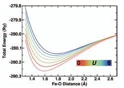
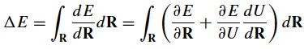
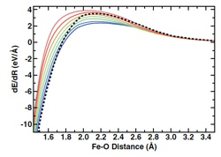
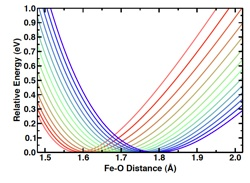
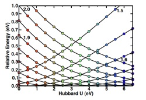
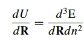
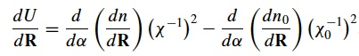
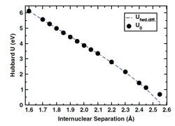
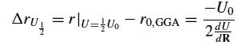

The Hubbard U may be straightforwardly calculated from linear response and will vary depending upon the configuration and coordination environment of the transition metal in question.  However, results at differing values of U are challenging to compare so most typically we average the calculated values of U for different points along a reaction coordinate.  In many circumstances, this average U approximation is sufficient, but for cases where coordination environment change dramatically, it is very important to directly incorporate these variations in U. 

 

Today’s tutorial is the first of several parts in which I will go over how to directly calculate potential energy surfaces that incorporate variations in U with position.  In this first part, I will just review the fundamentals of the approach, while in future tutorials I will show you some models of how to directly calculate the relevant variable-U potential energy surfaces.  

 

**1. Energetics from different values of U cannot be directly compared.**

Due to approximations, we cannot directly compare energetics at different values of U.  Instead, we can compare energies that have been referenced to a common value.  For instance, we can interpolate across U between different constant-U potential energy curves as long as those curves are aligned, e.g. so their minima are all zero or they share a common dissociation limit. Alternatively, we can integrate forces realizing that there is a contribution in the “true” force of the system coming from Hellmann-Feynman forces and a contribution from the variation in U with coordinates:

Then, what we can do is interpolate across forces or across energies:

Interpolation of forces: here we rely on smooth variation in the Hellmann-Feynman forces with variation in U to get a smooth integrable curve.  We can also linearly interpolate U for a given point and piece together the forces without calculating multiple potential energy curves. This is what we’ll do in a future tutorial.  

 

Interpolation of energies: here we rely on the fact that the Hubbard U contribution to the energy is smoothly varying with U and typically can be fit to a first or second order function. At a given position, we can fit the relative energetics and obtain values even at points of U where the properties were not calculated.  This approach is most useful for when you have a lot of constant U data to interpolate over already.  In this case, the top figure shows all of the E vs R curves at different values of U that have been referenced so their minima are all at zero energy (so E=Erel). In the second case, we turn the Erel vs R curves into Erel vs U curves at different values of R and use information about U at each R to get the right relative energy.

**2. We can determine the behavior of U with R.**
First, variations in U with R don’t matter much if the variation in coordinate space is small. Nevertheless, we assume here we have some dramatic change in binding or coordination.  There are a number of ways we can quantify how much U actually changes. First, for a given coordinate we can directly calculate U at a number of configurations. Remember, the U calculation is very affordable once you have a single point energy so this added cost is very low if you’re already calculating a reaction coordinate.  If we’d rather calculate a derivative in U for a given coordinate with only information about our equilibrium geometry we can obtain:

where in this case, we can see that this means we can either take the occupation dependence of the forces (by reversing the order of the derivatives) or taking the derivative with position of the energy curvature - (through the response functions). In the latter case, this means that we‘ll get:

for our final expression of the dependence of U on position.

We have a derivative on the occupations with position, which we can approximate and just the response functions themselves.  The resulting U variation predicted from integrating this expression when compared against actual values of U is in very good agreement over a large range of interatomic distances.

**3. Interpreting the relative significants of variations in U.**
In general, a small difference between the applied U and the true U of a calculation on the order of 1-2 eV in U values will only impact your energetic errors by 0.01-0.10 eV.  Fundamentally, a variable-U approach is always more accurate than an average U approach, but in practice the two results may be quite similar especially if variations in U over the relevant coordinate are small.  A metric for the relevance of DFT+U(R) is a distance equivalent to the full width half maximum:

Here, we measure the displacement of a bond that recovers a linear response U that is equal to half of the value at equilibrium.  Several small diatomic molecules, some of which we’ll discuss in future tutorials, have a displacement metric on the order of 0.2-0.5 Angstroms, which is very small!

**4. What can DFT+U(R) really do?**

Fundamentally, everything I have talked about today relies on the concept that there are a handful of hard degrees of freedom over which U variation is most important.  This makes sense if we think about how we plot reaction coordinates or binding curves and think about bond making and breaking events in general.  In general, the R coordinates we choose should be the hardest degrees of freedom over which U varies the most.  All other degrees of freedom can be folded in and taken into account effectively.  This makes sense when we consider that only direct bonds to the transition metal centers really matter and there are at most 6 of them, which are likely not all varying at once.

I hope that this tutorial has helped you to better understand why variations in U are important and how they may be straightforwardly incorporated into calculations. Please [email me](mailto:hjkulik@mit.edu?subject=Questions%20about%20First%20DFT+U(R)%20tutorial "mailto:hjkulik@mit.edu?subject=Questions about First DFT+U(R) tutorial") if you have any additional questions not answered here!
