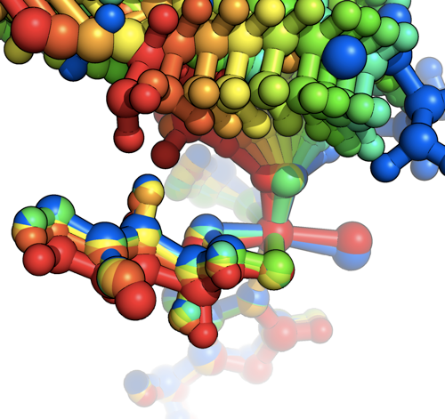

Previously, we looked at [how to visualize color-coded trajectories in VMD](../2011-12-13-more-visualization-vmd-pymol "More visualization with VMD and PyMOL"). Today we’ll look at how we can accomplish a similar effect with PyMOL.


First, assuming your trajectory is starting out as an xyz coordinate file, you can convert it to a pdb format with the [OpenBabel software package](http://openbabel.org/ "http://openbabel.org").  While[PyMOL](http://www.pymol.org/ "http://www.pymol.org") reads xyz files reasonably well, it tends to work slightly better with pdb files.

After [installing OpenBabel](http://openbabel.org/wiki/Get_Open_Babel "http://openbabel.org/wiki/Get_Open_Babel"), you can convert your xyz file to a pdb file using the command:

```
babel -ixyz <prefix.xyz> -opdb <prefix.pdb>
```

Then you can load the pdb file into pymol either with the “load” command or under **File>Open...**

One handy thing to note is that if a bond isn’t drawn in by default for your structures, you can always add them back in. It is best to do this before splitting up the states because the bond topology will be modified for all states in the single object.  In order to add bonds, modify the Mouse mode Mouse>3 Button Editing.  Then click on the two atoms you want to form a bond between.  In each case, a sphere will appear around the picked atom. Then create the bond under Build>Create bond between pk1 and pk2. Repeat this step for each missing bond. 

Now, we can visualize all the states in our trajectory in PyMOL a few ways.


1. Showing all states.
*Under Movie>Show All States, you can look at the superimposed structures from each frame of your coordinate file.*
2. Animating through each state.  
*The controls on the bottom right-hand corner of the PyMOL screen allows you to flip through each trajectory.*
3. Separate the states into individual files.  
*With the following command:* 
```
split_states <prefix>  
```
*we can split each frame of the original coordinate file into separate objects.*

In today’s example, we’ll use #3 as the route to coloring our trajectory.  This will definitely work well as long as you don’t have too many objects.  

Now, download the [color\_obj.py pymol script](http://www.pymolwiki.org/index.php/Color_Objects "http://www.pymolwiki.org/index.php/Color_Objects") that will automatically color all objects loaded in PyMOL. Then load the script:
```
run color_obj.py
```

In order to automatically color all objects with rainbow coloring:

```
color_obj(rainbow=1)
```

For an example system, we’ll turn on sticks for all objects under S>as Sticksand to create a ball and stick appearance, we’lll also S>as Spheres and then set `sphere_scale, 0.3`.  For rendering, we’ll set `ray_trace_mode, 1` (though 3 and 0 are also good options).


The final rendered result is:


I hope that you’ve had fun learning how to visualize small molecules in PyMOL. Please [email me](mailto:hjkulik@mit.edu?subject=Questions%20about%20Trajectories%20in%20PyMOL%20tutorial "mailto:hjkulik@mit.edu?subject=Questions about Trajectories in PyMOL tutorial") if you have any additional questions not answered here!
