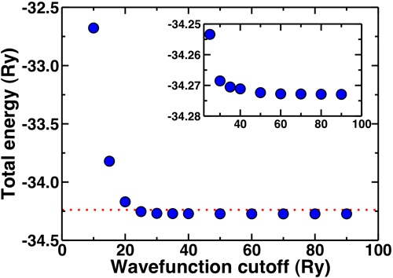
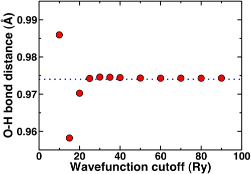
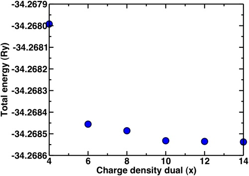
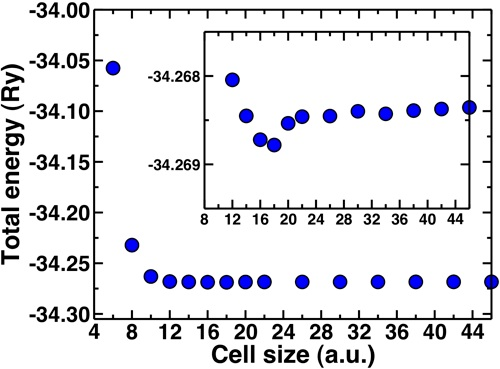
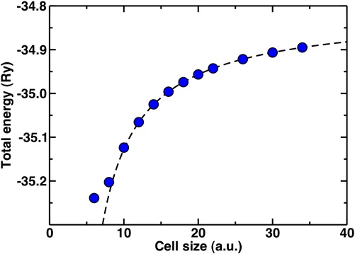

When starting any new series of simulations with [Quantum-ESPRESSO](http://www.quantum-espresso.org/ "http://www.quantum-espresso.org") or any other code, the first thing we need to do is to choose our run parameters.  While an experienced computational researcher will have general rules of thumb for what cutoffs or cell sizes to use and how many k-points, it can never hurt to revisit what I’ll call “Convergence 101” to make sure you’re doing things right.

**1. Converged with respect to what?: wavefunction and charge density cutoffs.**

The first thing we have to realize is that convergence is relative. If we study the converged total energy of a system with increasing wavefunction cutoff, it will continue to decrease as you increase the plane wave cutoff. Instead, we identify a set of quantities we wish to calculate - for instance dipoles, [vibrational properties](../2011-12-27-vibrational-properties-molecules "Vibrational properties of molecules"), [populations](../2011-01-24-population-analysis-and-pdos "Population analysis and PDOS"), or [relative energies](../2011-11-01-converging-and-comparing-multiple-electronic-states "Converging and comparing multiple electronic states"), to name a few. We can then choose our cutoffs based on the point at which these properties are unchanging even if the total energy continues to decrease.

As an example, we’ll look at the convergence of the total energy and optimized structure of a water molecule with plane wave cutoff.  In this case, we’ll use ultrasoft pseudopotentials that generally require lower cutoffs than norm-conserving pseudopotentials. If you’d like to try out these calculations yourself, you can [download this script.](Convergence_Scripts.zip)

Plotting out the total energy of an optimized water molecule with respect to cutoff, we see the energy rapidly converges around 20-25 Ry. To get a well-converged absolute total energy, we might wish to get within 0.1% of the asymptotic limit (-34.2729 Ry).  

The red dashed line on our total energy vs. wavefunction cutoff curve shows that we reach this limit on the total energy at around 25 Ry.  To get within 0.01%, we’d need a cutoff of 35 Ry. In fact, anything about 20 Ry or higher is a good first estimate.  The inset shows how the energy is essentially flat for all points 30 Ry and higher.

Note that these convergence trends are not absolute, and you should repeat some version of these tests every time you study something new.

Now, if we look at the O-H bond length of our water molecule as a function of cutoff, this property asymptotically converges to 0.974 Angstroms. We generally don’t report bond lengths to more than the thousandths digit and more typically to the hundredths digit.  So, now we’ll look at the convergence behavior of this property.

 

Again, here we see that the geometric property is mostly converged at 20 Ry but we are essentially totally converged with respect to the reference in blue dashes at 25 Ry.  The convergence of the bond distance with respect to the standard reporting precision for bond distances is more rapid than if we’re looking for a very precise total energy. This highlights again that most of the time we’re looking for converged properties and relative energies not total energies.

Now, a point we skipped over earlier is that since we’re using ultrasoft pseudopotentials, we also need to set the charge density cutoff. In all previous calculations it was set to 12 while we varied the wavefunction cutoff. It is advisable to only vary one parameter at a time when testing for convergence. Now that we know that the basic properties we’re interested in are definitely converged at 30 Ry, we’ll look at the different multipliers for the charge density we can use.  For norm-conserving pseudopotentials, we always use 4x the wfn cutoff for the charge density. In the case of ultrasoft, a general rule of thumb is 8-12x. Here, we’ll look at the dependence of the energy and the bond distance for a variety of charge density cutoffs:

**2.  Periodic boundary conditions and isolated systems.**

When we calculate properties of molecules, we essentially put them in a box with enough vacuum around them to ensure that the periodic images are not interacting.  For systems with net charge or dipole, the convergence of properties with respect to vacuum size can be quite slow.  We will look at how we test for convergence with respect to vacuum.

Alternatively, sophisticated periodic boundary corrections can be used that are directly incorporated into the calculation.  For now, we’ll just take a look at how different properties converge with vacuum size without PBC corrections. This time, we’ll again look at a water molecule as well as the protonated hydronium ion.

For water, the molecule is neutral but it has a net dipole. Neighboring dipoles in the periodic crystal can induce interactions, hence the need for sufficient vacuum. The molecular diameter of water is approximately 2.75 Angstroms or 5 Bohr radii.  We’ll look now at how the total energy converges with increasing cell sizes beyond 5 Bohr.

Here, we can see that the total energy converges rapidly from around 10 Bohr onwards and the inset shows that the total energy is fully converged with respect to cell size at about 20 Bohr.  The geometries are also converged at about the same rate. A general rule of thumb is to add at least 4-5 Angstroms of vacuum beyond the longest dimension of your neutral molecule (for water this is 10 Bohr).

Now, we’ll look at the special case of the positively charged hydronium ion.  If we wish to check for total energy convergence with cell size here, we will see different behavior than you might expect for the previous examples. In order to describe a charged, infinite system jellium is added to the background that effectively neutralizes the cell. The result is that the absolute total energy actually increases as we increase the cell size. One way we can obtain the asymptotic energy for an isolated charged system from our periodic one is through fitting our cell-size dependent data to a Makov-Payne type formula with 1/a and 1/a^3 terms.  

  
While we fit only on the region 16 Bohr and larger, it turns out our fit is pretty good for 10 Bohr or larger data points. The asymptotic total energy from M-P is -34.8107 Ry, still a good 0.07 Ry away from where we are at 40 Bohr. So it’s important to remember to carry out this correction if you want to compare charged systems.

I hope that you’ve learned or re-learned a few things about checking for convergence today. Please [email me](mailto:hjkulik@mit.edu?subject=Questions%20about%20Convergence%20101%20Tutorial "mailto:hjkulik@mit.edu?subject=Questions about Convergence 101 Tutorial") if you have any additional questions not answered here!

