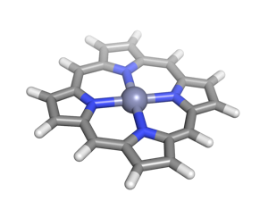

When starting a project, one of the first things we need to do is to build up the system we wish to study. This can be really easy if studying a system with available experimental coordinates or a previous paper.  Additionally, simple solid state materials often only require that you know the lattice parameter and a couple of atom positions.

The program [molden](http://www.cmbi.ru.nl/molden/ "http://www.cmbi.ru.nl/molden/") has a few really great built in tools for generating molecular structures from scratch or augmenting existing structures. Before you get started, make sure you [download a copy of molden](http://www.cmbi.ru.nl/molden/ "http://www.cmbi.ru.nl/molden/") that works on your platform. Note, this program requires X windows but many binaries are available on the FTP site.

**How to build a molecule quickly:**

As an example, let’s build a porphine and porphyrin (functionalized porphine) from scratch.  Of course, there are often structures you can grab, e.g. from the cambridge structural database or from the supporting information of a paper. But for more unique structures, one of the first things you’ll want to be able to do is to build your molecule from scratch. You can actually build a molecule pretty quickly with molden. Here’s how.

1. Launch molden and click “Zmat Editor”.  The ZMatrix Editor window will pop up.
2. Click “Add Line” in the ZMatrix Editor and you’ll see a whole periodic table to choose your element from alongside a choice of “Single, Double or Triple” bonds. This second part doesn’t matter right now.
3. We’re building a Zn porphine, so go ahead and select Zn (or any other transition metal). You should now see your first atom and a cross to indicate it is not bonded to anything yet.
4. Go ahead and “Add Line” again. This time, select N for nitrogen.
5. We want to add three more Nitrogens all with 2.1 Angstrom bonds. To do so we will select “Add Line” again. Now that we have two atoms, we need to select more atoms when defining where to put our nitrogen. First, we select the Zn center (that means that the distance between Zn and N is defined first in our Z-matrix), then we select the other nitrogen, which defines the angle. If we have more than two atoms already, we’ll also define a fourth interaction that sets our dihedral.
6. After adding the second nitrogen, you should have a straight line N-Zn-N. Now we want to add the other two nitrogens to be perpendicular. To do so, select first Zn, then one N and then the other. The angle may come out wrong, so you’ll want to set the angle (the middle box on that N’s line) to 90 degrees. Add the fourth nitrogen by selecting Zn, then the third nitrogen, then one of the other two nitrogens.
7. Now, here’s the fun part. We’ll take each nitrogen one at a time and choose “Substitute atom by fragment”.  Under the drop down list that appears, select pyrrole. Go back and repeat for each other nitrogen. The easiest way to do that is to click on the nitrogen in the molecule with your mouse.  Repeat until there are four pyrrole groups.
8. You’ll notice the Zn-N bond lengths are all set to 2.479 Angstroms. You’ll want to click on the box that says that and change them to 2.10 Angstroms. (Repeat four times).
9. We’re almost there, but we have too many hydrogens and are missing the linking carbons that form the porphine macrocycle. To fix this, we’ll delete one hydrogen from each pyrrole group. Moving clockwise around the molecule, delete one of the two hydrogens that appear to form a bond between each other between pyrroles. Do this by selecting the atom and then clicking “Delete line”. Repeat three more times.
10. Now, select each remaining hydrogen between the two pyrroles and rename it to carbon by clicking on the “H” label and typing “C” instead. Also, increase the former C-H bond lengths from 1.09 Angstroms to 1.45 Angstroms.
11. All that’s left to do is to add a hydrogen to each new C you’ve made. Add the H by clicking first on the carbon you want to add the hydrogen to then its nearest neighbors. Adjust the angle to 120 if it is set to 179.
12. Voila! You have a porphine structure now. To create a functionalized porphyrin, just substitute your formed hydrogens with other functional groups or add a functional group in an axial site.

I hope that you’ve learned or re-learned a few things about using molden to generate molecular structures today. Molden can be handy in a pinch for making molecules from building blocks quickly. In a future quick tip, I will show you how to make your own fragments for molden to read in so that you can more flexibly generate molecules. Please [email me](mailto:hjkulik@mit.edu?subject=Questions%20about%20molden%20quick%20tip "mailto:hjkulik@mit.edu?subject=Questions about molden quick tip") if you have any additional questions not answered here!

