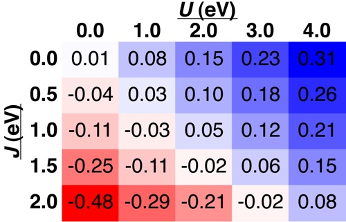

Thanks to everyone who voted for which topic they’d like to see covered next. It was a close one, but the first subject to hit the minimum threshold was DFT+U. I’d like to encourage you to keep voting - the next topic that has the highest votes next month will be the focus of the September tutorial. 

 

Over the past year, I’ve done quite a few different DFT+U tutorials so be sure to [check out the archive](../) to see if there’s anything you missed. Today, I’ll provide a brief overview of a newly reintroduced feature in [Quantum-ESPRESSO 5.0](http://qe-forge.org/gf/project/q-e/ "http://qe-forge.org/frs/?group_id=10&release_id=116"): the “+J” term.

 

As you’ll recall, the form of DFT+U implemented by Cococcioni and de Gironcoli in earlier versions of Quantum-ESPRESSO make a key simplification:

**Ueff=U-J**

Therefore, the U that we normally [calculate](../2011-11-15-calculating-hubbard-u-periodic-systems "Calculating Hubbard U for periodic systems") and [apply](../2011-10-18-right-hubbard-u-any-element "The right Hubbard U for any element") in the code indirectly incorporates some effective “J” properties but not directly.  And the form of our “+U” functional indirectly assumes J is zero in order to obtain a simplified expression. 

 

However, in a standard implementation, U represents the on-site coulomb interaction while J represents an on-site exchange interaction. Importantly, once we switch to an explicit U and J form, we can no longer calculate J or the standard U.  However, you may find it useful to be able to control these parameters separately, particularly for strongly magnetic systems.

Here’s what’s still the same and what’s different in the new code in how we specify the U and J term:

1. SAME: `lda_plus_u = .TRUE.`
2. NEW:   `lda_plus_u_kind = 0`  for simplified, `1` for U and J
3. SAME:  `Hubbard_U(i)  = U` value in eV for i in (1,ntyp)
4. NEW:   `Hubbard_J(k,i) = J`-related values in eV for i in (1,ntyp)

 

Note: the number of values in the Hubbard\_J array depend on the manifold of localized electrons. For p, we have J only (1). For d, we have J and B (1 and 2), and for f we have J, E2, and E3 (1,2, and 3). The numbers in parentheses reflect the k values that specify each of these in Hubbard\_J(k,i).  Note, B, E2, and E3 are optional. If you don’t specify them or set them to zero, the values from atomic ratios will be assumed. For the remainder of this tutorial, we’ll look at d electrons and only specify J, assuming B is from atomic ratios.

 

As a reminder, if you’re used to using some of the legacy Quantum-ESPRESSO codes, nel, nelup and neldw have been replaced by tot\_charge and tot\_magnetization for how we specify spin and charge in our system.

 

In the rest of this example, we’ll take a look at how sensitive properties can be to the U and J values that we use to give a sense of the appropriate parameter space to explore when using both U and J.

 

The comparison I’ll use is the spin state splitting between septet and quintet MnH. Experiments show that the septet is stabilized by about 0.21 eV, while a PBE-GGA shows the septet and quintet to be degenerate.  

 

Download the [scripts to run the calculations](script-uandj.sh "run script") and for [collecting the results here](script-collect.sh "collection script"). The run script will iterate over different U and J values for both septet and quintet MnH, while the data collection script makes a run of the final energy results. 

 

I’ve used the script to collect the results for the septet-quintet splitting at different values of U and J and plot them below here:

In terms of electron configuration, the only significant difference between septet MnH and quintet MnH is the coupling of the spin of Mn to the spin of 1s electrons on H. The results are clear here: adding a J term further stabilizes the quintet over septet, in the opposite direction of the experimental ordering, while a U term stabilizes the septet over the quintet in agreement with experiments.  Trends in absolute magnetization show that while the U increases these values, the J also reverses them. We observe in fact that a J has a greater effect than a U in the same energy range.

So, the overall conclusion is that a J can add some additional flexibility to your DFT+U calculations, but it may yield surprising results including reversing the trends you previously saw in your DFT+U calculations.  

I hope that you’ve enjoyed my most recent DFT+U tutorial. Please [email me](mailto:hjkulik@mit.edu?subject=Questions%20about%20Reader's%20Choice%20DFT+U%20Tutorial "mailto:hjkulik@mit.edu?subject=Questions about Reader's Choice DFT+U Tutorial") if you have any additional questions not answered here!

