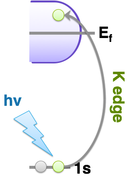
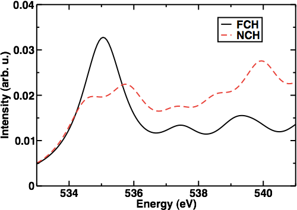
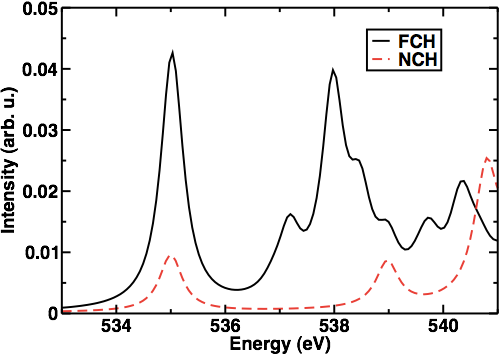

Our next reader’s choice topic is to review simulating K-edge X-ray absorption spectra with Quantum-ESPRESSO.  Thanks to everyone who voted for which topic they’d like to see covered.  I’d like to encourage you to keep voting, and if you don’t see your preferred topic in the list, you can always suggest it in the “other” option. 

 

There are a few different techniques and approximations that can be made in simulating X-ray absorption spectroscopy. Many of the approximations are system specific, so I recommend that you check out some of the references I’ll supply below to give more background as well as carry out your own reading and tests on a specific system you’re interested in.  Today, we’ll look at how to simulate the XAS of water molecules and clusters and compare to experimental results on bulk liquid water.  The scripts included also provide some results for carrying out the same simulation in bulk, crystalline materials.

 

 

Today, we’ll be looking at K edge XAS specifically for oxygen in the main example.  K edge refers to a core level 1s electron being excited (at left) by an x-ray up to occupy a previously unoccupied state above the fermi energy (in the condensed phase) or HOMO (in the case of molecules).  When the excitation occurs, the levels that get populated give rise to the characteristics of the XAS spectrum.  Typically the spectrum is comprised of two to three parts: a pre-edge component, main-edge (or rising-edge) and post-edge (or near-edge) component. 

 

 

XAS may be computed within ground state DFT.  Typically, the core hole that is formed at the 1s level may be modeled through a modified pseudopotential.  Depending on the particular system, a variety of approximations for the core hole description exist:

 

FCH: full core hole - an electron is removed from the core. This method tends to produce excitations at/near onset higher and underestimate main edge peak height.

HCH: half core hole - half an electron is removed from the core. This methods tends to overestimate main edge and underestimate post-edge or near-edge effects.

XCH: excited-state core hole - the core is modeled the same as in FCH but the excited state electron is included self-consistently in the calculation. This tends to produce results intermediate between FCH and HCH.

NCH: no core hole - useful for where the impact of the core hole on the character of the excited states is minimal, e.g. in some metals.

 

The ability of any of these methods to describe your system’s spectrum well should be evaluated when you are setting up your calculations or by consulting the literature for previous calculations.

 

Now, let’s start! As, I mentioned, we’ll be looking at oxygen K-edge XAS. To do that, we’ll need to download equivalent ultrasoft pseudopotentials for a [standard oxygen atom](http://www.quantum-espresso.org/wp-content/uploads/upf_files/O.pbe-van_gipaw.UPF "http://www.quantum-espresso.org/wp-content/uploads/upf_files/O.pbe-van_gipaw.UPF") and one for an [oxygen with a 1s core hole](http://www.quantum-espresso.org/wp-content/uploads/upf_files/O.star1s-pbe-van_gipaw.UPF "http://www.quantum-espresso.org/wp-content/uploads/upf_files/O.star1s-pbe-van_gipaw.UPF") (so we can compare the NCH, XCH, and FCH approximations).  Download the scripts to run the calculations [here](XASTut.zip "XAS scripts"). 

 

**This is the general procedure we’ll follow for all examples:**

1. Carry out an SCF calculation with pw.x. We’ll do this with the provided standard scf file. Note it is useful to include at least 2xocc bands here.
2. Determine the Fermi energy with xspectra.x. The script provided automatically inputs this as ef\_r into the input needed in #4 or you can do that manually.
3. Get the core wavefunction from the pseudopotential with upf2plotcore.sh. We create two here, one from the star1s pseudo called O\_h.wfc and one from standard pseudo called O\_std.wfc. You can also create your own.
4. Collect XAS (typically states below E\_f are excluded) using xspectra.x. This time you run xspectra.x again using a xanes-dipole calculation to collect the spectrum. This saves the results by default to xanes.dat. Remember to rename this file to avoid overwriting.

 

Remember to compile xspectra with the command `make xspectra` if you haven’t already.

Differences in XCH,FCH,NCH enter into how the SCF in #1 is calculated: for XCH and FCH, we use a modified pseudopotential with one 1s level empty, but for the former we add an electron to the valence.  In the case of NCH, an SCF calculation would resemble the standard SCF that you would do on a ground state system. Note, for XCH, some versions of XSpectra will not compute the Fermi energy properly. In that case, you can estimate the Fermi energy manually or cut by eye where the occupied states end.

Key parameters to keep an eye out for in the SCF calculation are the number of bands you calculate, the cutoffs (just like any other calculation), and number of kpoints.

 

For the XAS calculation (xanes\_dipole run in xspectra): you can choose to exclude or include the occupied states. There are also several paraemters to consider but I’ll highlight here that in input\_xspectra  xiabs is the number of the atom type that is the absorbing atom. For cases like our water cluster where there are a number of the same atoms, you should distinguish the atom with its own type, even if using the NCH approximation.  For the plotnamelist,  you can specify the number of points (xnepoint), the linewidth in eV (gamma),  range of states to plot (xemin,xemax) and you can also use variable linewidths, which may be useful for reproducing experiments with gamma\_mode.

 

So the two test systems I’ll have you run are a single water monomer with the NCH and FCH approximations. Then you’ll run a water cluster consisting of five water molecules - one of which forms 4 hydrogen bonds with the other four water molecules. We will compare the spectra obtained for that system as well. In the NCH case for the water cluster, only one SCF calculation needs to be carried out, but for FCH we need to do five separate single points. Download the series of script files you can customize [here](XASTut.zip "XAS scripts").

 

Within the shortcuts and approximations we’ve used, we can see when we plot the spectrum of a single water monomer with FCH or NCH that FCH does a better job at reproducing the rising edge/main edge feature (though there are not enough statistics here to say much more so we’ve smoothed out the data with a higher than normal linewidth to give a reasonable spectrum shape). Importantly, I have shifted the spectrum so the onset occurs around 535 eV, the experimental value:

Now, looking at the results from the water pentamer cluster:

 
It becomes even more apparent for the water pentamer why the FCH approximation or XCH approximation work best for water. Most of the XAS is above main edge features as predicted by NCH. The key features of wter XAS become apparent here though in the FCH results - an intense pre-edge feature is still present because this water cluster is isolated. However, we see much higher intensity around 538 eV in the main edge region as a result of hydrogen bonding of the other four water molecules to this water.
Note, even for disordered systems with large supercells, convergence of spectral properties with respect to number of k-points may be slow. You should test this for each system you study.

 

I hope that you’ve enjoyed this X-ray absorption spectroscopy tutorial. Don’t forget to download the sample scripts [here](XASTut.zip "XAS scripts"). Please [email me](mailto:hjkulik@mit.edu?subject=Questions%20about%20Reader's%20Choice%20XAS%20Tutorial "mailto:hjkulik@mit.edu?subject=Questions about Reader's Choice XAS Tutorial") if you have any additional questions not answered here!

 

References

[[1](http://pubs.acs.org/doi/abs/10.1021/jz300932p "http://pubs.acs.org/doi/abs/10.1021/jz300932p")] H. J. Kulik, E. Schwegler and G. Galli. “Probing the Structure of Salt Water under Confinement with First-Principles Molecular Dynamics and Theoretical X-ray Absorption Spectroscopy” Journal of Physical Chemistry Letters 3, 2653 (2012).

[[2](http://pubs.acs.org/doi/abs/10.1021/jp103526y "http://pubs.acs.org/doi/abs/10.1021/jp103526y")] H. J. Kulik, N. Marzari, A. A. Correa, D. G. Prendergast, E. Schwegler, and G. Galli. “Local Effects in the X-ray Absorption Spectrum of Salt Water” Journal of Physical Chemistry B 114, 9594 (2010).

[[3](http://prl.aps.org/abstract/PRL/v96/i21/e215502 "http://prl.aps.org/abstract/PRL/v96/i21/e215502")] D. Prendergast and G. Galli. “X-ray Absorption Spectra of Water from First Principles Calculations” Physical Review Letters 96, 215502 (2006).

