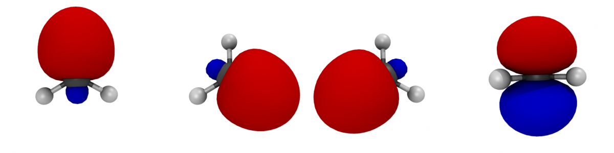

Using hydrocarbons, today we’ll go over the basics of constructing and visualizing Maximally localized Wannier functions as a tool for understanding bonding in molecules.  All of our calculations use the Wannier90 tool, which has its own tutorials and examples provided with the PW code that you may want to check out as well. Now Maximally localized Wannier functions are very much akin to Boys localization in localized basis set codes.  Normally MLWFs are extensively used for extended, periodic systems, but today I’ll show you how they can be handy for assessing bonding in molecules and isolated clusters that you might study with PWscf.

 

**I. Background: What is a Maximally localized Wannier function?**

In a nutshell, in periodic simulations we have Bloch states that are periodic wave functions. Wannier functions are localized in space, and through maximal localization we minimize the spread of the Wannier function in an optimizing fashion.  The result is orbitals that often can give a sense of the chemical character of bonding in a local fashion even when our system is extended. There are also many practical applications to MLWFs, including to use them for band structure interpolation. [Check out this review](http://rmp.aps.org/abstract/RMP/v84/i4/p1419_1 "Review article") for more detailed explanations. 

**II. How to get MLWFs from PWscf calculations**

Here’s what we’ll need (and how to get it):  
1. A compiled pw.x (make pw at the commandline)  
2. A compiled pw2wannier.x (make pp at the commandline)  
3. A compiled Wannier 90 package (make w90 at the commandline).

Here, I assume you’re running the latest version of [Quantum-ESPRESSO](http://qe-forge.org/gf/project/q-e/frs/?action=FrsReleaseBrowse&frs_package_id=18 "Quantum-ESPRESSO") (5.x), but if you’re using an older version of the code, you can also download the source directly from [wannier.org](http://www.wannier.org/ "wannier.org").  Make sure you have all your executables ready before we start on our examples below!

**III. Examples: running calculations and visualizing results**

There are five key steps for all of the tutorials and the [attached scripts](Oct23.zip "MLWF tutorial scripts") will enable you to run these steps automatically. Here they are in summary:

1. Run the SCF calculation: `pw.x < scf.in > scf.out` 
2. Run the NSCF calculation: `pw.x < nscf.in > nscf.out`  
3. Run wannier90 to get a list of required overlaps (between bloch states at differing k pts): `wannier90.x -pp system`  
4. Get a guess: `pw2wannier90.x < pw2wan.in > pw2wan.out`  
5. Compute MLWFs: `wannier90.x system`

Now, let’s look at some specific examples.

**1. Methane**  
One of the simplest systems we can imagine, methane (CH4) is an *sp3* hybridized molecule with equivalent C-H bonds in a tetrahedral structure. Once we’ve run [the script](Oct23.zip "MLWF zip archive") for methane, we can visualize the output. There are four MLWFs generated here because there are four bands - or four orbitals in which 8 electrons reside.  We can visualize the resulting XSF Xcrysden files using either XCrysden or VMD.  

*Here’s a helpful tip*: if you’re going to transfer your XSF files from a cluster to your home machine, it may help to compress them before hand. Since they’re not binary, the files are unnecessarily large.

To visualize with VMD, simply attempt to open the file and it should be automatically recognized. But we’ll need to do a few things to set up our molecule and orbitals for visualization.

Note: there’s a bit of a bug in the XSF files for viewing MLWFs of isolated molecules with VMD. The charge density box is centered about a different point than the molecular coordinates. The [script I have provided](Oct23.zip "script archive") automatically recenters the charge density box, but you may want to keep this in mind when generating MLWFs for your own systems. The key point is to center the charge density at (-a1/ngrid1,-a2/ngrid2,-a3/ngrid3), not at (-a1,-a2,-a3) - because the MLWF box is ax/ngridx smaller than the box that your molecule is in. Check out the script to see the fix for this.

Now that we’ve opened the correct VMD file, we can set up CPK representation for our molecule and two isosurface representations for our MLWFs.  Note, you can open all of the MLWF files for a given molecule into the same molecule representation if you like. When setting up isosurfaces, make one a +2.5 value for the positive signed wavefunction and -2.5 for the negative signed wavefunction. You’ll want to switch to isosurface representation and turn off the box.  And you may also wish to zoom out to see your molecule more clearly. For more details on visualizing with VMD, check out my [earlier tutorial](visualizing-vmd-rendering-pov-ray "VMD tutorial").

The final result looks something like this:

You can see that all four are identical, but because we’ve kept the orientation of the methane molecule fixed for reference, you only see the positively signed MLWF in the last one. Each represents strong localization of the density around the bond, and in general, this shape of MLWF is representative of *sp3* bonding.

 

**2. Methyl radical**

Now, let’s look at the methyl radical (CH3).  Here we have both a majority spin up component and minority spin down component so we’ll generate 8 MLWFs.

The spin up and down MLWFs will be nearly identical so I have only plotted one set. You can check this for yourself. You can tell the difference with the lone pair orbital on the far right while the other three look like *sp3* orbitals with some subtle differences compared to that for CH4.

I hope that you’ve enjoyed this Maximally localized Wannier function tutorial. Don’t forget to [download the sample scripts here](Oct23.zip "MLWF zip archive"). Please [email me](mailto:hjkulik@mit.edu?subject="MLWFs" "Email me") if you have any additional questions not answered here!

**Reference**  
N. Marzari, A. A. Mostofi, J. R. Yates, I. Souza, and D. Vanderbilt. “Maximally localized Wannier functions: Theory and applications” *Rev. Mod. Phys.* **84**, 1419-1475 (2012). ([Link to paper](http://rmp.aps.org/abstract/RMP/v84/i4/p1419_1 "Review paper"))

