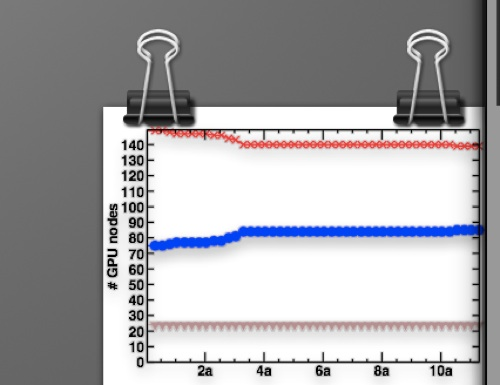

Today, I’ll take a brief detour from simulations with Quantum-ESPRESSO to take a general look at handy tools for keeping track of the jobs that we run and collecting simulations results. This is by no means a complete list of tools, but it should be helpful to those of you getting started in atomistic simulations or teach a few new things to those of you with some experience.

Now, job or run management really depends on both the types of machines you’ll be running on and the types of jobs you’ll be running. For instance, if you’re carrying out long molecular dynamics runs on a local cluster with no time limit, you probably don’t need too much job management.  But if you’re operating within time constraints or space constraints on a supercomputer to run many small jobs, your needs are going to be much steeper.

I’ll suggest some handy tools you can use to get started. I use both mac os X and linux, so PC users will find the following list a little light in tips for them, but I will suggest alternatives where I am aware of them. These tips are general, but future tutorials might tackle more specific details.

**1. A view at a glance with GeekTool.**

One of my favorite tools going back several years now is [GeekTool](http://projects.tynsoe.org/en/geektool/ "http://projects.tynsoe.org/en/geektool/"). You can do truly amazing things with it or really simple things with it. Basically, any image, shell command, or file can be displayed on your desktop, typically below any application but above your wallpaper. Here are a few ways I have used [GeekTool](http://projects.tynsoe.org/en/geektool/ "http://projects.tynsoe.org/en/geektool/") to handle job management:

A graph that keeps track of how many nodes are down, how many nodes are free on your machine, et cetera, can be clearly displayed on your desktop. This way, you can keep aware of any sudden changes in CPU load. The principles of the graph can also be extrapolated to other quantities. The basic framework is this:

Poll your queueing system for available nodes/down nodes (e.g. through `qstat -g c` if running an sge system) and collect that information to a file using a periodically running `cron`.  Tip: Once you write and test a script that will give you the quantities you need, make sure to double check that all the environment variables are set properly. The variables set in the cron environment are often less expansive than the ones you have set at login. 

You can read more about how to set up a cron on the web. But basically, you can edit your cron with `crontab -e` (a default editor will come up, typically `vi`) and add a line of the form:

```
MM HH DD YY DOW SCRIPT  > stdout 2>&1
```

For polling data, you might want to run your script every 30 minutes or every hour. A sample would look like this:
```
1,16,31,46 * * * * /home/me/myscript > logfile 2>&1
```

where an * means every day, year, etc. Be careful to set these to not run too frequently and overload your cluster. You’ll need to be sure to set these with a little bit of trial and error.

Now that I have say a data file that collects the time in minutes, the number of up cpus and down cpus, I can use grace to batch process a graph for me without ever looking at the data manually. The same can be done for anything that you want to keep track of. Running a molecular dynamics simulation? Collect data about conservation of energy in your simulations to make sure it’s staying on the right track. Collect information about how many of your short jobs are converged, how many have failed, etc. Either way, once you have data with numbers that you can graph, you can batch process with grace as follows:

Know the range of x-coordinates and y-coordinates you’re going to plot. Grace will not capture these in an automatic way that’s particularly helpful. I typically run a grep or awk command on my data to find the minimum and maximum x values and set them in a script. 

Customize your graph interactively first with a params file. It helps to set all of the key features: fonts, line types and symbols, and axes labels (eg. for time) interactively by opening up your data in xmgrace and then setting all of these features. Once you have done this accordingly, specifically setting special labels on axes ([read more in my previous xmgrace tutorial](quickstart-xmgrace "Quickstart with xmgrace")) and colors of lines, you can save the parameters you have set in a params file. This can be loaded again automatically by `gracebat` to format your graph.

The command you use to run `gracebat` is essentially the same as the parameters you would use for xmgrace, but now you will automatically generate a graph file:

```
/usr/local/grace/bin/gracebat -nxy <data file> -param <paramfile> -world $xmin $ymin $xmax $ymax -hardcopy -printfile <graph-file>.eps
```

Once this file is generated, all you need is a passwordless login and `scp` to your machine from the host where it’s generated and you can display that image with a refresh commensurate with how frequently you’re generating the graph. 

You’ll set up passwordless login, if you haven’t already set it up by doing the following:

On your personal machine, type `ssh-keygen` if you don’t already have a ssh key generated. Check if you have a file in `~/.ssh/id_dsa.pub`. 

Now copy it over to the remote machine you want to be logged into without a password:

```
cat ~/.ssh/id_dsa.pub | ssh user@remotehost 'cat >> ~/.ssh/authorized_keys'
```

Now test to see if it worked by:
```
ssh user@remotehost
```
You should not need to enter your password this time.

Once you have passwordless login, you can also use scp without a password. If you end up setting up multiple geektool data collection points, I recommend collecting all that data in a single scp, even if some of it is coming from multiple sources. 

An alternative is to use a syncing tool like dropbox and set up daemons on both cluster and your personal machine to transfer files.

Here’s an example of what a graph like this would look like on your desktop:



Other cool things you can do with geektool: write a script to collect a list of running jobs, recently finished jobs, or the status of jobs. Then display this result on your screen. Basically, anything you’d normally check in a shell you can do with geektool instead and have an easy handle on whether there’s anything you need to check on.


**2. Script construction: think about your constraints.**

It makes sense to bundle your jobs in many cases if you’re running a lot of similar jobs. The simplest way to do this is to send one job to the queue that iterates over a number of different variables set in a bash or python script. However, you may wish to do something more sophisticated. Depending upon the nature of the jobs you run, here are a few things to think about when setting up jobs:


-Are you running a series of similar jobs, wherein starting from a previously converged job in one geometry or using the density of that job can speed up the subsequent job? E.g. if you want to calculate properties of a system with U=0, and do a DFT+U job at U = 3 eV, you can probably benefit from restarting the second job from the first. Think about writing your scripts in a way to take care of this.


-If a job fails, do you have procedures in place to restart the job with different mixing, different initial guess, different convergence criteria, higher number of allowed steps in an optimization or in the scf convergence? Does the cluster you run on occasionally terminate your jobs before they’re done or pass errors? You can potentially set up your jobs to restart themselves or check for these problems. Setting up these failsafes can ensure that your jobs run and re-run well.

One way to address all of these potential issues is through submitting a dependent job inside your base job if you’re running on a queuing system. That is, when you send in one job, a job that’s dependent on that job’s completion will be sent in at the same time and only run once the other job is completed. For instance, if running in an sge queueing system, you need the job ID of the first job to submit a dependent job. Luckily, this is assigned to a variable like $SGE\_JOB\_ID. So, for instance, inside my script I can write:
```
qsub <jobscript_again> -d $SGE\_JOB\_ID
```

Now, this alone won’t do much. But you’ll want to have a part of your jobscript dedicated to parsing: have that dependent script test to see if the previous run completed, and run through the subsequent steps you would carry out next. This can also be handy in molecular dynamics, but you’ll want to iterate counters on your files and make sure you’re restarting from each previous run.

Other things you can do include checking whether shorter jobs run more frequently or whether bundling all your jobs together with a single request for multiple nodes might get you higher priority in the queueing system (e.g. on a supercomputer).

**3. Keeping alive: a global view of your environment with tmux or screen.**

Sometimes, you’re working interactively - you’re running test jobs, you’re collecting things on standard out, you’re compiling code. And then what happens? You need to go somewhere and you have to log out and everything’s lost. Or maybe you just have your variables set a certain way, are in the middle of something, and when you come back later, you can’t quite piece together what you were doing. Well, here’s where `tmux` and `screen` come to the rescue.  Screen is an older linux utility while tmux is sort of a “next generation” of `screen`. Check your cluster to see which one is available to you.

When you login to a machine, you can enter a screen or tmux session by typing either command at the commandline. The result is that you’ve created a virtual terminal inside a terminal.

For instance, if you have screen on your cluster, once you’ve opened it in a terminal, close that terminal by closing the window. Then login and open a new terminal, and type:

```
screen -ls
```

You should see your previous session that you opened listed as (Detached) with a number next to it. You can then “connect” your current terminal to the previous session through:

```
screen -d -r <session ID>
```

And you’re back in the same terminal environment you were before! To exit any screen session just type `exit`. I think screen is a great easy way to keep track of sessions between work and home or between days.


The basics of tmux work similarly. Type `tmux` to start a session. `ctrl-b` and numbers or typing `?` gives you access to a host of different ways to switch between sessions and initialize new sessions.

**4. Consider writing a wrapper script for the queuing system.**

If you’re at all like me, you’ve been in a hurry before and set up a bunch of jobs. Then you come back the next day, and you don’t remember which jobs you set up or what happened to them. I highly recommend setting up a wrapper script that you call instead of standard qsub/qdel commands. The purpose of this script is to make a record of key features of your jobs: when it was submitted, from what folder, what the job name was, maybe what the job did, and what the time limit/resource requests were. Yes you can keep track of most of this through the queueing system. But this way, you can collect all this data into a log file, named after the date the job was submitted. You can do the same every time you delete a job or it finishes. Using this data, you can also automatically look for recently completed jobs and have bash cd you to the directory of the recently completed job to check the status.

Python can be quite handy for this task. All you really need to do is pass it the standard job script you’d normally submit through qsub, but this time python will parse that script for job parameters, check the time and date of submission, and collect the job ID. More questions about how to do this in detail? Feel free to email me and ask for samples. I highly recommend this for anyone starting out. If you run a lot of jobs, you may aim to track them in your lab notebook or in a file, but this is one of the best ways to keep track of your files. And usually this can result in setting up data files that can be used with GeekTool to check the status of your runs at a glance.

I hope that you’ve enjoyed this tutorial on job and simulations management. Please [email me](mailto:hjkulik@mit.edu?subject=Questions%20about%20job%20management%20101%20tutorial "mailto:hjkulik@mit.edu?subject=Questions about job management 101 tutorial") if you have any additional questions not answered here!


