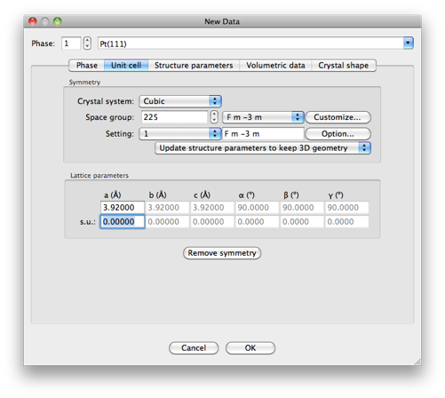
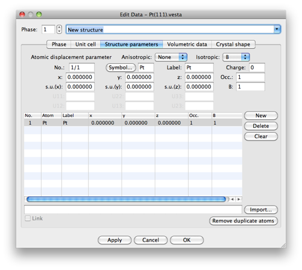
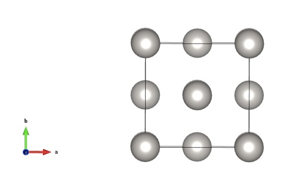
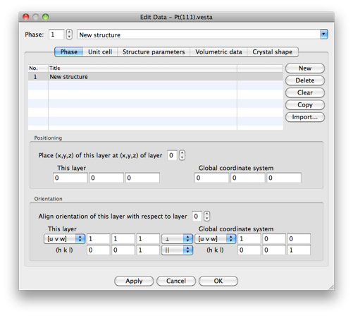
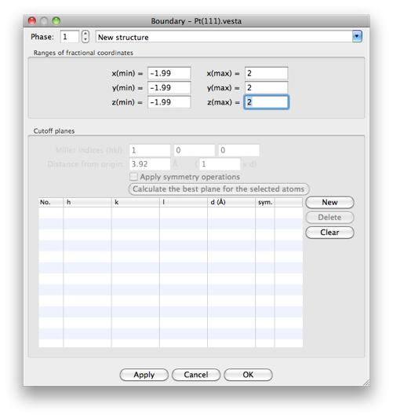
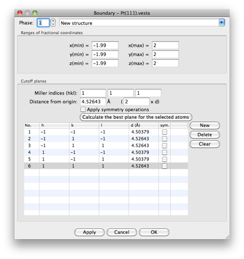
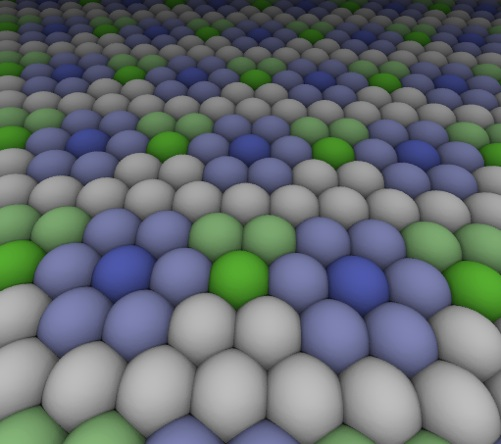

In order to study systems relevant to heterogeneous catalysis, extended supercells of slabs of bulk material must be set up and surrounded by vacuum in order to mimic the properties of an exposed surface. Today, I’ll go over how you can use the program [VESTA](http://jp-minerals.org/vesta/en/ "http://jp-minerals.org/vesta/en/") to set up the initial coordinates for your supercell.


 


The example we’ll build up to today is fcc Pt(111).  We’ll use the experimental lattice parameter of 3.92 Angstroms.


 


First, start by [downloading VESTA](http://jp-minerals.org/vesta/en/download.html "http://jp-minerals.org/vesta/en/download.html").


 


Next, go to the `File>New Structure...` menu to start building your structure.


 


Let’s rename our structure to something useful, e.g. Pt(111). Then, click on the “Unit cell” tab.


 


Our material is of the **F m -3 m** space group or **#225** and it is Cubic. Select this by first clicking **Cubic** for the Crystal system then entering the space group.  Next, set a = 3.92 Angstroms to match the experimental lattice parameter. You should see something like the window below:



 


Finally, press “OK” for now. It’s also a good idea to save your file with `File>Save As...` and choose a name like Pt(111).vesta


 


We still need to add more properties to build our cell. So, let’s go back and this time do `Edit>Edit Data>Structure Parameters...` Here we need to add in our atoms.  


 


In our fcc space group, we only need one atom at the origin to represent filling all of the sites in our lattice. The rest will be automatically generated. So, we need to make a single atom with symbol Pt and label Pt at 0,0,0.  Click on “New” to do this. The window should look as follows:



 


Now when you press “OK” you should see that an fcc unit cell has been generated:




 

The next three steps are where it gets a little trickier. But trust me, it’s worth it!


 


1. We want to reorient our cell so the (111) surface is exposed and normal to the x-axis.

 


Go back to editing properties `Edit>Edit Data>Phase...` and change the orientation to [u v w] 1 1 1 and perpendicular from 1 0 0 and parallel. The window should look like this:



 


Press “OK”. Now you should see a different orientation. Note that moving the cell in the graphical window will change the aperance but not alignment of atoms.


 


Now moving on to the harder stuff...


 


2. We want to build a 2x2x2 supercell. To do this, we’ll want to edit the boundaries to make VESTA draw extra atoms for us. You can edit the boundaries by clicking on `Boundary...` in the left sidebar. 


 


We want to set the minimum and maximum in fractional coordinates to range (-1.99,2.00). We don’t want to duplicate atoms, hence the -1.99 instead of -2.00 on the bottom end of the range. Your window should look like this:



 


3. Here comes the tricky part... now, we want to generate cutoff planes so our supercell is shaped along the right dimensions. This takes a little bit of trial and error but here’s how we’ll do it:


 


We want to add the following planes to shape and cull our atoms to the right supercell shape:


 


**Miller indices   Distance**
(-1 -1 -1)                 1.99
(-1  1 -1)                  2.00
(-1  1  1)                  2.00
(1  -1 -1)                 1.99
(1  -1  1)                  1.99
(1  1   1)                  2.00

  
The differences in the distances are because of rounding differences in the way in which the cutting planes are applied. If you apply all the cutting planes just as described above, you should end up with 64 atoms.

 
Your window should look as follows:



 

Now, we are ready to save our coordinates. Go to `File>Export Data...` and save your XYZ coordinates.


 

You can check that everything you have done is correct in a few different ways. First, you can look at the coordinate file and see if the coordinates generated make sense.


 

Next you can go ahead and visualize them in VMD with periodic boundary conditions turned on.  


 


In the plane of our slab, our periodic repetition is sqrt(2)*2*a. For separation between slabs, we can just set that number to something large, e.g. 30. So we’ll set pbcs with this command:

```
pbc set {30.0 11.08 11.08 60 90 90}
```

Now we can look at our extended system by increasing the number of cells drawn in each direction and verify we have the right coordinates. It should look a little something like this:


 




 

I hope you found this structure building tutorial helpful. If you have any questions, please [email me](mailto:hjkulik@mit.edu?subject=Questions%20about%20VESTA%20structure%20building%20tip "mailto:hjkulik@mit.edu?subject=Questions about VESTA structure building tip")!


