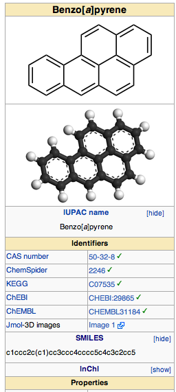

When we carry out simulations, one of the first things we need to do is to build the molecules that we want to study.  This step can be arduous for complex systems where existing experimental structures are not available (i.e. proteins from [the protein databank](http://www.rcsb.org/pdb/home/home.do "PDB"), molecular structures from [the Cambridge structural database](http://www.ccdc.cam.ac.uk/Solutions/CSDSystem/Pages/CSD.aspx), or crystal structures from available diffraction patterns or known point groups/symmetry).  There are a number of ways to build molecules, depending on the type of molecules you want to build.  For instance, I've previously given you tips on how to use [Avogadro](../2013-05-21-ten-research-tools-and-shortcuts "Ten research tools and shortcuts") with the force field turned on to build a molecule in an optimal geometry, functionalize and [make custom molecule groups in molden](../2012-06-12-quick-tip-building-molecules-molden/ "molden"), and use [VESTA to build crystal structures](building-slab-geometries-catalysis-vesta).  Today instead we'll look at how simple text strings can be used to build 3D structures that are very good starting points for our first principles simulations.


How do we map a 3D structure to a string and vice versa? Simplified Molecular-Input Line-Entry System (SMILES) is a great tool for combinatorial chemical studies and also for building your starting structures.  It's (mostly) human readable and more systematic, relying on graph theory, vs. the IUPAC InChI notation. The full rules for how a SMILES string gets built can be quite complicated but here are some handy tips:


1. You can ignore the hydrogens. Based on the number of connections of atoms in a string, the hydrogens can be treated implicitly.


2. We need to bracket anything that's not a standard organic element, but we can also include charge. For instance, `C` is just "C" for carbon but we'll want to do `[Ti]` for Ti(0) or `[Ti+]` for Ti(I). If elements are in an aromatic compound, they're lowercase. Otherwise they're uppercase.


3. We assume single bonds unless otherwise specified and atoms next to each other in a standard smiles string are assumed to be bonded. Double bonds are indicated by an `=` sign.


4. If we want to describe a ring (perhaps an aromatic one) we need to indicate each ring with a numerical label. For instance, benzene is `c1ccccc1`.


5. Branching can generally be described by putting parentheses around the branching compounds.  This is also useful for functionalized molecules. For instance,  `CC(C)C(=O)O` for isobutyric acid.


If you'd like to learn more about how SMILES works, check out the tutorials [here](http://www.daylight.com/meetings/summerschool98/course/dave/smiles-intro.html "SMILES tutorials").


Here's the most handy tip of all: if you can find a wikipedia page or a data sheet for a particular molecule you're interested in, most of the time there will be a smiles string for that molecule.


For instance, if I want to know the SMILES string for benzo[a]pyrene, I can search for it and then go to the right panel on the wikipedia page.  Clicking [show] next to SMILES in this panel will show me the SMILES string, as shown below:





 


So what do we do once we have a SMILES string from a search or from figuring it out ourselves?  Well, now we can turn it into a 3D structure using OpenBabel. I've previously mentioned babel as a useful tool. You can download it on a mac using homebrew or in linux. Check out [their website](http://openbabel.org/wiki/Main_Page) for more operating systems or for tips on how to use babel.


Once we have a smiles string, we can put it in a text file that we'll label with a '.smi' extension just to remind us what it is. The general syntax for babel will be:


```babel -ismi <mysmilesfile.smi> -oxyz <myxyzfile.xyz> --gen3d```


Here, `<mysmilesfile.smi>` is the file containing the SMILES string and `<myxyzfile.xyz>` will be the coordinate file you want to generate. You can generate other 3D coordinate file types including PDB and mol2, but for today we'll assume you're most interested in xyz files.  The magic here is gen3d. This command, which should be after the input and output file names, first builds the structure following connectivity specified in the SMILES string and then optimizes the resulting structure with the MMFF94 force field (if all atoms are parametrized) or UFF force fields.  If you prefer to use different force fields, you may have some luck in recompiling the code (force field is specified in gen3d.cpp). This force field should work fine for organic and mid-sized molecules that are well described by SMILES strings.


The magic in SMILES is that polymers or repeats of SMILES strings are easy to compile together, it's easy to store SMILES strings in a python library and build them together, and so on.  


Here's an example we can do together, coronene is a pretty big polycyclic aromatic hydrocarbon that would take me a long time to build in avogadro or molden. Its smiles string is:


```c1cc2ccc3ccc4ccc5ccc6ccc1c7c2c3c4c5c67```


(you can figure that out yourself or find it on wikipedia).  Put that in a file ending with '.smi' or [download my copy here](coronene.smi).


Now, with babel installed, at the commandline we'll do:


```babel -ismi coronene.smi -oxyz coronene.xyz --gen3d```


The end result should be something that looks like this:


 


As an extension to this, babel also supports conformer searches and scoring, again based on force fields.


Here, the syntax is: 

```
obabel  <mysmilesfile.smi> -O <myxyzfile.xyz> --gen3d --conformer --nconf 50 --score energy
```

A handy example that combines our earlier forays is a pentamer of alanine peptide. We take the SMILES string for a single alanine:

```
O=C(O)C(N)C
```

is what we would find on wikipedia. However, we note that we want to repeat this 4 more times and only include the COOH in the terminal residue so instead we'll shift it to read:

```
O=C(O)C(C)NC(=O)C(C)NC(=O)C(C)NC(=O)C(C)NC(=O)C(C)N
```

where I use repeats of  `C(=O)C(C)N` to represent the alanine residues.


We could do one better and write it as:

```
O=C([O-])C(C)NC(=O)C(C)NC(=O)C(C)NC(=O)C(C)NC(=O)C(C)[N+]
```

in order to get the zwitterionic termini that are common in solution.


If we just convert it normally, we'll find that the structure looks a little odd. So instead we'll run a conformer search to find the lowest structure:

```
obabel  ala.smi -O ala\_conf.xyz --gen3d --conformer --nconf 50 --score energy
```

We have to use openbabel to do this and the syntax as you can see is slightly different. Note, now the structure seems more reasonable as a starting point for the peptide (see below):


As you can see, you can generate even complex starting structures for molecules from simple strings that are easy to access for just about any molecular system you're interested in.


I hope you enjoyed this tutorial and learned a little bit more about using SMILES and openbabel for generating structures. If you have any questions about this tutorial, feel free to [email me](mailto:hjkulik@mit.edu?subject="Question%20about%20SMILES%20tutorial" "email me").

**Scripts:**
[alanine pentamer smiles file](ala.smi)  
[coronene smiles file](coronene.smi)  
