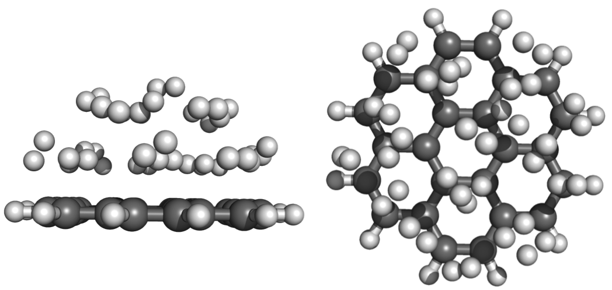

In this tutorial, we’ll briefly review how to set up fixed atom or boundary condition molecular dynamics calculations in TeraChem. In a fixed atom molecular dynamics calculation, specified atoms are fixed at their initial positions, without physical movements. These calculations are useful for studying surface reactions, especially when molecule surface tends to break apart during molecular dynamics simulations. 
 
In order to run a fixed atom calculation in TeraChem, you’ll need 
1) a xyz coordinate file that contains the starting position of all atoms.
2) a fixed atom file named “fixed-atoms” that contains the atom to be fixed in MD calculations.
3) an input file set up for MD.
 
I will use the reaction of coronene with hydrogen as an example, the initial set up is shown below:
 

 
Here’s an example “fixed-atoms” file:
```
6      
3      
4
9
10
17
18
```
The first line specifies the number of fixed atoms.
The following lines indicate fixed atoms based on their ordering in coordinate file, and each line stand for one atom. The ordering starts from 0 in coordinate file. The six fixed atoms correspond to six carbon atoms in the center of coronene.
 
For the input file set up for MD:
```
coordinates coronene-h2.xyz
charge         0
method        rhf
basis            3-21g
run               md               #specify molecular dynamics simulation
nstep            30000          #total number of steps
timestep       0.5               #time step 
tinit              2000            #initial temperature
t0                 2000            #constant temperature
thermostat    langevin      #thermostat to keep the constant temperature
```
The above covers coordinates, charge, method and basis for all ab initio calculations, and parameters correspond to an MD run.
 
Moreover, we may want to add boundary condition to our MD simulations. In a boundary condition MD simulation, the molecules in the system are restrained to move inside a spherical volume by boundary potential. We can change the radius of the spherical volume to make it shrink and enlarge periodically in a variable boundary condition. Variable boundary conditions can help constrain atoms movements and highly accelerate chemical reactions. 
 
In order to run a variable boundary condition molecular dynamic calculation, you need a few more lines in the input file besides all the parameters in a MD run:
```
mdbc                       spherical                 #spherical boundary condition
md\_r1                     4.5                           #first radius (r1) of boundary condition
md\_k1                    10.0                         #k1 parameter for spherical boundary condition r1
md\_r2                     2.0                           #second radius (r2) of boundary condition
md\_k2                    5.0                           #k2 parameter for spherical boundary condition r2
mdbc\_t1                 3000                        #time step for boundary condition r1
mdbc\_t2                 1000                        #time step for boundary condition r2
mdbc\_hydrogen     yes                           #turn on hydrogen for boundary condition
```
You can set r1, r2 and k1, k2 to be same value for constant boundary condition, respectively. 
 
I’ve attached starting coordinates, input file, fixed atom file for an example calculation of fixed atom and variable boundary condition molecular dynamics simulation of coronene with hydrogen. You can also run fixed atom only simulation or boundary condition only simulation for sure. 

**Scripts:**  
[start.in](start.in)  
[coronene-h2.xyz](coronene-h2.xyz)  
[fixed_atoms.in](fixed_atoms.in)  
 
