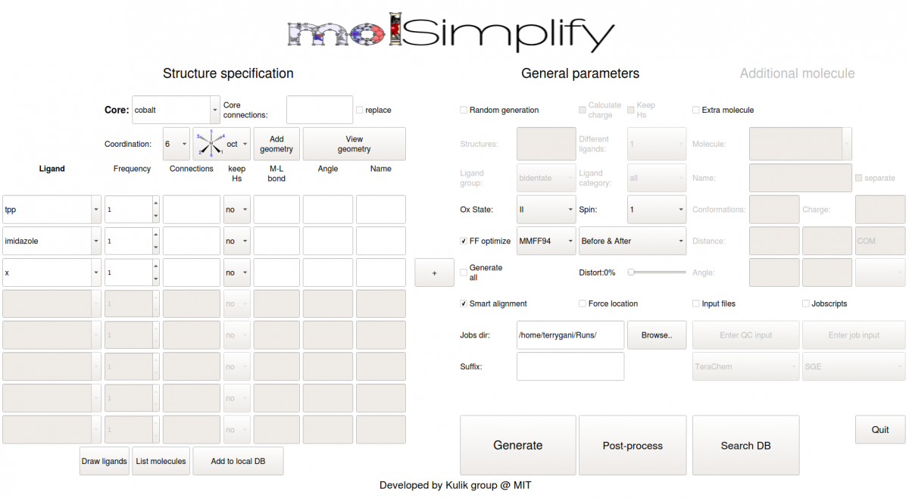
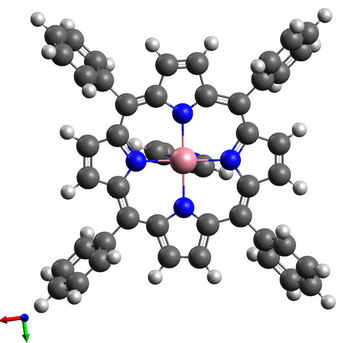
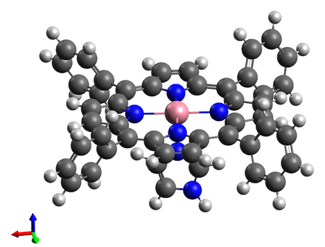

In our first tutorial, we'll briefly discuss how to use molSimplify to generate simple coordination complexes. Our example today is a cobalt porphyrin with an imidazole axial ligand and an empty 6th coordination site.


Before starting the tutorial, please remember to activate your conda environment using the following syntax, where `environment_name` is the name of your conda environment:


`conda activate <environment_name>` 


Graphical User Interface
------------------------


Firstly, we'll show how to use the graphical user interface (GUI). The GUI can be started by entering `molsimplify` at the command line with no additional arguments. A new window resembling the image below should open on your screen.





Within the GUI, hovering over each textbox brings up a popup briefly explaining its purpose. For structure generation, the only required inputs are to specify are the core, coordination number/geometry and the list of ligands (left side of the figure above).


First, reproduce the settings in the image above by selecting `cobalt` as the core, a coordination number of `6`, and `oct` to set an octahedral coordination environment.


The available ligands can be checked by clicking the drop down box. Add ligands one row at a time. Once you have selected a ligand and designated a frequency, you can add another row by pressing the plus (+) button to right of the active ligand row. Add a `tpp` ligand (tetraphenylporphyrin), an `imidazole` ligand, and an `x` ligand, where the `x` ligand represents a vacant coordination site. 


Other optional features that are relevant to structure generation include:


* **keep Hs**: By default, one hydrogen atom (if present) is stripped from each coordinating atom (`-keepHs no`). This is beneficial in most cases but should be disabled (`-keepHs yes`) in some cases such as ammonia or ethylenediamine.
* specifying the **oxidation** and **spin state**, which activates spin- and oxidation-state-dependent metal-ligand bond lengths that are generally of higher quality than the default sum of covalent radii
* **FF optimization** (off by default), which activates partial force field optimizations that significantly improve structures containing bulky ligands
* **Smart alignment** (on by default), which adds ligands to the complex in the best possible order
* **Force location** (off by default), which fixes ligand positions to allow for specific stereoisomers (e.g., fac/mer) to be generated
* **Jobs dir**, which specifies the location where the output files are saved

The [user guide](molSimplify_v1.pdf) and [molSimplify publication](http://onlinelibrary.wiley.com/doi/10.1002/jcc.24437/abstract) can be referenced for more details.


Clicking `Generate` should run the code and a popup window should appear if successful. An `xyz` file containing 3D coordinates of the complex should appear in the `Jobs dir` folder, which may then be viewed/edited by structure editors such as Avogadro. Additionally, a command line interface (CLI) input file (see below) should also be generated.


The generated structure is shown here:


                 


Command Line Interface and Input-file-based generation
------------------------------------------------------


Next, we'll show how to use the input file generation. For purposes of this tutorial, we've created a file for you called example-1.in that will generate a porphyrin with an imidazole ligand. You can download it here. Alternatively, one could also copy and rename the input file generated from running the GUI. In theory, the options could also be entered into the command line manually but this is not recommended.

```
-core cobalt 
-geometry oct  
-coord 6  
-lig tpp,imidazole,x  
-ligocc 1,1,1   
-ff MMFF94   
-ffoption BA  
-spin 2   
-oxstate II
```

molSimplify input files contain one line per option (options that are not specified take their default values), with `#` signifying a comment (and not read) as in Python. Please remove any comments before running a molSimplify input file.


Now, ensure that you are in the directory that contains the example-1.in input file, and run the following in the command window:


`molsimplify -i example-1.in`

Be sure to inclue the -i flag so that molsimplify will read the input file provided. If successful, you should get the same output as the previous GUI run. Job status is written to the command window.


You may see an openbabel warning with the following lines: `Open Babel Warning in GetAtomicNum.`


This is a harmless warning regarding the site with no ligand, and it can be ignored.


In subsequent tutorials, we'll demonstrate other capabilities of molSimplify, including the custom core functionalization feature and database search features.


**Notes in structure generation:**


1) One can have `-ligloc True` in the input file to make sure that the order of the input ligands is maintained in the octahedral structure generation, where ligands will be placed at the equatorial plane first then the axial plane.


2) For SMILES string ligands, one can use the keyword  `smicat` to control which atoms should be connected to the metal. For example, `-smicat [[1, 4], [2, 7], [5], [1]]` tells molSimplify to generate a complex with two bidentate ligands in the equatorial plane and two monodentate ligands at the axial plane. For the first bidentate, the first and forth atom in the SMILES string would be the connecting atoms (C and O for a SMILES string of `C=NCO`). 


**Scripts and files:**

[Mol Simplify User Guide](molSimplify_v1.pdf)

[example-1.in](example-1.in)
