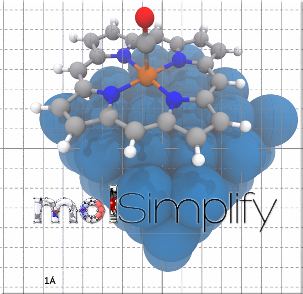
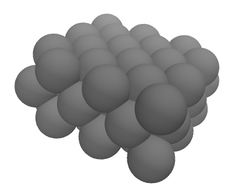

In this tutorial, we are going to introduce the latest molSimplify feature – a tool that allows the construction of periodic geometries and facilitates adsorbing any type of molecule supported by the basic molSimplify onto a slab in various ways. This tool is under development and is only available when calling molSimplify from the command line. In order to follow this tutorial, please make sure you have the most recent molSimplify build (using [conda](../2021-10-27-installing-molsimplify/) or from  [source](https://github.com/hjkgrp/molSimplify/)). We are going to demonstrate how to use this tool to construct geometry files suitable for simulation of some small molecules adsorbed onto a Pd slab. The basic procedure consists of two parts: the first is building a suitable supercell or “slab”, upon which to adsorb our molecules, followed by the actual placement. We'll cover placing adsorbates in the next tutorial.

 

1. To start, we will need information about the repeating unit of periodic system. This information must consist of a set of points defining the unit cell, and a set of three cell vectors that define how the atoms repeat in the lattice (this can alternatively be given as a set of angles and lengths). You can give these inputs separately, but molSimplify conveniently supports importing both from a `.cif` file. You can obtain .cif files for systems of interest from online databases, like the  [Inorganic Crystal Structure Database](http://icsd.fiz-karlsruhe.de) (ICSD), the  [Cambridge Structural Database](http://www.ccdc.cam.ac.uk/solutions/csd-system/components/csd/)  (CSD), or the  [Crystallography Open Database (COD)](http://www.crystallography.net/cod/) . For this example, we'll use a Palladium unit cell from the COD, which you can download [here](pd.cif). This cell is from Bredig, G; Allolio, R. Roentgenuntersuchungen an katalytisch wirkenden Metallen, Zeitschrift fuer Physikalische Chemie(Frankfurt Am Main)1927 ; 126, 41 - 71. Download the `.cif` file and be sure to note where it is and what it is called. In our case, it is located under `~/Downloads/pd.cif`. You can visualize the structure using [Avogadro](https://avogadro.cc/docs/). This is a very simple bulk metal but the same approach could be used for more complex materials, such as metal oxides, just as easily.
2. Next, we'll need to decide how big a slab we want to simulate. We want to make it large enough to cover every type of surface site we'd like to study, but no larger so that our calculation can finish as quickly as possible (remember, we will simulate this cell with periodic boundary conditions). We will choose an approximate size of 10x10x5 Ȧ. Our code will only perform integer duplications of the unit cell so we might end up a little bigger than our targets. To use the cell builder, open the terminal and invoke molSimplify from the command line using the special argument `-slab_gen`. This activates the slab builder module, and it is compulsory to give basic unit cell information as well. Since we are using a `.cif` file, we’ll use the argument `-cif_path` and the path to our file. The last thing we need give at this stage is an instruction of how big we want the slab to be, which we specify with the `-slab_size` argument. Our call is therefore:  `molsimplify -slab_gen -cif_path ~/Downloads/pd.cif -slab_size {10,10,5}`. molSimplify will produce a folder called `slab` in the usual run directory. If you're not sure where this is, it should be reported by the calculation - in our case, the code returns `Created a supercell in /home/jp/Runs/`. You can override the location by specifying `-rundir YOUR_ABSOLUTE_PATH`.
3. If we look inside the `slab` folder, there are three files produced. The first file is called `super332.xyz` – this is the geometric information for our slab, and it looks like this:  
  
The code will also display the cell parameters for the slab at the end of output. You can use these vectors and the geometry file to simulate the slab. The second file is `SD.xyz`. This is a enlarged version of the slab (not to be used for computation!) that allows you to check that the slab has the periodicity you expect and that everything worked out correctly. The last file is a ready-made input file for [Quantum ESPRESSO](http://www.quantum-espresso.org/)  (QE). If you want to use this file, you'll have to modify the `pseudo_dir` line and the names of the pseudopotentials under `ATOMIC SPECIES` to make sure that the code can find pseudopotentials for all of the atom types you use. You'll also notice three columns of 1s or 0s after each atomic coordinate. This indicates to QE that this atom is free to move in 3 dimensions. If you'd like to hold the bottom n layers frozen in this file, you can add `-freeze n` to the call to molSimplify, for example:  
  
`molsimplify -slab_gen -cif_path ~/Downloads/pd.cif -slab_size {10,10,5} -freeze 1`

  

In the next tutorial, we'll show how to position molecules and transition metal complexes on slabs easily using molSimplify. There are many more features of the slab building module that allow you to customize various aspects of the generation process, including trimming to different exposed planes. Be sure to check out the user  [guide](molSimplify_v1.pdf)  for more details!

