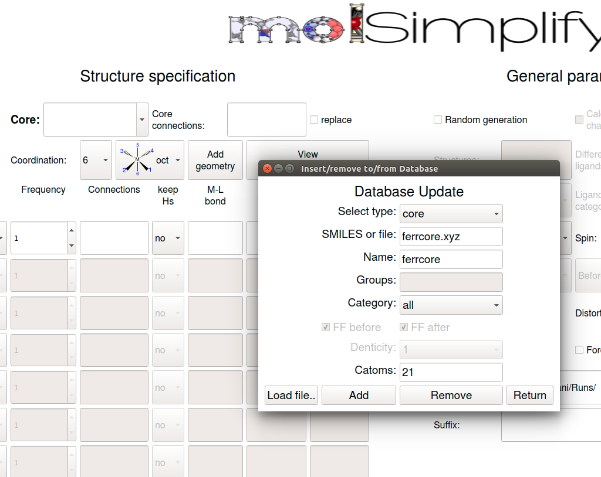
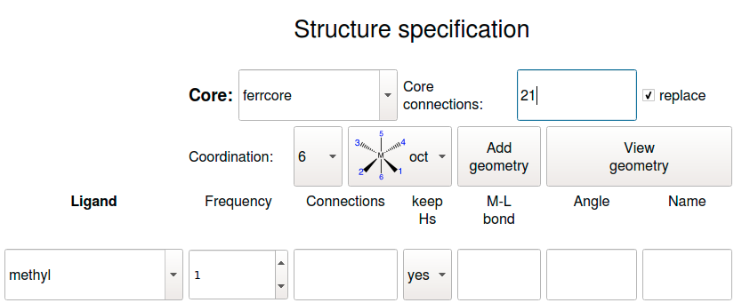
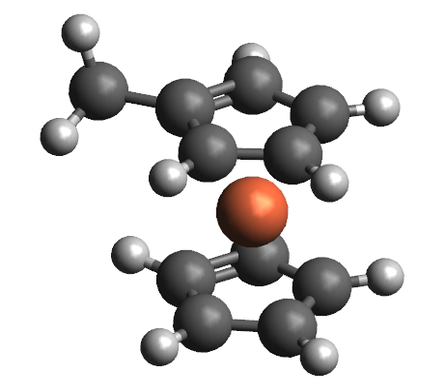

In this tutorial, we'll show how to use molSimplify's custom core functionalization feature. This feature allows new functional groups (FGs) or ligands to be attached to user-specified positions in existing structures, and is most useful for studying the effects of ligand functionalization on transition metal complexes. Our example today is based on our [previous work](http://pubs.acs.org/doi/abs/10.1021/acs.chemmater.6b02378) on hydrogen bonding in functionalized ferrocenium (Fc+) complexes.


To start, we first need to add the custom core coordinates (either `.xyz` or `.mol` file) to molSimplify's data files. In this tutorial, we will use the isolated Fc+ custom core (`ferrcore.xyz`) attached below, which contains a fluoride group that we would like to replace with a methyl group. Within the GUI, click `Add to local DB` at the bottom left, which should bring up a popup window. Download the [ferrcore.xyz](ferrcore.xyz) file, and load the downloaded file using the "Load file" interface. Then select `core` in `Select type`, give your custom core a name in `Name`, and specify the connection atom index (i.e., index of the atom linking the FG to be replaced to the custom core, 21 in this case). If the FG contains more than one atom, molSimplify is able to detect and replace the entire submolecule. Then click `Add`, and you should be notified if successful.





Alternatively, without the GUI, one can also copy the custom core file into the Cores subdirectory and manually add a new entry to cores.dict by specifying the details of the custom core file following the format used in cores.dict, i.e., name: molfile, connection atom index, maximum denticity.


After adding the custom core on GUI, close the GUI completely, and re-open it. Next, on the GUI, specify the custom core name and connection atoms that you just added, as well as the new functional group, as shown below. Here, we choose to keep Hs as the target methyl group is stored in our database as CH3. Also, check the `replace` box as we are replacing an FG with a new FG. While we have not checked the `FF optimize` option, you can choose to check this option.





Now click `Generate`, and the generated structure should look like this:





Relevant command line options are as follows. You can use `molsimplify -i commands.in` using the file `commands.in` indicated below ([commands.in](commands.in)). Note that comments are not permitted in `.in` files, and therefore anything after the `#` should be deleted in your file.

```
-core ferrcore # custom core name  
-replig true # ligand replace option  
-lig methyl # new ligand  
-ligocc 1 # ligand frequency, always 1 for custom core replacement  
-ccatoms 21 # custom core connecting atom  
-keepHs yes # keep hydrogens in structure  
-ffoption no # turn off force-field optimization
```

Recall that we selected the `replace` option in this example to replace an existing FG with a new one. By not selecting the `replace` option, one can also add new ligands to unsaturated sites, e.g., to add axial ligands to a square planar complex. This is particularly useful for macrocyclic ligands such as cyclams that are best stored as custom cores because a particular ring conformer is desired. In this case, the connecting atoms refer to the unsaturated sites in the custom core.


Lastly, a special case arises when the FG to be replaced is a hydrogen atom. For instance, in the Fc+ example above, we could possibly want to introduce a second FG by replacing one of the hydrogen atoms. As before, we could treat the hydrogen atom as a group to be replaced using the `replace` option. 


