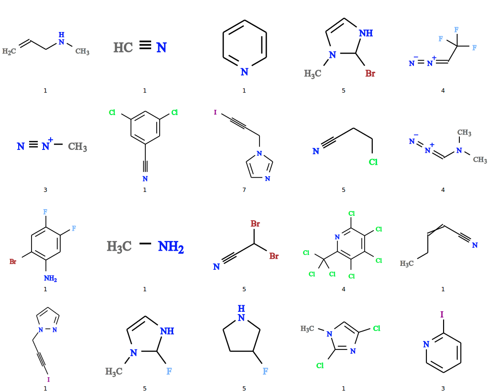

In this tutorial, we'll show how to use molSimplify to perform chemical database screening, leveraging on calls to [OpenBabel](http://openbabel.org/docs/dev/Fingerprints/intro.html) together with useful preprocessing and postprocessing tools for seamless integration with the rest of the molSimplify package.


Today, we will demonstrate how to search a large chemical database for potential monodentate nitrogen-containing ligands. Although the GUI version of molSimplify contains a rudimentary database search interface, we have recently revamped the database search module to include new features only available through the command line. Hence, in order to follow this tutorial, please make sure that you have the latest molSimplify build (using [Conda](../2021-10-27-installing-molsimplify/) or from [source](http://github.com/hjkgrp/molSimplify/tree/compact)).


First, we need to download a suitable database to be searched. For this tutorial, we will adopt the [ChEMBL database](http://www.ebi.ac.uk/chembl/), a large (over 1.6 million distinct compounds), open-source, database of bioactive molecules maintained by the European Bioinformatics Institute. Please follow the instructions on the ChEMBL website to download the latest release of the database in the **sdf format** and extract it into the Data subdirectory of molSimplify. 


Next, we need to build a suitable database query by describing the molecules ("hits") that we are interested in. A nitrogen atom able to coordinate to a metal complex may be described as having fewer than three explicit (non-H) connections and not having a positive formal charge. This may be expressed in [SMARTS notation](http://www.daylight.com/dayhtml/doc/theory/theory.smarts.html) as `[#7D1,#7D2;!+]`.


Beyond having an available coordinating N atom, we might also want our hits to obey several other properties. Firstly, we might want to restrict their size to exclude molecules such as long nucleotide or peptide chains. In this tutorial, we will exclude all molecules with 15 or more atoms. Next, we will restrict the allowable elements to H, C, N and halides to avoid issues with linkage isomerism. Finally, we will restrict the number of allowable substructure matches to just 1, again to avoid ambiguity in coordinating atom and also multidentate ligands.


Relevant molSimplify options are listed below:

```
-dbsearch True
-dbcatoms 1 # index of connecting atom in SMARTS query, see below
-dbbase chembl_<Version Number> # name of your database file without the file extension
-dbfname simres.smi # results file name, default is simres.smi
-dbatoms <15 # atom filter
-dbsmarts [#7D1,#7D2;!+]
-dballowedels H,C,N,F,Cl,Br,I # allowed element filter
-dbmaxsmartsmatches 1 # max. SMARTS matches filter
```

molSimplify handles the calls to OpenBabel and returns the final list of hits as a list of [SMILES strings](http://www.daylight.com/dayhtml/doc/theory/theory.smiles.html) named `simres.smi` in this case. Removal of counterions and stereochemical descriptors is automatically performed and resulting duplicates automatically removed (i.e., stereoisomers and salts with different counterions). For purposes of subsequent complex generation, also appended are connecting atoms of each hit corresponding to the connecting atoms in the SMARTS query (`-dbcatoms`). The entire search takes about half an hour, and yields 114 hits (attached file). Different versions of ChEMBL may yield slightly different results.


Considering the large number of hits produced, we may decide to further filter the results by selecting a smaller subset of hits that are maximally dissimilar from each other. We have implemented a simple algorithm that performs such a dissimilarity search. To activate it, run the following input file (`simres.smi` is the output from the database search):

```
-dbfname simres.smi # dbdissim looks for a file with this name  
-dbdissim 20 # number of dissimilar results desired
```

The dissimilarity search output is written to the file [dissimres.smi](dissimres.smi). The `-dbdissim` option can also be appended to the original input file above if it is known beforehand that the dissimilarity search is necessary.


OpenBabel has a feature that converts lists of SMILES strings to simple vector graphics for rapid visualization:


    `$ obabel -ismi dissimres.smi -osvg -O dissimres.svg`


The results of the 20 molecule dissimilarity search should look like the following. Again some variability might occur with different versions of ChEMBL. (The caption is the index of the connecting atom in the SMILES string.)





Lists of SMILES strings such as simres.smi and dissimres.smi produced above may then be specified as input to molSimplify structure generation in place of regular ligands. molSimplify then loops over the list and generates one structure for every entry. To illustrate this, let's return to the example in the [first tutorial](../2016-06-18-molsimplify-tutorial-1-structure-generation/) (porphyrin with imidazole axial ligand):

```
-core cobalt # core  
-geometry oct #  coordination geometry  
-coord 6 # coordination number  
-lig tpp,dissimres.smi,x # replace imidazole with dissimres.smi  
-ligocc 1,1,1 # ligand frequencies  
-ff MMFF94 # force field to use  
-ffoption BA # force field options  
-spin 1 # spin multiplicity  
-oxstate II # oxidation state
```

Replacing the imidazole axial ligand with `dissimres.smi` results in the generation of 20 tpp complexes with different axial ligands. Recall that we previously already found the correct connecting atom through the `-dbcatoms` option during the database search.


SMARTS strings allow for fine-grained queries but can be very complicated for the untrained. Hence, we have also implemented simplified verbose queries that aim to simulate common SMARTS queries for a variety of purposes. This is triggered by the `-dbhuman` option, which replaces the `-dbsmarts` option (everything else remains the same). Currently this feature supports monodentate and bidentate ligand searches with varying connecting atom identities, hybridizations and number of linking carbon atoms (for bidentate ligands). These are controlled by individual options following `-dbhuman`. The following input file searches for bidentate ligands containing 2 sp3 nitrogen atoms linked by 2 carbon atoms (e.g., ethylenediamine):

```
-dbsearch True
-dbcatoms 1 4
-dbbase chembl_<Version Number> #Database name
-dbfname simres.smi
-dbhuman yes
-dbvdent bidentate # denticity
-dbvconns N,N # connecting atoms
-dbvlinks 2 # number of linking carbon atoms
-dbvhyb 3,3 # hybridization of connecting atoms (sp^n)
```

Finally, we note that OpenBabel has the capability to work with fastsearch (`.fs`) indexed versions of databases, which can reduce the time required for searches. This is recommended if you intend to perform a large number of database searches. To create the fastsearch index, enter the following command in the command line (replace `database.sdf` with the actual file name):

`$ babel database.sdf -ofs`

Then copy the `.fs` file into the molSimplify Data subdirectory (together with the `.sdf` file). This process may take about an hour for databases as large as ChEMBL, but only needs to be done once. To use the fastsearch index in the database search, specify


`-dbfs yes`


in the molSimplify input file.

**Scripts:**

[Database Search Results](simres.smi)

[sim-db-search.in](sim-db-search.in)

[Dissimilarity Search Results](dissimres.smi)

[dissim-db-search.in](dissim-db-search.in)

[example-loop.in](example-loop.in)

[example-smarts.in](example-smarts.in)

