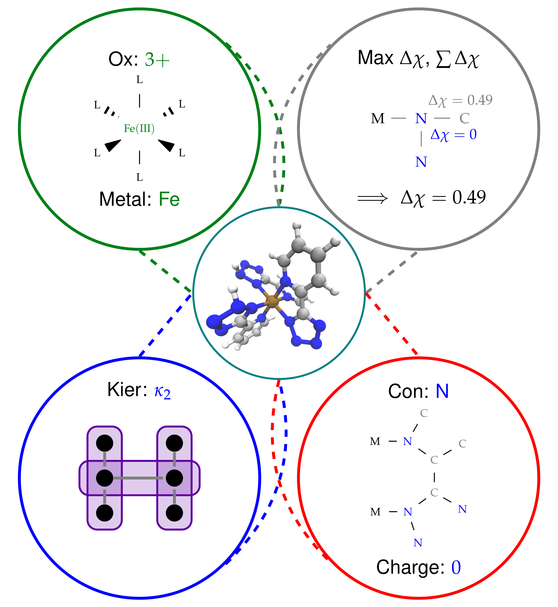
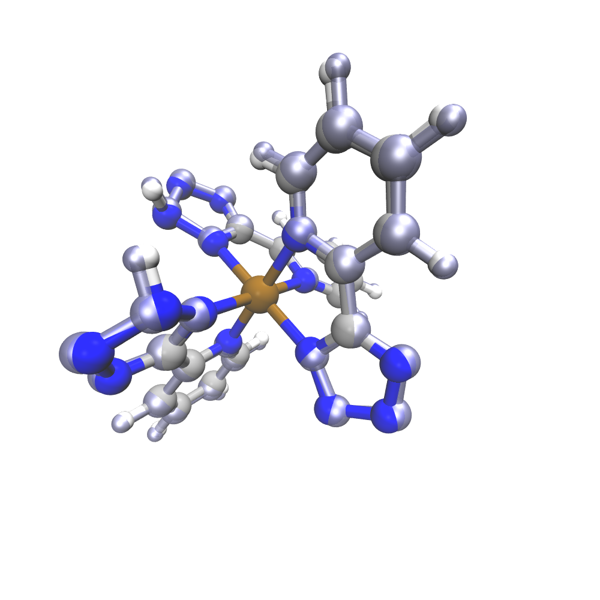

We have recently implemented an artificial neural network (ANN) in molSimplify – you can read all about it in our recent Chemical Science paper [here](http://dx.doi.org/10.1039/C7SC01247K), but the basic principle is easy to understand. We first collected information from 2700 transition metal complexes that we optimized using DFT, and described them using a set of descriptors that we selected using LASSO regression. Our choice of descriptors includes information about the immediate environment around the transition metal center, for example the identity of the connecting atom and the difference in electronegativity between the connecting atom and its immediate neighborhood, as well as more general descriptors of ligand shape and size (for example, the Kier index [1]):





 


Achieving the right mix of descriptors is tricky and work finding an optimal balance between information content, transferability and correlation with transition metal complexes is ongoing research in the group. Using a vector of these descriptors, we were able to predict a range of DFT properties of the resulting complexes. However, since none of our descriptors require knowledge of the exact optimized geometry beforehand, we are able to compute them for any hypothetical complex, and we can (and do!) use this information to help molSimplify make better initial structures. In particular, our ANN can make predictions about bond lengths at the structure generation stage, giving starting guesses that are closer to the DFT-optimized values. This is supplemental to our database approach, where if a ligand/spin/oxidation state is not present in the database, the ANN predicted value can be used in its place.


The ANN in molSimplify is automatically activated for any suitable complex – which is limited at this stage to octahedral first-row transition metal complexes (Cr to Co in (II) and (III) oxidation states and Ni(II) only) with symmetric axial and equatorial ligands. In order to demonstrate, let’s consider an Fe(III) complex with an arbitrary ligand from a SMILES string, `c1(nn[nH]n1)c1ncccc1`. We specify the connecting atoms for this bidentate ligand to be nitrogen atoms with the line `–smicat 8,6`. You could enter this in the command line or through the GUI, but here we’ll provide an input file that has all the work done for you already. Simplify download it and invoke


`molsimplify -i ann_tutorial.in`  
 


When using the ANN, it is important to provide a full specification (i.e. oxidation state and spin) or the complex is ambiguous and the ANN will not activate. Looking at the console output, we see:


``` 
******************************************************************
************** ANN is engaged and advising on spin ***************
************** and metal-ligand bond distances    ****************
******************************************************************
You have selected a low-spin state, multiplicity = 2
('delta is', array([14.74659983]), ' spin is ', False)
ANN predicts a spin splitting (HS - LS) of 14.75 kcal/mol at 20% HFX
ANN low spin bond length (ax1/ax2/eq) is predicted to be: 2.03 /2.01 /2.00 angstrom
ANN high spin bond length (ax1/ax2/eq) is predicted to be: 2.10 /2.08 /2.22 angstrom
distance to splitting energy training data is 4.67
ANN results are too far from training data, be cautious
ANN predicts a HOMO value of -16.11 eV at 20% HFX
ANN predicts a LUMO-HOMO energetic gap value of 3.89 eV at 20% HFX
ANN results should be trustworthy for this complex 
distance to HOMO training data is 0.55
distance to GAP training data is 0.32
*******************************************************************
************** ANN complete, saved in record file *****************
*******************************************************************
```


Taking this line by line, we are informed that we have selected a doublet state, and we get a measure of how close this compound is to our training data (measured by the Euclidean norm in our descriptor space). We have observed that the ANN results are typically reliable if this distance is <1-2, and less so otherwise. The ANN trust distance of 4.67 indicates that we believe the predictions for the complex are a little far so should be treated with caution.


The next few lines advise on ground state spin energies. In this case, the ANN predicts a low-spin ground state for this complex (which is verified by DFT), and gives an estimate of the spin splitting magnitude (based on B3LYP). The next line contains the predicted Fe-N bond length of 2.03 Å. 


We can easily generate both complexes by modifying the spin line in the `ann_tutorial.in` to say:


`-spin 2 6`


Running again, we get two different structures for the two spin states. The low spin state has the bond length from before, 2.03 Å, but the high spin result has a bond length of 2.14 Å. Plotting these two together, with the HS geometry in blue overlay, shows the difference:





When we run DFT on the these two geometries (at doublet and sextet spin respectively), we observe the final calculated bond lengths are 2.01 Å and 2.16 Å, which follow the trends of our predictions very well. In general, for complexes with training distances < 1.0, we observe an approximate average error of 0.03 Å across different metals and spin states, which rises to 0.1Å for compounds futher from our training data. Still, this gives us a good starting point for geometry optimization, tailored to the target spin and oxidation state (and HFX fraction!) used.


If you ever don’t want to use the ANN for a given complex, you can disable it by passing the optional `-skipANN True` flag to molSimplify.


[1] Kier, L. B. (1985), A Shape Index from Molecular Graphs. Quant. Struct.-Act. Relat., 4: 109–116. doi:10.1002/qsar.19850040303


