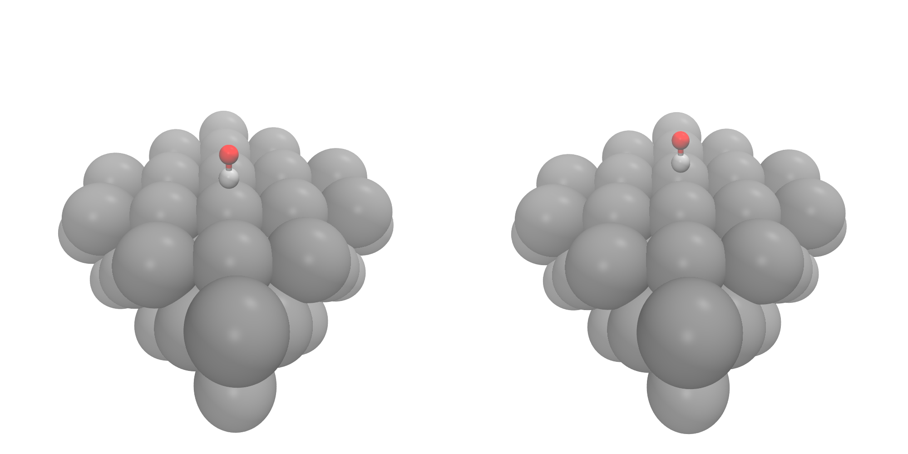
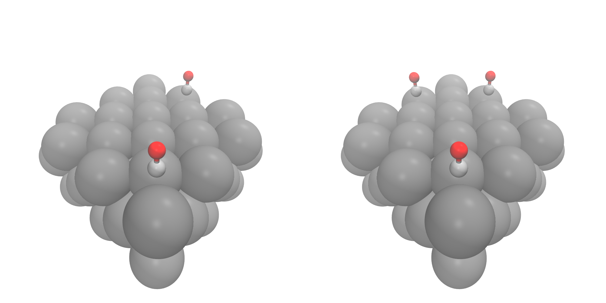
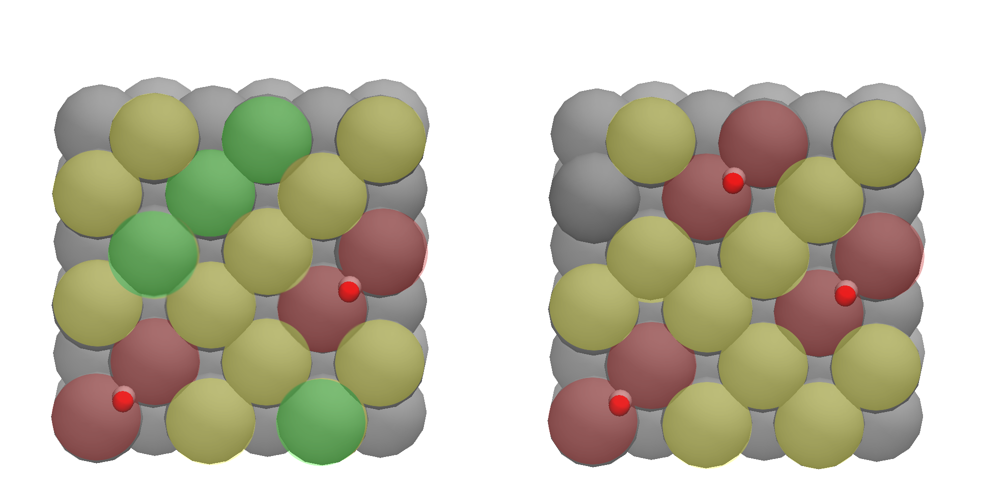
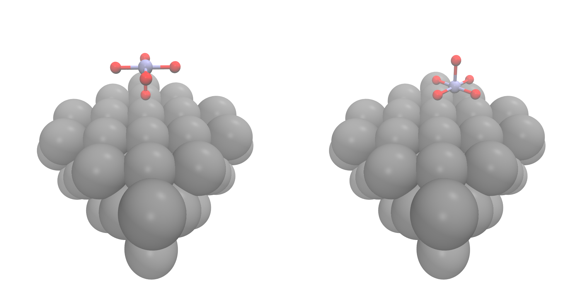
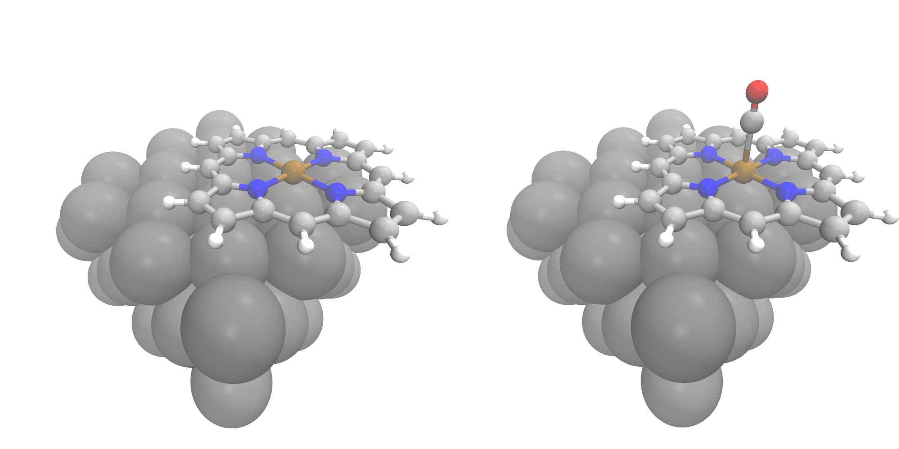

In this follow up to our first [tutorial](../2016-12-02-molsimplify-tutorial-2-slab-builder/) , we are going to describe how to use molSimplify to control the placement of molecules, atoms and complexes on surfaces. We’ll assume you have followed the last tutorial and have a file containing the xyz coordinates of your surface (you might want to relax the surface geometry in a quantum chemistry code first, depending on your usecase). If you don’t have one handy, we’ll provide one here ([slab.xyz](slab.xyz)). You will also need the three cell vectors that describe the periodicity of your slab. If you generated your slab with molSimplify, they will be printed at the end of generation, and also in your quantum chemistry input file. Finally, you’ll also need some molecules to place on your surface. Here, we will start with a simple CO molecule ([co.xyz](co.xyz)). For more complex placement, we will use two different complexes – a tetrahedral pyramidal MnO5 complex ([mno5.xyz](mno5.xyz)) and an iron porphyrin ([fepo.xyz](fepo.xyz)) complex. You could easily generate these two structures in molSimplify, for example with 

`molsimplify –core mn –lig O –ligocc 5 –coord 5 -geometry spy`

`molsimplify –core fe –lig porphyrin –ligocc 1 –coord 4 -geometry sqp`

but we have provided them all in `geos.zip`. You can also generate a slab and do placement at the same time, by combing the calls in this tutorial with the previous one. Before we begin, please ensure that you have [slab.xyz](slab.xyz), [co.xyz](co.xyz), [mno5.xyz](mno5.xyz) and [fepo.xyz](fepo.xyz) in your current directory (or edit our input files to point to the correct path). To run our input files, invoke them with

`molsimplify –i [input file name]`

First, let’s place a CO molecule on the surface. Our most basic call to the placement module must specify 1) a path to our target molecule 2) how to place it and 3) what attachment points on the object and surface to use. Here, we set `-target_molecule` to point to [co.xyz](co.xyz), and selected that we want a centered placement, specified by the `-align_method center` (with C-connecting to one surface Pd). The required input file is given as [1co.in](1co.in), and this produces the left pane of Figure 1. The slab builder will write the loaded cell and input files to a folder called loaded in the default molSimplify run directory (control this with `-rundir YOUR/PATH`).

Figure 1: Centered and staggered placement options

If we would like to have staggered placement on the surface between a number of different sites, we can control this by giving the `-num_surface_atoms` argument, which tells molSimplify how to share the placement between objects. Giving a value of 2 leads to a bridging placement, shown in right pane of Figure 1 ([stag\_1co.in](stag_1co.in)). We can also add multiple copies of the same adsorbate by changing the `-num_placements` flag, which is set to 2 and 3 on the left and right panes in Figure 2, and given as [stag\_2co.in](stag_2co.in) and [stag\_3co.in](stag_3co.in) respectively.

Figure 2: Multiple placement options

Note how molSimplify attempts to space the adsorbates out as much as possible, paying attention the periodic nature of the boundaries. The placement will be done sequentially in a greedy way, by seeking additional placement sites that are not directly adjacent to occupied sites. The allocation of the third molecule can be seen in Figure 3, where yellow circles denote sites adjacent to occupied sites (red), and green circles denote free sites. Any further placements will be distributed onto the yellow sites.

 

Figure 3: Multiple placement logic illustration

CO is a pretty easy molecule to place, so let’s try something else. We can use molSimplify to control the exact placement by giving atomic indices with the `-object_align` flag. To illustrate, let’s place an MnO5 complex on the surface in two different ways. First, consider (the somewhat unlikely) case of the single axial oxygen coordinating with the surface, which is index 6 in [mno5.xyz](mno5.xyz), and gives the left frame of Figure 4. We can get a more natural configuration by giving indices 2, 3, 4, 5 instead, along with increasing the number of surface sites to 4 to indicate the number of locations oxygen binds:

Figure 4: Placement by atomic indices

The input files are [mno1.in](mno1.in) and [mno4.in](mno4.in). In these cases, we have also provided a specified vertical height of 2.0 Å with the `-align_dist` argument. If we don’t provide a distance, the code will use the covalent radii of the atomic species in question. Since we can’t guarantee that an arbitrary distance is achievable for a given arrangement of atoms, the code will try to position, rotate and distort (using a force field)  the molecule to get as close to the target distance as possible.

Finally, we’ll demonstrate our layered placement approach. Start by placing a porphyrin on the surface – this is done by using `-object_align Fe`, referring to the metal center in the porphyrin. This gives the left pane of Figure 5 ([fepo.in](fepo.in)). In order to get the right pane of Figure 5, find the newly created cell, move it to the working directory, and rename it `loaded_fepo.xyz` – or you can use the one we have [provided](loaded_fepo.xyz). Now, we’ll give this file as the unit cell, and [co.xyz](co.xyz) as the object to place, with the `-surface_atom_type Fe` and `-object_align C` arguments. This gives us an easy way to exploit all of the features in the placement module to build arbitrarily complex structures in a layer-by-layer manner! The input file is [loaded\_fepo.in](loaded_fepo.in) – be sure to check that all of the file locations match the paths in that file (it expects everything to be in the running directory).

Figure 5: Layer-by-layer construction

We’ve only touched on a small set of the possible options that are available for controlling placements – other options include setting coverage fractions, controlling rotation on the surface precisely, as well as controlling the number of atoms to freeze in the input file, and more besides!

