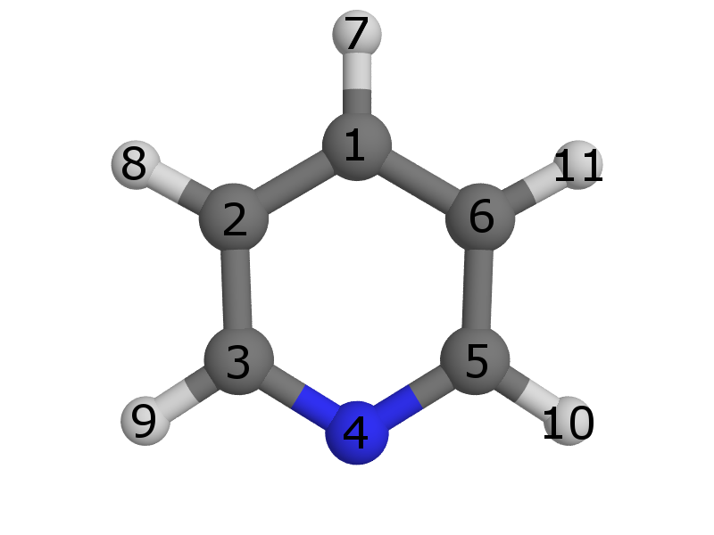

One of the most common ways in which we can think about improving on a given molecule, whether it is an inorganic catalyst or even an organic drug, is to explore small functionalizations of the basic structure – adding small new groups or replacing existing ones while keeping the core intact. molSimplify supports replacing ligands in already-built inorganic complexes using the [custom core](../2016-12-25-molsimplify-tutorial-3-custom-core-functionalization/) functionality. However, often we might want to explore a large number of simple functionalizations easily and automatically. Here, we will introduce the latest feature of molSimplify: inline ligand decoration. This feature will allow us to add small functional groups to existing ligands while we build the structure.

For this tutorial, we will consider modifying the properties of an Fe complex, dichlorotetrakis iron, by functionalization of the pyridine as an example. We'll use this experimentally available heteroleptic complex because it will help show how to match ligands with decorations. We're going to use the command line interface since this feature is not available in the GUI. Once molSimplify is [set up](../2021-10-27-installing-molsimplify/), the first step is to build the basic complex. Since we are interested in spin splitting energy, we'll need to make a high and low spin version of this complex. This is easily done as follows:

`molsimplify -core Fe -lig pyridine chloride -ligocc 4 2 -spin 1 5` 

You can see that the `-ligocc` argument indicates that we want two chloride groups and four pyridines, while the list of low (singlet, multiplicity=1) and high (quintet, multiplicity=5) spins tells molSimplify to generate geometries for both using our  [artificial neural network (ANN)](../2017-02-27-molsimplify-tutorial-5-using-machine-learning-build-better-structures-0/). Speaking of the ANN, we notice that it gives a predicted HS ground state with a spin splitting energy of -9.3 kcal/mol, and notice that the distance to the training data is 0.85, which indicates this result should be used with caution (this is mainly due to chloride groups, which tend to dissociate in gas-phase DFT optimizations and so are sparse in our data). We'll end up with geometries for both spin states. We note that molSimplify will assumes a II oxidation state for iron by default. If we want to look at redox potentials as well, we will also need the oxidation state III versions, which we can obtain with the following slight modification:

`molsimplify -core Fe -lig pyridine chloride -ligocc 4 2 -spin 2 6 -oxstate III`

Remember to choose correct spin multiplicities to account for the one fewer electrons relative to Fe(II)! We see the ANN again predicts a HS ground state with a splitting energy of -6.6 kcal/mol. If we run single point calculations on these structures in Terachem, we find spin splitting energies of -20 kcal/mol and -13 kcal/mol respectively – remember that our ANN predicts properties of optimized structures, and we use the single point calculations here because they are much faster, but cannot be relied upon in general. We will assume that it suffices here and that we can assume the complex is high spin in general. We find that the high spin to high spin ionization potential based on single points is 5.2 eV. Let’s see if we can alter this value by functionalizing our ligand.

**Decorating a single site in a single ligand:**

Consider our pyridine ligand. We are showing an eample that shows atom indices. This view was produced in pymol, where you can view atom indicies by setting the label to atom index:

Let us replace the hydrogen in position 7 with a chloride group. We have implemented a simple syntax to control exact placement, and it works as follows. We need to give two arguments: a SMILES string describing the functionalization, and an index telling us where to place the group. The first atom in the SMILES string will be the new joining atom, and the atom given in the decoration index will be the atom to replace:

`molsimplify -core Fe -lig pyridine chloride -ligocc 4 2 -decoration Cl -decoration_index 7`

We notice that the decoration ends up on the first ligand that we listed (pyridine).

**Decorating multiple sites in a single ligand:**

We can also add multiple groups. We’re going to add a CO group at the 9 position as well. We can do this by providing a pair of SMILES strings and a pair of indices. In order to avoid ambiguity in the case with multiple ligands, you need to group these with brackets:

`molsimplify -core Fe -lig pyridine chloride -ligocc 4 2 -decoration [Cl,CO] -decoration_index [7,9]`

We can see that our decoration is applied to all the pyridine ligands. Let's see how this functionalization performs, generating both ox II and III complexes in the same way as before and computing their properties. We find that the addition of these groups raises the ionization potential by about 1 eV, up to 6.13 eV (based on high spin to high spin II -> III transition).

**Decorating a single site in multiple ligands:**

Additions to multiple liga1nds can be done by giving a list of SMILES and locations, separated by a space. We will demonstrate how this would work with the following example, where we have given 3 different pyridine molecules as ligands:

`molsimplify -core Fe -lig pyridine pyridine pyridine chloride -ligocc 1 1 2 2 -decoration Cl CO -decoration_index 7 9`

The three repeats of pyridine, and the three matching `–ligocc` values, are needed because we have three different types of pyridine. This will produce one pyridine with the Cl decoration at position 7, one pyridine with the decoration at position 9 and 2 pyridines with no decoration, which gives the following result:

I hope you found this structure building tutorial helpful. If you have any questions about this tutorial or molsimplify, please [email us](mailto:molsimplify@mit.edu?subject=molsimplify%20ligand%20functionalization%20tutorial%20questions)!

