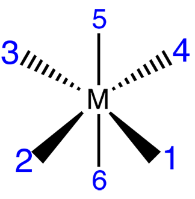
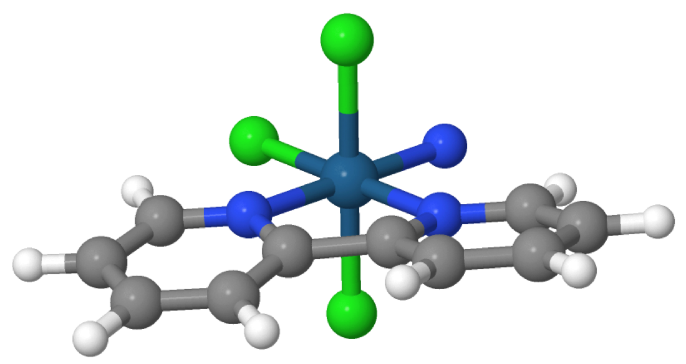
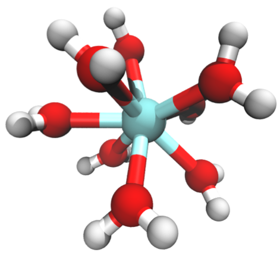
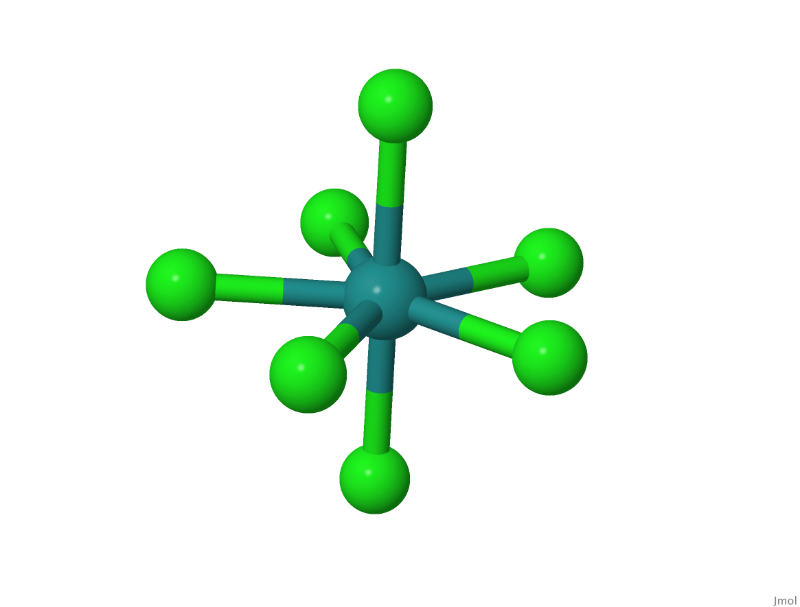

So far in our molSimplify tutorials, we have been focusing on generating structures for first row transition metal complexes. While the study of such complexes is certainly crucial for research areas such as catalysis and pharmacology, it is imperative that we also include heavy metal complexes in our investigations in order to motivate rapid advancement of inorganic chemistry research. Hence, today in our tutorial we will show how to use molSimplify for generating structures of second and third row transition metal complexes.


The first structure that we will learn to generate today serves as an excellent example of a higher period transition metal complex with a vital application in medicinal inorganic chemistry. It’s an Osmium(VI) nitrido compound with the formula OsN(2,2′-bipyridine)Cl3 that exhibits anticancer properties.


You can use either the command line interface or the input-file-based generation system for generating such structures. The arguments for both the options are essentially the same. Let’s go through each step to help you through the process.


**1) Visualizing the geometry** 


Before you enter the input arguments, you will have to visualize the complex geometry in order to take note of the atom indices where you would want to place specific ligands in order to generate your desired coordination environment around the metal center. In order to do that, open the GUI interface and select your desired metal core (in this case Osmium) and the associated geometry (in this case, octahedral). Next, click on the View geometry button. On your screen, you should see an image like the one shown below.





Take note of the atom indices so that you can later specify where each ligand’s connecting atom is to be attached to the metal center.


**2) Writing the input file**


Now, we must write an input file which gives molSimplify the necessary information for structure generation. The contents of a sample input file (input.in) are shown below.

```
-core Os
-geometry oct
-coord 6
-lig bipy chloride [N] chloride
-ligocc 1 1 1 2
-smicat [1]
-oxstate 6
``` 


Let’s go through each argument one by one. The `–core` argument specifies the metal core as Osmium and the `–lig` argument specifies the ligands as bipyridine, chloride and nitrogen. The `–ligocc` argument specifies the frequency of the ligands in the complex. Note that the `–ligocc` values correspond to the order of ligands given in `–lig` argument. The ligands’ connecting atoms will be attached to the metal center in the order specified in `–lig` through 1 to 6 (as seen in the image produced from View geometry option in GUI). The `–oxstate` specifies the oxidation state of the metal. The -smicat argument provides a list of indices (1-indexed) for the SMILES atoms that coordinate the metal. In this case, [1] is provided since the ligand is a single element.


**3) Generating the structure**


To generate the structure, enter the following command in terminal:


`molsimplify –i input.in`


Alternatively, you can also generate the structure by specifying minimal arguments in the command line interface as:


`molsimplify -core Os -lig bipy chloride '[N]' chloride -ligocc 1 1 1 2 -smicat '[1]'` 


The .xyz file for the structure will be generated and saved in the Runs directory of molsimplify. The final structure for OsN(2,2′-bipyridine)Cl3 generated by molSimplify is shown below.





So now you know how to generate a third row transition metal complex using molSimplify. That’s great! What makes Osmium(VI) nitrido compounds even more interesting than the more commonly known Platinum anticancer drugs such as cisplatin is that Osmium compounds were always notorious for their toxicity and now they serve as a promising candidate for a chemotherapeutic agent that could even offer advantages over the generic platinum based anticancer drugs! It was actually the effects of ligand functionalization in these Osmium complexes on cellular responses that lead to this change in our perception of the utility of Osmium in medicinal chemistry. So now you can also use other advanced features of molSimplify such as custom core or ligand decoration to generate a variety of structures with ligand functionalization. More details on this functionality of molSimplify are provided in [Tutorial 3](../2016-12-25-molsimplify-tutorial-3-custom-core-functionalization/) and [7](../2017-10-02-molsimplify-tutorial-7-easy-ligand-functionalization-molsimplify/).


**What more can we do?** 


When we venture into the field of higher period transition complexes, we must also start to think about coordination numbers higher than 6. Due to the larger size of late transition metals, their complexes tend to have higher coordination numbers like 7 or 8. Using molSimplify, you can generate such structures with higher coordination numbers and geometries such as square anti-prismatic.


Let’s generate a simple molecule like Zr(H2O)8 with a square anti-prismatic geometry. The steps for generating the structure are the same as those for the Osmium compound. In fact, the input arguments are even simpler. You can type the following command in the command line interface to generate an .xyz file for Zr(H2O)8 :


`molsimplify -core Zr -coord 8 -lig water -ligocc 8` 


Similarly, we can also generate a 7 coordinate complex such Ru(Cl)7 by the command:


`molsimplify -core Ru -coord 7 -lig chloride -ligocc 7` 


The structures for Zr(H2O)8 and Ru(Cl)7 generated by these commands are shown below.


       


As you might have noticed, we did not specify the geometry associated with the structure. This is because molSimplify defaults to a geometry of square anti-prismatic for coordination number 8 and pentagonal bipyramidal for coordination number 7.


By the end of this tutorial, you should be able to use molSimplify to generate 2nd and 3rd period transition metal complexes with higher coordination numbers like 7 or 8.


We hope you found this tutorial helpful. If you have any questions about this tutorial or molsimplify, please [email](mailto:molsimplify@mit.edu?subject=mol%20simplify%20tutorial%208%20questions) us!


