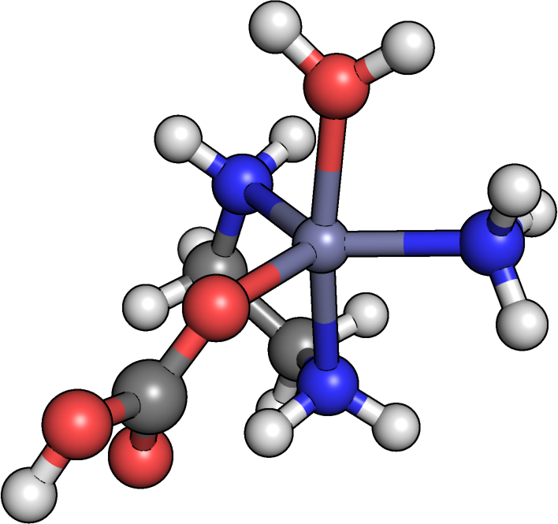

In this tutorial, we will show how to replace multidentate ligands in a prebuilt complex. This feature, which facilitates screening of diverse catalyst scaffolds, was recently added to molSimplify.

Today’s example involves the following Zn(II) intermediate in a model carbonic anhydrase catalytic cycle, stored as zncat in our Cores subdirectory:

Suppose that we would like to increase the chain length of one of the ethylenediamene (en) ligands, i.e., replace it with a 1,3-diaminopropane (SMILES: NCCCN) ligand. As with regular custom core functionalization, we first need to identify the connecting atoms of the original en ligand. As shown above, you can use your favorite visualization package such as Avogadro or PyMol, and we see that these are atoms 4 and 5. Alternatively, if you have PyQt5 installed, you can also click "draw ligands" from the main GUI window, or run `molsimplify -core zncat -drawmode` (also newly implemented) from the command line to get a vector graphic.

Here, we’re going to use the command line interface, but this feature is also available in the GUI (see the previous tutorial on custom core functionalization). The syntax is as follows:

`molsimplify -core zncat -ccatoms 4,5 -lig NCCCN –ligocc 1 -smicat "1,5" -replig true -oxstate II -spin 1 -geometry tbp`

The complex building and functionalization routines have been merged recently in an extensive reorganization of the code. Thus, the command above now does what we might intuitively expect: first removing the specified ligand, and then placing the new ligand as though it were building a complex from scratch.

The oxidation state and spin are included only to generate the correct quantum chemistry input, and do not otherwise affect the generated structure because we are treating the rest of the complex as a fixed custom core.

Another new, useful feature is a general distance geometry conformer search routine to automatically locate suitable conformers of SMILES ligands, such as the one above. A SMILES to 3D routine (e.g., in Avogadro) would create a straight-chain conformer, which is unsuitable for chelation. Our conformer search instead yields an appropriate cis conformer, as shown above.

The product should look like this, although your results may vary slightly because the conformer search is partially random:

The replacement ligands can also be of lower denticity. Suppose we instead want to replace en with an NH3 and an OH2 ligand:

`molsimplify -core zncat -ccatoms 4,5 -lig ammonia,water -ligocc 1,1 -replig true -oxstate II -spin 1`

The product should look like:

Note also that the ordering of connection atoms is preserved: the ammonia ligand is added to where atom 4 was previously, and the water ligand is added to where atom 5 was previously.

I hope you found this tutorial useful. If you have any questions about this tutorial, please [email](mailto:molsimplify@mit.edu?subject=mol%20simplify%20tutorial%209%20questions)  us!

