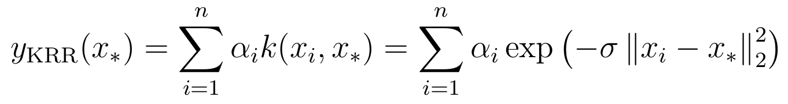
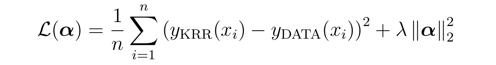

In the second part of our tutorial, we will demonstrate how to use R to conduct kernel based prediction of atomization energies based on RACs. You’ll need `QM9_descriptor_file.csv`, which we prepared using molSimplify in the previous [tutorial](../2018-02-20-qm9-kernel-models-using-molsimplify-racs-and-r-part-1/) and also provide [here](QM9_descriptor_file.csv). We’ll use R to conduct a simple KRR model using a radial basis function kernel – we recommend the excellent, free  [RStudio IDE](https://www.rstudio.com/) but a similar procedure could be followed in your favorite language. In particular, we’ll use the [CVST package](https://CRAN.R-project.org/package=CVST) to train our model and [DRR](https://CRAN.R-project.org/package=DRR) to conduct accelerated cross validation. Both packages are available from CRAN and depend on [kernlab](https://CRAN.R-project.org/package=kernlab]).


We’ll use 4000 points for training and the remaining ~131k molecules as a test set and construct a model the following general form:





We use the same, slightly uncommon form of the kernel (sigma being the inverse width) as in the [kernlab implementation](https://cran.r-project.org/web/packages/kernlab/vignettes/kernlab.pdf). The sum here runs over the n=4000 training examples. Effectively, we are performing a non-linear transformation from our space of descriptors into to a high-(in this case, infinite-)dimensional space of transformed features. The kernel function returns the inner product in this space, and as can be seen from the above, the influence of each training points is controlled by the Euclidean distance between the training point and the query point. The rate of influence decay with distance is controlled by the hyperparameter σ. The weights α are learned during training, where we seek to minimize a loss function along with a regularization term controlled by λ:





While the intention of this guide is not to review KRR methods, we'll make a brief comment that the model complexity is controlled by n, the number of training points used, and solving for the model coefficients typically involves the (approximate/blockwise) inversion of the nxn kernel matrix, and so in general shows poor scaling with large numbers of training examples.


Again, we have provided a full script that will allow you conduct the calculation (`simpleKRR.R`), and we’ll skip some of the boilerplate and focus on the key lines. The first step is to read in the data and partition into test and training sets:


```
## load the file prepared in part 1
data <- read.csv("QM9_descriptor_file.csv",header=TRUE,row.names = 1)
## choose number of training points
training_examples <- 4000
## partition the data
train_ind = sample(nrow(data),training_examples)
df_test = data[-train_ind,]
df_train=data[train_ind,]

```
The next step is to apply normalization to the data. We’ll follow best practice and normalize (to mean 0 and variance 1) using the training data only:


```
## normalize data
df_train <- scale(df_train,center=TRUE,scale=TRUE)
train_center <- attr(df_train, 'scaled:center')
train_scale <- attr(df_train, 'scaled:scale')
df_train <- as.data.frame(df_train)
# note: best practice, only use training scales!
df_test <- scale(df_test,center = train_center,scale=train_scale)

```
The next step is to convert the data to a format CVST understands, and then build the test and training objects:


```
## Load into CVST
x_train <- df_train[,2:ncol(df_train)]
y_train <-  df_train[,'u0']
x_test <- df_test[,2:ncol(df_test)]
y_test <-  df_test[,'u0']
train_data_CVST <-constructData(x=as.matrix(x_train), y=y_train)
test_data_CVST <-constructData(x=as.matrix(x_test), y=y_test)

```
For our first try, we won’t worry about optimizing hyperparameters (σ, λ) and instead simply use some reasonable values:


```

## set up learner
krr_learner = constructFastKRRLearner()   ## Build the base learner
## first time around, don't do CV but use a reasonable kernel:
params_krr = list(kernel="rbfdot", sigma=1E-6, lambda=1E-11,nblocks=4)
```
The `constructFastKRRLearner()` comes from the DRR package and implements fast, divide-and-conquer matrix inversion that will be useful for doing cross validation a little later and is critical if we want to use larger kernel matrices. Now, we can train and test the model. We will convert back to original units (Ha) and then further convert units to kcal/mol, and print the results:


```

## train model
krr_trained = krr_learner$learn(train_data_CVST, params_krr)
## use model for prediction
test_krr = krr_learner$predict(krr_trained, test_data_CVST)
train_krr = krr_learner$predict(krr_trained, train_data_CVST)
pred_test_y_krr =  as.vector(test_krr*train_scale["u0"] +  train_center["u0"])
pred_train_y_krr = as.vector(train_krr* train_scale["u0"] +  train_center["u0"])
pred_test_y_krr = as.vector(test_krr*train_scale["u0"] + train_center["u0"])
pred_train_y_krr = as.vector(train_krr*train_scale["u0"] + train_center["u0"])
test_target = as.vector(test_data_CVST$y*train_scale["u0"]  +  train_center["u0"])
train_target = as.vector(train_data_CVST$y*train_scale["u0"]  +  train_center["u0"])
## evaluate
train_mse_krr = mse(pred_train_y_krr,train_target)*(HA_to_kcal_mol^2)
test_mse_krr = mse(pred_test_y_krr,test_target)*(HA_to_kcal_mol^2)
train_e_krr =  (pred_train_y_krr - train_target)*HA_to_kcal_mol
test_e_krr =  (pred_test_y_krr - test_target)*HA_to_kcal_mol

```
Running the code produces the followings output:


```

krr train rmse = 10.36 kcal/mol       
krr train MAE = 7.37 kcal/mol       
krr test rmse = 10.98 kcal/mol       
krr test MAE =  7.79 kcal/mol

```
Note that this corresponds to one random sample of 4000 training points and the results might differ a little bit each time the code is run. It would be best practice to run this code multiple times and average the results.


In order to improve the result using cross-validation, we will do a quick 5x5 grid search in (σ, λ) around our initial guess, using the following code:


```
## set parameters for CV
params_CVST_krr = constructParams(kernel = 'rbfdot',sigma=10^(seq(-8,-4,length=5)),lambda=10^(seq(-12,-8,length=5)),nblocks=4)
## conduct 10-fold CV
CV_ret_krr <-  CV(data= train_data_CVST, learner = krr_learner,params =  params_CVST_krr,fold = 10, verbose = TRUE)
## capture the optimal parameter choices
params_krr <- CV_ret_krr[[1]]

```
These lines define our grid of hyperparameter values and conduct 10-fold cross-validation to choose the optimal combination. In general a much larger field of hyperparameter values should be considered and the grid should be iteratively refined, but we have preemptively narrowed down the range in order to reduce run time. Using the new `params_krr` in the code above (the provided script does both) yields the following results for a typical run:


```
krr train rmse = 9.53 kcal/mol       
krr train MAE = 6.68 kcal/mol       
krr test rmse = 10.42 kcal/mol       
krr test MAE =  7.20 kcal/mol

```
We will warn that conducting detailed cross-validation is expensive, and adding the above lines of codes decreases the run time from seconds to minutes on a standard workstation.
**Scripts and files:**

[simpleKRR.R](simpleKRR.R)

[QM9_descriptor_file.csv](QM9_descriptor_file.csv)
