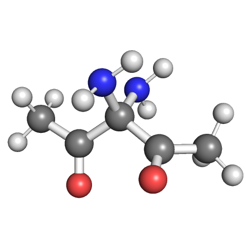

molSimplify comes with about 160 built in common ligands and a nifty [decoration manager](../2017-10-02-molsimplify-tutorial-7-easy-ligand-functionalization-molsimplify/) to modify them. However, this cannot hope to address the scope of possible ligands, so we also support providing your own ligands as SMILES or in 3D molecule formats.  Let's make a triple bidentate complex with three different ligands, none of which are available by default in molSimplify and each from a different source, to illustrate this. First, make sure you have an updated version of molSimplify, [ideally from conda](../2021-10-27-installing-molsimplify/).

**1) Directly from SMILES string**

The first ligand we will consider is an acetate ion, with SMILES `CC(=O)[O-]`. We'll assume this coordinates in a bidentate fashion using both oxygens, i.e. atom numbers 3, 4 – counting from the left, as SMILES strings are parsed left to right and hydrogens added later. The homoleptic complex with this ligand can be made as follows:

`(molsimplify)$ molsimplify -lig "CC(=O)[O-]" -ligocc 3 -smicat 3,4 -skipANN True`

Notice how we call for 3 copies of the ligand and give the correct connection points. Also that we have not given a metal, spin or oxidation state – Fe(II) is assumed by default but can be set easily. If you provide a SMILES string, molSimplify will automatically look for a suitable conformer for coordination with the target complex.

**2) Adding a SMILES string to the database**

The next ligand we consider is a nitrogen-substituted version of acetylacetone (ACAC), with the SMILES string `O=C(C)C(N)(N)C(=O)C` and connection atoms 1, 8.  Let's call it NACAC.  If you use a particular SMILES string often and want to add it to the built in database, you can do this easily from either GUI or, in the most recent release, from the command line. To use the GUI, select “add to local DB” and enter the information as below:

alternatively, this can be achieved from the command line:

`(molsimplify)$ molsimplify -ligadd "O=C(C)C(N)(N)C(=O)C" -ligname NACAC -ligcon 1,8 -skipANN True`

Note that if this the first time that you are adding a custom element to the database, you'll be prompted to list a path to a local directory where the custom data can be kept (to prevent trying to write to the conda package). In most cases your current directory will do fine, or something like `/Users/user/molSimplifyCustomData`. The path should be specified as a global path in quotation marks. If you ever want to change this directory, you can edit the configuration under `~/.molSimplify`.

The corresponding homoleptic complex and be built as follows:

`(molsimplify)$ molsimplify -lig NACAC -ligocc 3 -skipANN True`

**3) Adding a mol or xyz file to the database**

Sometimes SMILES are not convenient and one would rather use a specific 3D geometry. As an example, our final ligand will be glycinate (2-aminoacetate), which we will import from the standard `.mol` file `gly.mol` (provided below). The oxygen atoms are in positions 3, 4. This can be added to the ligand database in the same way as before (via the GUI) or with

`(molsimplify)$ molsimplify -ligadd gly.mol  -ligname glycinate -ligcon 3,4 -skipANN True`

Make sure the file gly.mol is available in the folder where you run the command.  The call to generate the homoleptic is exactly as before:

`(molsimplify)$ molsimplify -lig glycinate  -ligocc 3 -skipANN True`

Note that in this case the exact provided 3D geometry will be used and molSimplify will not attempt to find a suitable conformation for you, so make sure any 3D geometry you supply is a reasonable ligand!

 

**4) Putting in all together**

We can freely mix and match the above approaches. The hetroleptic complex with one copy of each ligand can be created with:

`(molsimplify)$ molsimplify -lig "CC(=O)[O-]" NACAC glycinate -ligocc 1 1 1 -smicat 3,4 -skipANN True`

Two notes:   we need to specify `-ligocc 1 1 1` to tell molSimplify to use one copy of each ligand and we still need to provide the connection atoms for the SMILES ligand `CC(=O)[O-]` as it is not stored locally. We use the `-skipANN` flag to skip the loading of our machine learning models.

# Files

[gly.mol](./gly.mol)
