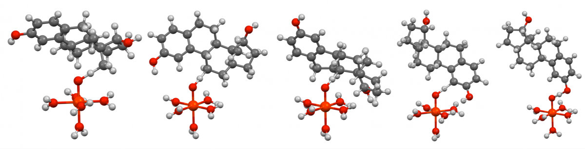

**Note:** TS generation is not currently working as of 10/18/19. Check back here for updates later.

**Introduction**

Today we're going to teach you about new features in molSimplify that make it possible to generate transition states in addition to intermediates for inorganic complexes. Currently, molSimplify supports two reaction types: PCET and C=C bond insertion. We are working on expanding the capability and if you have any reaction types that you wish molSimplify to incorporate, please email [molsimplify@mit.edu](mailto:molsimplify@mit.edu)!

The transition state (TS) is the first-degree saddle point, the highest point along one and only one dimension on a multi-dimensional surface, on the potential surface. An example of one such point is shown in the figure below:

TSs of chemical interest are usually the highest energy point along a reaction coordinate that connects reactants to products, i.e. a metal-oxo complex and a substrate containing a reactive C-H bond to a metal-hydroxo complex and a substrate radical in a proton-coupled electron transfer (PCET) reaction: 

To find a transition state, many path-oriented search methods can be employed such as a coordinate scan or nudged elastic band. However, these methods usually require energy evaluations at various structures along the reaction coordinates requiring significant computational resources before precise TS optimization and characterization can be performed. Another method to generate an initial structural guess for TS optimization is to place the substrate of interest near the metal site of the complex and iterate by hand with trial and error. This method requires extensive labor and experience with similar reaction types and substrate-complex combinations and makes it difficult to automate TS discovery in virtual high-throughput screening.

molSimplify provides an alternative method to generate the initial structure for TS optimization that is nearly cost-free, command-line enabled, and, as with intermediate complexes, the approach is pretrained to density functional theory(DFT)-optimized TS structures. Currently, molSimplify supports two reaction types: PCET and C=C bond insertion. We are working on expanding the capability and if you have any reaction types that you wish molSimplify to incorporate, please email [molsimplify@mit.edu](mailto:molsimplify@mit.edu)!

 

**Procedure**

In this tutorial, we will attempt the generation of the TS structure for PCET or C=C bond insertion between the substrates, cyclohexene and estrogen, and a metal-oxo complex, 3[FeIV(O)(H2O)5]2+.

First, we consider the iron-oxo complexes and the substrates separately. The ground state (GS) geometry of the iron-oxo complex can be generated using the usual GS generation routine in molSimplify ([see Tutorial 1](../2016-06-18-molsimplify-tutorial-1-structure-generation/)) using the command line: 

`molsimplify -core fe -lig water,oxo -ligocc 5,1 -oxstate 4 -spin 3`

The structure is shown below.

Another way to generate the metal-oxo complex of interest is by loading the structure of the catalyst of your interest directly with an xyz file (e.g., named your\_catalyst.xyz) using: 

`molsimplify -core your\_catalyst.xyz -lig oxo -ligocc 1 -oxstate 4 -spin 3`

Because this part of the structure generation employs the usual GS generation routine, all functions to decorate the GS structure are available, i.e. ligand decoration ([see Tutorial 7](../2017-10-02-molsimplify-tutorial-7-easy-ligand-functionalization-molsimplify/)) and custom core ([see Tutorial 3](../2016-12-25-molsimplify-tutorial-3-custom-core-functionalization/)).

To differentiate between a usual GS and a TS structure generation, we use the `-tsgen flag` to turn on the TS routine. The substrate to be activated can then be specified using the flag -substrate, i.e. `-substrate cyclohexene` (or `-substrate estrogen`). Because there are more than one hydrogen atoms that can be transferred to the iron-oxo complex, we use the `-subcatoms` flag to specify which hydrogen we want to activate (start counting at 0). The acceptor ligand in the iron-oxo also needs to be specified as there are multiple basic sites in 3[FeIV(O)(H2O)5]2+(although the oxo ligand is much more basic than the H2O ligands). `-mlig` is used to specify which ligand in the metal-oxo complex the substrate is attached to (-mlig oxo  in this case). Following the assignment of mlig, the specification of which atom(s) within a polyatomic ligand the substrate should attach to (i.e, -`mligcatoms 0`) is required.

In summary, a TS structure of 3[FeIV(O)(H2O)5]2+abstracting the allylic hydrogen at atom number 9 of cyclohexene (counting starts at zero) is generated by the command line input: 

`molsimplify -core fe -lig water,oxo -ligocc 5,1 -oxstate 4 -spin 3 -tsgen -substrate cyclohexene -subcatoms 9 -mlig oxo -mligcatoms 0`

The generated TS structure is shown below:

There are two additional methods molSimplify identifies the connection atom(s) in the substrate, 1) `-subcatoms all` and 2) *no flag*. The first method is useful when there are multiple hydrogen atoms in the interested substrate and the TS structure for each of them is desirable (i.e., for steric accessibility assessment). molSimplify automatically determines all hydrogen atoms in the substrate and loop through each of them to generate TS structures:

 

`molsimplify -core fe -lig water,oxo -ligocc 5,1 -tsgen -substrate estrogen -subcatoms all -mlig oxo -mligcatoms 0`

 

Selected TS structures activating a primary, secondary, tertiary, aryl C-H, or O-H of estrogen are shown below: 

The other method, without the specification of the subcatoms flag, will prompt molSimplify to automatically search throughout the substrate dictionary for all predefined functional groups and build a TS structure for each of them:

 

`molsimplify -core fe -lig water,oxo -ligocc 5,1 -tsgen -substrate cyclohexene -mlig oxo -mligcatoms 0`

 

(notice the absence of the -subcatoms flag)

The two predefined functional groups for cyclohexene are allyic C-H, which has two values in the substrate dictionary for two enantiotopic TS, and C=C bond, totaling to three separate generations of TS structures. The structures are shown below:

I hope you found this transition state structure building tutorial helpful. If you have any questions about this tutorial or molSimplify, please email [molsimplify@mit.edu](mailto:molsimplify@mit.edu)!

