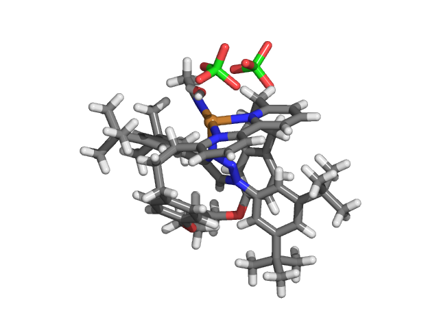
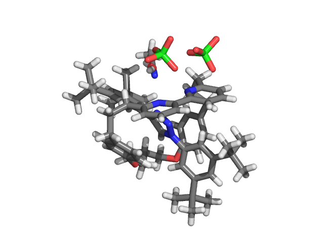
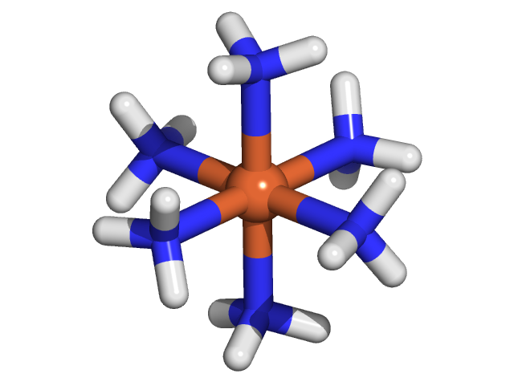

Many of the classes and methods that are used in molSimplify can be incorporated into your own Python scripts. This can be used to extend the geometric manipulation routines in molSimplify to custom use-cases, or to help post-processing the results of DFT calculations. The most useful can be found in molSimplify/Classes and molSimplify/Scripts. If you installed Python from source, you can view these files locally. Alternatively, if you installed molSimplify using conda, these files can be viewed on GitHub at <https://github.com/hjkgrp/molSimplify>.


Broadly speaking, molSimplify is structured around two classes: mol3D and atom3D. Try viewing molSimplify/Classes/mol3D.py using either a Python editor or the GitHub page. This class includes methods to interact with a molecule using a Python interface.


You will want to write your code using a Python editor like Spyder, Geany, Sublime, etc. Save your script as a .py file and place it in the same folder as Rotaxane.xyz and Octahedral.xyz (you can download these files at the bottom of this page). To run your Python script, first the command line and activate your conda environment set up with molSimplify:


```
source activate <Your Environment Name>
```


Then, navigate to the folder and execute the script by typing:


```
python <The Name of Your Script>.py
```
An .xyz file can be imported using Python using molSimplify by typing:


```
# Import both the mol3D and atom3D classes from molSimplify
```

```
from molSimplify.Classes.mol3D import mol3D

# Note that the atom3D class in molSimplify is imported by the mol3D class
```


```
rotaxane = mol3D() # Create an instance of the mol3D class; currently the molecule object is empty

rotaxane.readfromxyz('Rotaxane.xyz') # Now load in the atoms and coordinate information from the .xyz file
```


The mol3D class now stores the molecule that is pictured below, with a copper atom at the center, in brown:





If we want to find metal atoms in this molecule, we can do that using the methods built in to molSimplify. Continue typing:


```
metal_atom_index = rotaxane.findMetal() # Use the findMetal method to identify metal atoms in our molecule

print(metal_atom_index) # Notice that findMetal() returns a list
```


Our molecule contains one metal atom and the index of this metal atom is zero. We can interact with this atom specifically using the atom3D class:


```
metal_atom = rotaxane.getAtom(0) # Returns the zeroth atom as an atom3D object

print(metal_atom.symbol()) # Print the symbol associated with this atom3D object
```


Using the symbol() method we were able to identify this atom as a copper atom. If we want to modify our molecule (by deleting this copper atom for example), molSimplify can do that as well:


```
rotaxane.deleteatom(0) # Use the deleteatom() method to remove the copper atom
```


Finally, we can save our new molecule as an .xyz file:


```
rotaxane.writexyz('No_Metal_Rotaxane.xyz') # mol3D objects can write xyz files using the writexyz() method
```
The resulting molecule (after the copper atom is deleted) looks like this:





The mol3D class also has the capability to check geometry based on a dictionary, with metrics as outlined by our recent publications / preprints. We can use the “IsOct” method to determine if a geometry is truly octahedral. Our default metrics are outlined in the source code, as a method in the mol3D class.


Starting from an empty mol3D object again:


```
from molSimplify.Classes.mol3D import mol3D

rotaxane = mol3D()

rotaxane.readfromxyz('Rotaxane.xyz')

print(rotaxane.IsOct())
```
This does the actual geometry check, and returns a tuple containing a flag, assigned 1 for a “good” geometry, and 0 for a “bad” geometry, the metrics that were failed, and a dictionary of all made measurements. A custom dictionary can be provided if certain metrics (such as long metal-ligand bond lengths) can be tolerated. Despite being named IsOct, this method can check tetrahedral and square planar geometries as well, provided reference dictionaries.


To compare this to a truly octahedral geometry, we can take a look at Fe<sup>II</sup>(NH<sub>3</sub>)<sub>6</sub>, and apply the geometry check.


```
from molSimplify.Classes.mol3D import mol3D

octahedral = mol3D()

octahedral.readfromxyz(‘Octahedral.xyz')

print(octahedral.IsOct())
```
When comparing the two structures, we can see that the rotaxane is not octahedral with respect to the metal center (as visualized above), but the Fe<sup>II</sup>(NH<sub>3</sub>)<sub>6</sub> (visualized below) is:





Thus, the geometry flags are assigned as 0 and 1 for rotaxane and Fe<sup>II</sup>(NH<sub>3</sub>)<sub>6</sub> respectively, when analyzing the metal center for an octahedral geometry.

## Scripts and Files

[Rotaxane.py](./Rotaxane.py)

[Octahedral.xyz](./Octahedral.xyz)

[No_Metal_Rotaxane.xyz](./No_Metal_Rotaxane.xyz)

[Rotaxane.xyz](./Rotaxane.xyz)
