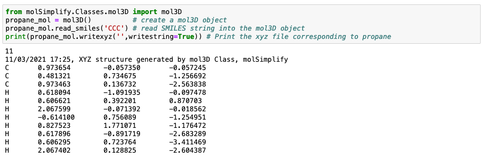
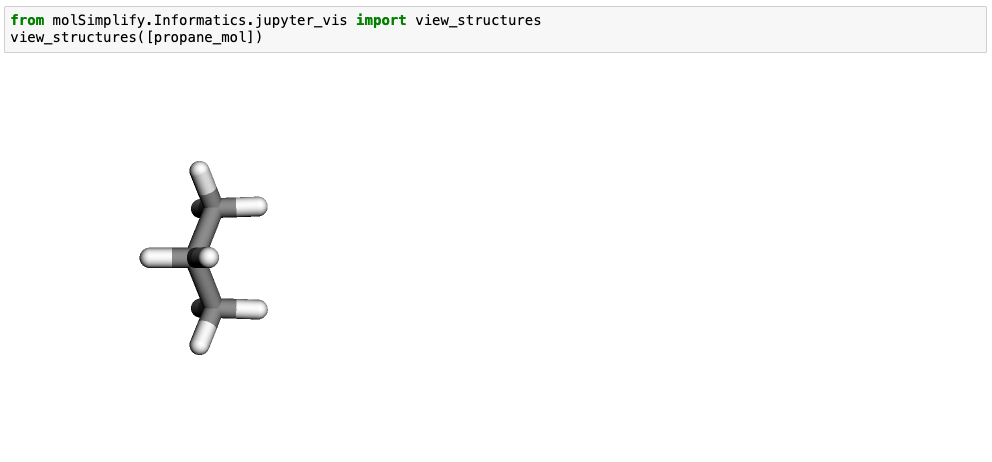
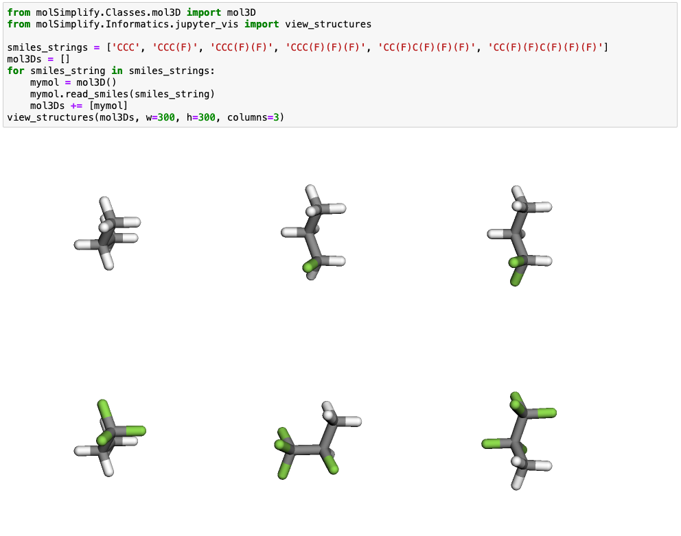

molSimplify can be used to visualize molecules built from SMILES strings. In this tutorial, we will use molSimplify to generate several variants of a molecule and display them in a grid.


To start out, install molSimplify via Conda using our [instructions](https://github.com/hjkgrp/molSimplify#readme) on Github and activate the mols_test environment. Depending on which distribution of Anaconda you are using, you may have Jupyter notebooks already installed in your environment. If not, you may install Jupyter using the following command:


```
conda install -c conda-forge jupyterlab
```
Open a Jupyter notebook using the command:


```
jupyter notebook
```
and then create a new Python 3 file. Here, we will create a cell where in which a propane molecule is loaded into a mol3D object:


```
from molSimplify.Classes.mol3D import mol3D
propane_mol = mol3D()          # create a mol3D object
propane_mol.read_smiles('CCC') # read SMILES string into the mol3D object
print(propane_mol.writexyz('', writestring=True)) # Print the xyz file corresponding to propane
```
The result of these commands is shown below:





Now that we have obtained the structure of the propane molecule, we would like to display it. To do so, we can use a function built into molSimplify that displays any array of mol3D objects, xyz strings, xyz filenames, or mol2 strings:


```
from molSimplify.Informatics.jupyter_vis import view_structures
view_structures([propane_mol])
```
The output of this command is shown below:  
 





Using this workflow, we can use molSimplify to generate a series of molecules with various functionalizations. For example, suppose we want to create a series of propane molecules with increasing fluorination. First, we will create an array of SMILES strings that we'd like to visualize. Then, we create mol3D objects for each, and display the array:


```
from molSimplify.Classes.mol3D import mol3D
from molSimplify.Informatics.jupyter_vis import view_structures

smiles_strings = ['CCC', 'CCC(F)', 'CCC(F)(F)', 'CCC(F)(F)(F)', 'CC(F)C(F)(F)(F)', 'CC(F)(F)C(F)(F)(F)']
mol3Ds = []
for smiles_string in smiles_strings:
    mymol = mol3D()
    mymol.read_smiles(smiles_string)
    mol3Ds += [mymol]
view_structures(mol3Ds, w=300, h=300, columns=3)
```
The view_structures command allows us to adjust the width and height of the viewer windows and adjust the number of columns in the grid display. The result of this cell is shown below:





