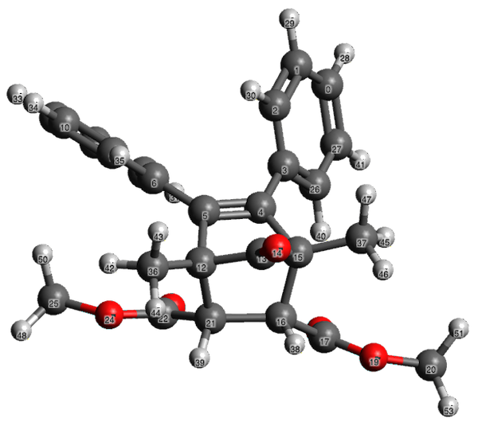
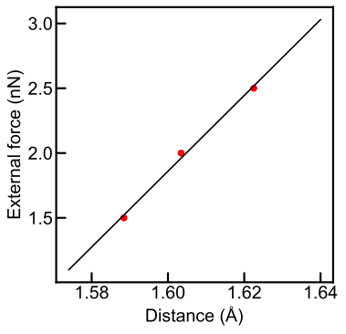
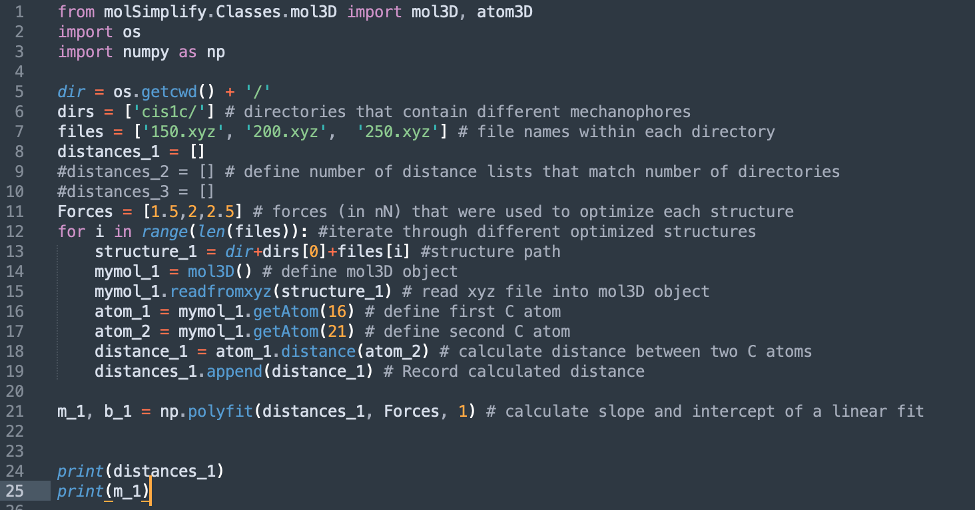

The tensioned model for bond activation (TMBA) can facilitate high-throughput virtual screening of diverse mechanophores. In this tutorial, we will show how to calculate the transition force ($f^*$) using TMBA.  


All input files, output files, and scripts can be downloaded from a [link at the end of the tutorial](#scripts-and-files). Today’s example for calculating activation force is _cis_-acyl-NEO, a mechanophore based on a neobornenone scaffold that can release CO under tension:



The use of the TMBA requires the calculation of two parameters: the effective force constant ($k_{\rm eff}$) and the force-free reaction energy ($\Delta E$). 

## Calculating the effective force constant

The effective force constant calculation requires optimized structures of the reactant under tension, and can be performed using the slope of the external applied force as a function of bond distance of the cleaving bond (in our example, atoms 16 and 21). Here, we will optimize the structure of _cis_-acyl-NEO under three distinct applied forces, where the force is applied to two terminal methyl groups (atoms 20 and 25). 

The input file for optimizing a structure under tension using the ORCA software package looks like the following:

```
! B3LYP D3BJ Opt def2-svp RIJCOSX
%pal nprocs 8 end
%geom POTENTIALS
{C 20 25 1.5}
end
end
* xyzfile 0 1 cis-acyl-neo.xyz
```
After the optimizations are completed, we obtain cleaving bond distances at three different external applied forces. In this exampled, these values were found to be 1.588, 1.603, and 1.622. Using a linear fit, we obtain a value of $k_{\rm eff}$ of 29.2. 



The distances can be obtained by either manually inspecting bond distances with molecular visualization software or by using the custom Python script provided below (calc_keff.py), which uses the [molSimplify](https://github.com/hjkgrp/molSimplify) software package.



## Calculating the force-free reaction energy 

The force-free reaction energy ($\Delta E$) can be calculated by optimizing the reactant and the diradical intermediate separately, followed by single-point calculation at a higher level of theory. An input file for ground state optimization is provided below:

```
! B3LYP D3BJ Opt def2-svp RIJCOSX
%pal nprocs 8 end
* xyzfile 0 1 cis-acyl-neo.xyz
```

The optimization of a diradical intermediate can be achieved through broken symmetry DFT (BS-DFT), however this can be complicated due to the geometry convergence to a closed-shell structure. This can be avoided by obtaining a triplet geometry instead, which can serve as an approximate singlet diradical structure. Job inputs for optimizing both ground state singlet diradical and triplet intermediate structures are provided below, and singlet diradical optimization should be attempted first. In case of failure, triplet geometry can be used as a substitute:

### Singlet diradical:

```
! uks B3LYP D3BJ Opt def2-svp RIJCOSX
%pal nprocs 8 end
%scf
Brokensym 1,1
end
* xyzfile 0 1 intermediate.xyz
```

### Triplet:
```
! B3LYP D3BJ Opt def2-svp RIJCOSX
%pal nprocs 8 end
* xyzfile 0 3 cis-acyl-neo.xyz
```

Finally, we carry out a single-point calculation using a higher level of theory. The job inputs for single-point calculation for ground state and diradical intermediates are provided below:

### Ground state:
```
! uks b3lyp d3bj def2-tzvpp RIJCOSX
%pal nprocs 8 end
* xyzfile 0 1 reagent.xyz
```
### Diradical:
```
! uks b3lyp d3bj def2-tzvpp RIJCOSX
%pal nprocs 8 end
%scf
Brokensym 1,1
end
* xyzfile 0 1 intermediate.xyz
```
Using this approach, we obtain the force-free reaction energy of 59.4 kcal/mol. 

## Generating a prediction from TMBA

A parametrized TMBA model has the following formula: 
$f^* = 0.0237\times\Delta E + 0.0494\times k_{\rm eff} - 0.495$

 Plugging in the computed parameters we obtain:
 $f^* = 0.0237\times59.4 + 0.0494\times 29.2 - 0.495 = 2.36 {\rm  \ nN}$, which is in good agreement with the experimentally measured transition force of 2.51 nN. 

Here, we have provided a brief walkthrough on using TMBA to predict the transition forces of covalent mechanophores. We hope you found this tutorial helpful and can use this approach for the accelerated screening of mechanophores!

### Scripts and Files:

[tutorial.zip](tutorial.zip)


<!-- To start out, install molSimplify via Conda using our [instructions](https://github.com/hjkgrp/molSimplify#readme) on Github and activate the mols_test environment. Depending on which distribution of Anaconda you are using, you may have Jupyter notebooks already installed in your environment. If not, you may install Jupyter using the following command:


```
conda install -c conda-forge jupyterlab
```
Open a Jupyter notebook using the command:


```
jupyter notebook
```
and then create a new Python 3 file. Here, we will create a cell where in which a propane molecule is loaded into a mol3D object:


```
from molSimplify.Classes.mol3D import mol3D
propane_mol = mol3D()          # create a mol3D object
propane_mol.read_smiles('CCC') # read SMILES string into the mol3D object
print(propane_mol.writexyz('', writestring=True)) # Print the xyz file corresponding to propane
```
The result of these commands is shown below:


Now that we have obtained the structure of the propane molecule, we would like to display it. To do so, we can use a function built into molSimplify that displays any array of mol3D objects, xyz strings, xyz filenames, or mol2 strings:


```
from molSimplify.Informatics.jupyter_vis import view_structures
view_structures([propane_mol])
```
The output of this command is shown below:  
 


Using this workflow, we can use molSimplify to generate a series of molecules with various functionalizations. For example, suppose we want to create a series of propane molecules with increasing fluorination. First, we will create an array of SMILES strings that we'd like to visualize. Then, we create mol3D objects for each, and display the array:


```
from molSimplify.Classes.mol3D import mol3D
from molSimplify.Informatics.jupyter_vis import view_structures

smiles_strings = ['CCC', 'CCC(F)', 'CCC(F)(F)', 'CCC(F)(F)(F)', 'CC(F)C(F)(F)(F)', 'CC(F)(F)C(F)(F)(F)']
mol3Ds = []
for smiles_string in smiles_strings:
    mymol = mol3D()
    mymol.read_smiles(smiles_string)
    mol3Ds += [mymol]
view_structures(mol3Ds, w=300, h=300, columns=3)
```
The view_structures command allows us to adjust the width and height of the viewer windows and adjust the number of columns in the grid display. The result of this cell is shown below:


 -->

